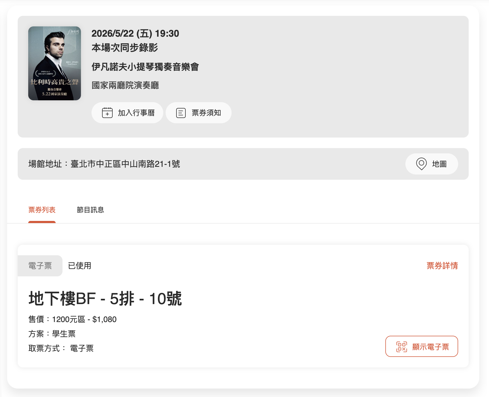
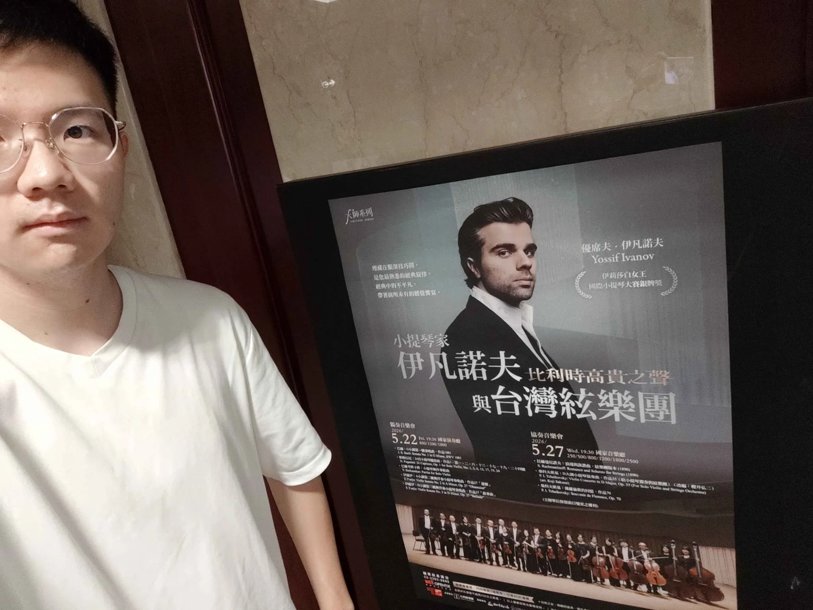
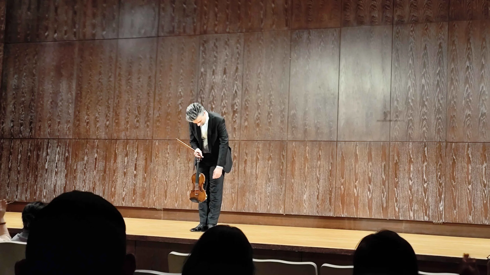
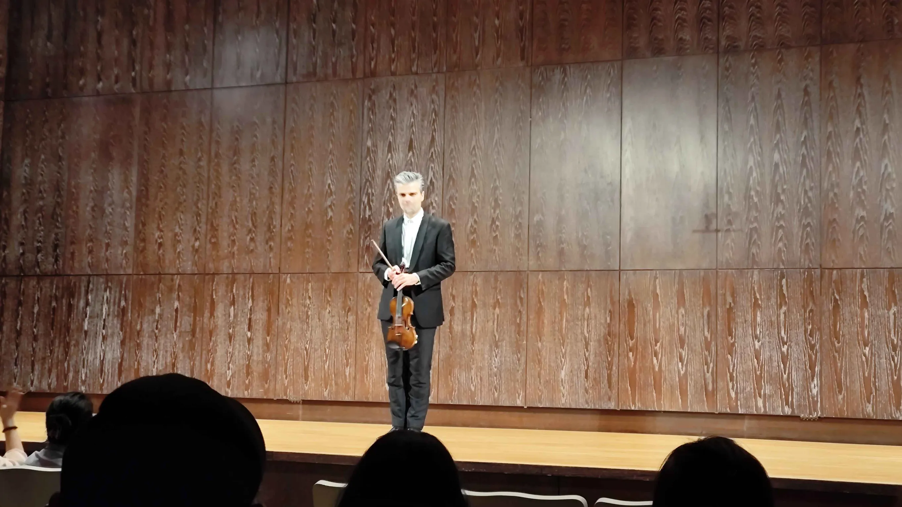

<InfoBox>
交大音樂概論 / 期末賞析心得報告\
授課教師：宋育任
</InfoBox>

伊凡諾夫這次在台灣總共有兩場音樂會。第一場是小提琴獨奏會，第二場是與台灣絃樂團合作的協奏音樂會，我聽的是第一場。這場獨奏會最大的特色是「無伴奏小提琴」—— 沒有鋼琴或樂團伴奏，因此所有旋律、和聲暗示、節奏推進、音色變化與情緒轉折，都必須由一把小提琴完成。節目從巴洛克時期的巴赫開始，經過帕格尼尼的炫技傳統，再進入二十世紀的巴爾考斯卡斯與伊薩伊，形成一條「無伴奏小提琴如何從宗教性、複調性，走向炫技、現代語彙與個人化表達」的脈絡。

<InfoBox style="info">
**關於小提琴獨奏家**

優席夫・伊凡諾夫（Yossif Ivanov）是一位來自比利時的小提琴家，1986 年出生，師承 Zakhar Bron、Igor Oistrakh、Valery Oistrakh 與 Augustin Dumay 等人。他非常非常早就在音樂界嶄露頭角，16 歲時獲得蒙特婁國際音樂大賽首獎，兩年後又在布魯塞爾伊莉莎白女王國際音樂大賽獲得第二名與觀眾獎。這兩項經歷讓他迅速受到歐洲古典樂界注意。

除了獨奏之外，伊凡諾夫也活躍於室內樂與協奏曲演出，曾在維也納金色大廳、倫敦 Wigmore Hall、薩爾茲堡 Mozarteum、卡內基音樂廳等重要場館演出。他也與許多知名樂團和指揮合作，因此並不是只以「比賽得獎者」身分被看見，而是已經發展成成熟的職業演奏家。另外他發行的唱片也屢獲讚譽，其中收錄比利時奏鳴曲的專輯 Ambroisie / Naïve 獲得《Diapason》年度金獎。2020 年，他也錄製了近年重新發掘的伊薩伊 (E. Ysaÿe) 小提琴協奏曲，並再次獲得《Diapason》金獎。未來還計畫錄製帕格尼尼的《24 首隨想曲》（此場音樂會有演奏部分曲目）。

教學方面，他自 2008 年起任教於伊莉莎白女王音樂學院與布魯塞爾皇家音樂學院，現為布魯塞爾皇家音樂學院小提琴系主任。

伊凡諾夫目前使用的小提琴是 1710 年卡洛・托諾尼名琴（前任持有者為德・貝里奧），由伊莉莎白女王音樂學院慷慨借予。
</InfoBox>

## 上半場曲目

### 巴赫：G 小調第一號奏鳴曲 (BWV 1001)

<Note>
J. S. Bach: Sonata No. 1 in G Minor, BWV 1001
</Note>

這首樂曲是 Sonatas and Partitas for Solo Violin（6 首無伴奏的奏鳴曲與組曲）的第一首，創作於 1720 年。關於這組作品的來源有則軼事是這樣的，原始手稿（以及其他樂曲的手稿）據說是孟德爾頌在一家肉鋪裡被發現的，當時肉舖老闆正在用這些寶貴的樂譜稿包肉。雖然故事無從證實，不過也側面說明了巴赫的作品在 19 世紀初其實並不為人知。

<InfoBox style="info">
巴赫在世時（1685–1750）在德國地區有一定名聲，但主要是作為管風琴演奏家，而不是作曲家。他死後作品幾乎被遺忘了將近一個世紀。

直到 1829 年，孟德爾頌在柏林指揮演出馬太受難曲（這是這首曲子自巴赫去世後的首次公開演出），引爆了歐洲音樂界對巴赫的重新認識，之後才開始大規模整理、出版他的作品。
</InfoBox>

<InfoBox style="info">
另外前面提到的「Sonatas and Partitas for Solo Violin」的「Sonata」不是古典主義時期的奏鳴曲式，而是巴洛克時期的教會奏鳴曲。

巴洛克時期的 Sonata 只是「用樂器演奏」的意思，結構慣例大概是「慢—快—慢—快」。

古典主義時期的 Sonata Form 是海頓、莫札特、貝多芬確立的結構（呈示部、發展部、再現部）。
</InfoBox>

這首最大的特色是沒有伴奏、只用一把小提琴的情況下，卻能用各種技法讓單一樂器有演奏「複音音樂」的感覺，這是我整場最期待的樂曲。

#### 介紹

巴赫的無伴奏小提琴作品最重要的特色，是讓單旋律樂器表現出接近多聲部音樂的效果。小提琴本來不能像鋼琴一樣同時彈出完整和聲，但巴赫透過了以下技巧，讓聽者感覺到音樂中存在多個聲部。
- 雙音（double stops）：同時拉兩條弦，發出兩個音。這是最直接的「同時兩個聲部」，伊凡諾夫在演奏此曲用了不少次這樣的技法。
- 分解和弦（arpeggiation）：鋼琴可以同時按三四個鍵，小提琴做不到，因為琴橋有弧度且四條弦不在同一平面上，同時壓三四條弦很困難。所以巴赫想到的方法是把和弦「拆開」快速連續拉，讓聽者耳朵自動把這幾個音「合」回去。我覺得這個技巧很類似電腦科學裡面的 concurrency 的概念，就是在同一個時間內一次處理多個事情。這個技巧在第一樂章 Adagio 尤為明顯。
- 和聲暗示（Implied Harmony）：即使小提琴不能像大提琴或鋼琴那樣持續演奏低音，巴赫仍會在樂句開頭或和弦底部放入低音，讓聽者記住這個音。接著上方旋律繼續發展時，利用聽覺暫留的原理讓聽者的腦海中自動補齊「隱藏的低音」和背景和弦。

#### 各樂章特色

<InfoBox style="warning">
- 第一樂章：慢板 Adagio
- 第二樂章：賦格 Fuga
- 第三樂章：西西里舞曲 Siciliana
- 第四樂章：急板 Presto
</InfoBox>

如同前面提到的，這首奏鳴曲的四個樂章呈現「慢—快—慢—快」的結構。

第一樂章 Adagio 帶有沉思、宣敘調式的感覺，像是在鋪陳一個嚴肅而內省的空間。

第二樂章 Fuga 是全曲的核心。賦格的主要特點是相互模仿的聲部以不同的音高，在不同的時間相繼進入，按照對位法組織在一起。這是我最喜歡的樂章，因為賦格本該是屬於複音音樂的作曲方式，而巴赫卻能只用單把小提琴就能讓賦格需要的多重旋律交織在一起。另外我對於伊凡諾夫能精準演奏巴赫要求的技法也感到非常驚奇，這段必須要在小提琴領域有極高的造詣才有辦法詮釋。

第三樂章 Siciliana 是西西里舞曲風格，通常以 6/8 或 12/8 拍呈現，帶有搖晃、柔和、略帶田園感的節奏。不過在巴赫這首作品中，舞曲感並不是非常外顯；它不像一般舞曲那樣有強烈的律動，而是被處理得更內斂、抒情。對我來說，這個樂章比較像是從前兩樂章的嚴肅與複調壓力中暫時鬆開，但 6/8 拍的「舞蹈感」並沒有強烈到讓我能馬上敢覺得出來。

第四樂章 Presto 則以快速流動的音型作結，展現小提琴的速度感與線條推進。

### 帕格尼尼：24 首小提琴隨想曲

<Note>
N. Paganini: 24 Caprices, Op. 1 for Solo Violin
</Note>

這也是我最期待的演奏，平時有在聽李斯特的樂曲，很喜歡他那樣炫技式地演奏鋼琴。好奇之下去查了李斯特的生平，發現他受帕格尼尼影響很深。他親眼看過帕格尼尼的演出，當時是 1831 年，李斯特約 19 歲，在巴黎聽到帕格尼尼演奏後完全為之所震撼。李斯特事後說這場音樂會改變了他的一生 —— 他決定要成為「鋼琴界的帕格尼尼」。這燃起了我的好奇心，畢竟能帶給李斯特那麼大啟發的小提琴家，肯定在小提琴上有極高的造詣，想知道帕格尼尼在小提琴上能變出什麼樣鬼斧神工的技法。

帕格尼尼的《24 首小提琴》隨想曲是在 1802 年至 1817 年期間，分成三組（六首、六首、十二首）所陸續寫成的。查了資料才發現他創作隨想曲的時候竟不到 20 歲，而且當時的他在整個歐洲大陸已經非常有名，憑藉著極其高超的演奏技巧，據說在任何城市的演出門票都會在開賣不久就被搶購一空。加上他本人非常非常瘦，當時的人們不禁把他與魔鬼的形象聯想在一起，而更有訛傳他將自己的靈魂出賣給魔鬼，用以換取超凡的演奏絕技。帕格尼尼的出現，刺激了當時各種樂器的演奏家都去尋找技巧的突破方法，也包含了李斯特在內。

回到樂曲，雖說名為隨想曲但實際上這 24 首樂曲更接近練習曲的性質（而且是難度極高的練習曲），每首小曲都在探索特定的難度極高的小提琴技巧，例如二重泛音、雙音奏法、左手撥奏、飛躍斷奏，直到 20 世紀上半葉都一直未有人公開演奏完整的 24 首曲或全數錄音。即便到了近代已經有些大師能完整掌握所有曲目，「攻略這 24 首隨想曲」對於小提琴手而言仍然是里程碑式的成就。

<InfoBox style="warning">
- 第 1 號，E 大調：行板
- 第 2 號，B 小調：中板
- 第 6 號，G 小調：慢板
- 第 13 號，降 B 大調：快板
- 第 17 號，降 E 大調：稍緩的序奏－行板
- 第 19 號，降 E 大調：慢板－極快板
- 第 24 號，A 小調：主題與變奏
</InfoBox>

第 1 號以跨弦琶音為主，在四條弦之間快速交替，分解出和弦的層次感。

第 6 號反其道而行，以慢板展示音色的歌唱性與細膩控制，帕格尼尼在這首炫耀的不是速度，而是讓小提琴像人聲一樣呼吸。

第 13 號「魔鬼的笑聲」則以三度雙音的快速進行為核心，音型的律動確實像是在咯咯笑。

第 19 號是跳弓（ricochet）的展示，弓在弦上自然彈跳，製造出清晰的顆粒感。

第 24 號作為整組的終結，則是一首主題加十一段變奏的綜合技法總覽，每段變奏輪換一種技法，從快速音階、平行八度、雙音，到最後以左手撥奏（pizzicato）收場。我在現場看到伊凡諾夫把小提琴當吉他撥弦的時候，覺得特別有趣。

## 下半場曲目

### 巴爾考斯卡斯：小提琴無伴奏組曲

<Note>V. Barkauskas: Partita for Solo Violin</Note>

<InfoBox style="warning">
- 前奏曲 Prelude  
- 諧謔曲 Scherzo  
- 極緩板 Grave  
- 觸技曲 Toccata  
- 後奏曲 Postlude  
</InfoBox>

巴爾考斯卡斯的《Partita》放在中場休息後，形成很明顯的風格轉換。標題「Partita」會讓人聯想到巴赫的組曲傳統，但這首作品使用的是更現代的音樂語言。它不一定以傳統旋律的優美為主，而更重視音色、節奏、張力、對比與片段化的表現。

五個樂章的名稱也很有意思：Prelude、Scherzo、Grave、Toccata、Postlude 既保留古典或巴洛克形式的影子，又可以被重新詮釋。Prelude 像是開場；Scherzo 可能帶有比較尖銳、跳動或詼諧的性格；Grave 則偏向沉重、緩慢與凝視；Toccata 通常具有強烈的動作感與技巧性；Postlude 則像是結尾後的餘韻。

這首作品可以理解為：現代作曲家回望傳統形式，但用更當代的聲響去重寫它。因此它和巴赫之間不是斷裂，而是一種跨時代的對話。

---

## 四、伊薩伊：A 小調第二號無伴奏小提琴奏鳴曲，作品 27《迷戀》

<Note>E. Ysaÿe: Violin Sonata No. 2 in A Minor, Op. 27 “Obsession”</Note>

<InfoBox style="warning">
- 迷戀－前奏曲：稍活潑地  
- 馬林柯尼亞－稍慢板  
- 暗影之舞－薩拉邦德舞曲：慢板  
- 復仇女神－狂暴的快板  
</InfoBox>

樂章：

1. 迷戀－前奏曲：稍活潑地  
2. 馬林柯尼亞－稍慢板  
3. 暗影之舞－薩拉邦德舞曲：慢板  
4. 復仇女神－狂暴的快板  

伊薩伊的無伴奏奏鳴曲承接了巴赫與帕格尼尼之後的小提琴傳統。一方面，它有巴赫式的嚴謹結構與精神性；另一方面，它也吸收了浪漫時期以後更強烈的個人情緒、戲劇性與技巧張力。

第二號奏鳴曲標題為《迷戀》，可以理解為一種被某種音樂記憶或精神狀態纏繞的狀態。四個樂章的標題都帶有強烈的心理與戲劇色彩：從 Obsession 的執著，到 Malinconia 的憂鬱，再到 Danse des Ombres 的陰影之舞，最後以 Les furies 的狂暴收束。這使它不像單純的形式練習，而更像是一段內在心理狀態逐漸失控、推向極端的過程。

在整場節目中，這首作品可以視為巴赫傳統的現代化與心理化。它不只是「寫給小提琴的作品」，而是把小提琴變成一種能表現執念、陰影與劇烈情緒的媒介。

---

## 五、伊薩伊：D 小調第三號無伴奏小提琴奏鳴曲，作品 27《敘事曲》

<Note>E. Ysaÿe: Violin Sonata No. 3 in D Minor, Op. 27 “Ballade”</Note>

第三號奏鳴曲《敘事曲》通常被視為伊薩伊無伴奏奏鳴曲中非常集中、戲劇性很強的一首。標題 Ballade 暗示它不是單純的抽象奏鳴曲，而帶有敘事感：音樂像是在講述某種故事或心理歷程。

它放在節目最後，具有總結效果。前面的巴赫建立了無伴奏小提琴的結構高度，帕格尼尼展示了技巧極限，巴爾考斯卡斯帶入現代聲響，而伊薩伊則把這些元素重新融合：既有複調與形式，也有炫技與戲劇性，還有高度個人化的情緒表達。

## 照片

<SplitterCenter>票根</SplitterCenter>

<Columns noline={true} ratio="1.74fr 1fr">

</Columns>

