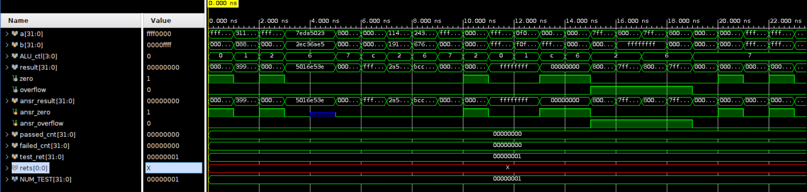

import lsbAlu from './CO-lab1/lsb-alu.png?url';
import msbAlu from './CO-lab1/msb-alu.png?url';
import alu32 from './CO-lab1/32-bit-ALU.png?url';
import alu32Upper from './CO-lab1/32-bit-ALU-upper.png?url';
import alu32Lower from './CO-lab1/32-bit-ALU-lower.png?url';

{/* ============================================================================ */}


## I. Architecture Diagrams

Below is the architecture diagram of the 1-bit ALU (LSB):


Below is the architecture diagram of the 1-bit ALU (MSB):


Below is the architecture diagram of the 32-bit ALU.  The "set" pin of the MSB is wired back to the "less" pin of the LSB, indicating the result of `slt` operation when `ALU_ctl` is `0111`.

<Columns noline ratio="1fr 4fr">
<div class="w-full">
  
</div>
<div class="w-full">
  
  <div class="h-4"></div>
  
</div>
</Columns>


<div class="h-8"></div>


## II. Questions

<InfoBox style="default">
How overflow is calculated?
</InfoBox>

The overflow only happens when adding two positive numbers or adding two negative numbers (equivalently, subtracting a positive number from a negative number or subtracting a negative number from a positive number).  WLOG, we only need to consider the cases of addition.

Suppose we are adding two $32$-bit numbers $A$ and $B$, where $A$ and $B$ have the same sign.  Suppose $C_{in}$ is the carry-in of the MSB, and $C_{out}$ is the carry-out of the MSB.

If $A$ and $B$ are both positive:
- $C_{in}$ is $1$ $\rightarrow$ overflow occurs, $C_{out}$ is $0$
- $C_{in}$ is $0$ $\rightarrow$ no overflow, $C_{out}$ is $0$

If $A$ and $B$ are both negative:
- $C_{in}$ is $1$ $\rightarrow$ no overflow, $C_{out}$ is $1$
- $C_{in}$ is $0$ $\rightarrow$ overflow occurs, $C_{out}$ is $1$

The detection of overflow for signed integer addition/subtraction can be elegantly done by xoring the `carry-in` and the `carry-out` of the MSB:

$$
\text{overflow} = C_{in} \oplus C_{out}
$$

If the result is $1$, then overflow occurs.

According to the spec, the overflow detection is only activated when the operation is `ADD` or `SUB`, so additional logic is needed to handle this case.

```verilog
wire integer_overflow = carry_in ^ carry_out;
assign overflow = (operation == 2'b10 ? integer_overflow : 1'b0);
```


<InfoBox style="default">
Explain why ALU control signal of `SUB` is `0110` and `NOR` is `1100`?
</InfoBox>

Subtraction is equivalent to adding the 2's complement of the second operand:

$$
A - B = A + (\text{2's complement of } B) = A + (\sim B + 1)
$$

Hence, it's natural to set the control signal of `SUB` to `0110`, which is the same as `ADD` but with the 3rd bit inverted (`ALU_ctl[2] = 1`).  Furthermore, we need to set the `carry_in` of LSB to `1` to handle the `+1` in the 2's complement.

```verilog
assign carry_in = {carry_out, ALU_ctl[2]};
```


Similarly for the `NOR` operation, according to De Morgan's law:

$$
A \text{ NOR } B = \neg(A \lor B) = (\neg A) \land (\neg B)
$$

which means we can first invert both operands, then perform `AND` operation.  This is equivalent to setting the control signal of `NOR` to `1100`.


<InfoBox style="default">
If you assign different signal to these operation, what problems you may
encountered?
</InfoBox>

The circuit will be more complicated and it will take more time (require extra logic gates) to decode the control signals.


<InfoBox style="default">
True or false: Because the register file is both read and written on the same clock cycle, any
MIPS datapath using edge-triggered writes must have more than one copy of the register file.
Explain your answer.
</InfoBox>


False.

A single register file is sufficient because it is designed with independent read and write ports.  The processor typically employs a split-cycle design, where writes are executed in the first half of the clock cycle (e.g., triggered by the falling edge) and reads are resolved in the second half. This ensures no structural hazards or data conflicts occur, eliminating the need for multiple copies of the register file.


## III. Experimental Result of ALU

<InfoBox style="info">
Show the waveform screen shot of the testbench `tb_alu.0.txt` result.
</InfoBox>



<InfoBox style="info">
What other cases you've tested? Why you choose them?
</InfoBox>

```c
// Random
0x11451400 0x19191800 ADD 0x2a5e2c00 0 0
0x24342434 0x67676767 SUB 0xbcccbccd 0 0
        -7          6 SLT          1 0 0
```

```c
// Logical Operations and Zero Flag
0x00000000 0x00000000 ADD 0x00000000 1 0
0xffffffff 0xffffffff AND 0xffffffff 0 0
0x0f0f0f0f 0xf0f0f0f0 OR  0xffffffff 0 0
0x00000000 0xffffffff NOR 0x00000000 1 0
        10         10 SUB          0 1 0
```

```c
// Overflow
0x7fffffff 0x00000001 ADD 0x80000000 0 1
0x80000000         -1 ADD 0x7fffffff 0 1
0x7fffffff         -1 SUB 0x80000000 0 1
0x80000000          1 SUB 0x7fffffff 0 1
```

```c
// SLT
        10         20 SLT          1 0 0
        20         10 SLT          0 1 0
        -5         -2 SLT          1 0 0
        -2         -5 SLT          0 1 0
```

```c
// SLT with Overflow (Exercise C.24)
0x80000000 0x7fffffff SLT          1 0 0
0x7fffffff 0x80000000 SLT          0 1 0
```


## IV. Problems Encountered & Solution

<Note>
List some important problems you've met during this lab and their solution.
</Note>

<InfoBox style="danger">
Vivado does not support MacOS.
</InfoBox>

<InfoBox style="success">
I found this GitHub repo:

<Link url="https://github.com/ichi4096/vivado-on-silicon-mac" />

It provides a way to run Vivado inside a Docker container (distro: Ubuntu 22.04).  After 1 hour of installation and setup, I successfully ran Vivado on my MacBook.

The trade-off is that the performance is slower than running Vivado directly on a Linux system.  Hence, for the development, I used Icarus Verilog for compilation and running the testbench.

```bash
iverilog -g2012 -o lab1_alu.out tb_alu.sv src/alu.v src/bit_alu.v src/msb_bit_alu.v
./lab1_alu.out
```
</InfoBox>


## V. Feedback

Lab 好玩！


