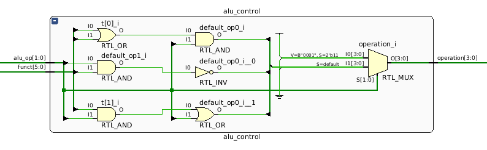
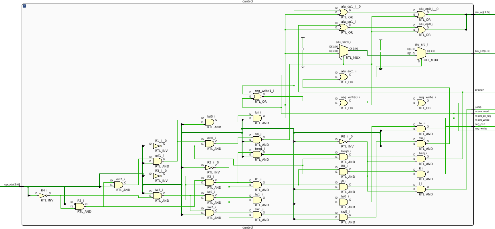
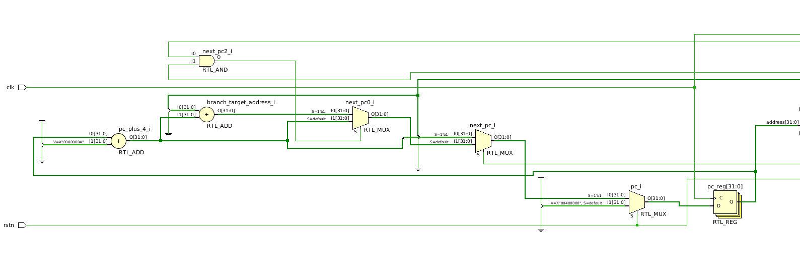
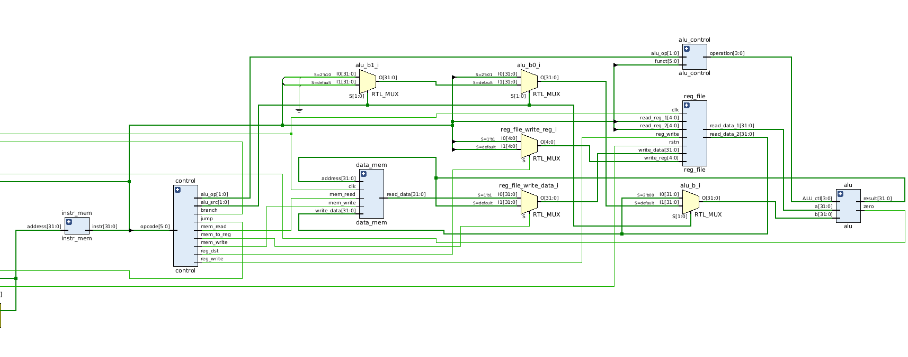
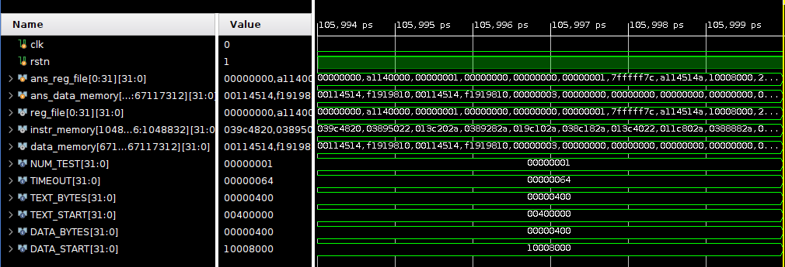

{/* =================================== */}


## Architecture Diagram


### ALU Control

參考簡報第 34 頁的圖，然後加了一個 MUX 來擴充 `lui`、`ori`。




### Main Control

參考簡報第 32 頁的圖，使用 PLA (Programmable Logic Array) 來設計，這樣也方便擴充 `j` 指令。




### Single Cycle CPU






Write Register MUX：由 `RegDst` 訊號控制。
- 當 `RegDst = 1` 時選擇 `rd` 欄位（用於 R-type）
- 當 `RegDst = 0` 時選擇 `rt` 欄位（用於 I-type）。

ALUSrc MUX：修改課本擴充成 2-bit 的 `alu_src`。詳細說明在 [Problems Encountered and Solution](#problems-encountered-and-solution)。

MemtoReg MUX：由 `MemtoReg` 訊號控制。
- 當 `MemtoReg = 1` 時選擇 Data Memory 的讀出資料。
- 當 `MemtoReg = 0` 時選擇 ALU 運算結果。

Next PC MUXes： 由 Main Control 的 Branch 與 Jump 訊號，配合 ALU 輸出的 Zero 訊號共同控制。- 如果 `Branch & Zero = 1` 則選擇 `branch_target_address`
- 如果 `Jump = 1` 則選擇 `jump_target_address`
- 以上皆不滿足則選擇 `pc + 4`


## Experimental Result




## Answer the Following Questions

<InfoBox>
When does write to register/memory happen during the clock cycle? How about read?
</InfoBox>

write to register/memory 是正緣觸發的 sequential logic，固定發生在 clock signal 的 positive edge。

read from register file/memory 是組合電路，只要輸入訊號有變動就馬上會立刻把值輸出到排線上（delay 來源是 logic gates）。


<InfoBox>
Translate the "branch" pseudo instructions (`blt`, `bgt`, `ble`, `bge`) in the Green Card into real instructions. Only `at` register can be modified, and other common registers should not be modified.
</InfoBox>

{/* beq $s1 $s2 25 */}

```asm
# equivalent to "blt $s1 $s2 offset"
slt $at $s1 $s2
bne $at $zero offset

# equivalent to "bgt $s1 $s2 offset"
slt $at $s2 $s1
bne $at $zero offset

# equivalent to "ble $s1 $s2 offset"
slt $at $s2 $s1
beq $at $zero offset

# equivalent to "bge $s1 $s2 offset"
slt $at $s1 $s2
beq $at $zero $offset
```


<InfoBox>
Give a single `beq` assembly instruction that causes infinite loop. (consider that there's no
delay slot)
</InfoBox>

```asm
beq $zero $zero -1
```

<InfoBox>
The `j` instruction can only jump to instructions within the "block" defined by "(PC+4)
[31\:28]". Design a method to allow `j` to jump to the next block (block number + 1) using another `j`.
</InfoBox>

假設現在的 block number 是 5，想法是先跳到當前 block 的最後一個位置，然後在最後一個位置 `j` 時 `PC+4` 就會在下一個 block，順利吃到下一個 block number。

```asm
0x5???????  j 11111111111111111111111111

...

0x5FFFFFFC  j 00000000000000000000000011      BLOCK 5
-----------------------------------------------------
0x60000000                                    BLOCK 6
0x60000004
...
0x6000000C  # (Finally Goes Here)
```


<InfoBox>
Why a Single-Cycle Implementation Is Not Used Today?
</InfoBox>

所有指令都要在一個週期內完成的話，瓶頸會卡在某個最慢的指令（通常就是 `lw` 因為 `lw` 要經過 `IF > ID > EX > MEM > WB` 這 5 個 stages），導致時脈提升會有上限。另外也沒辦法將指令平行化處理（pipeline），會有硬體資源 idle。


## Problems Encountered and Solution

這份 lab 的目標是做出一個最小可動的 CPU，所以我選擇了不靠 AI 自己動手寫，這樣才能真正學到東西，而且助教寫的提示超級詳細，跟課本的圖對照著做就能順利做出來。

然後首先是擴充 `j` 指令，想了一段時間後，最後發現現有的 control signals 沒辦法優雅地相容 jump 操作（jump 的定址方式跟 branch 是異質的），所以就在 `control.v` 的 output 加上了一個 `jump` 訊號，並且開一條新的 sub-datapath 算指令為 `jump` 時的目標 PC。

`lui` `ori` 比較麻煩，花了一點時間想該怎麼擴充現有的設計。後來的解決方案是：
1. 不需要開新的 control signals，都可以用現有的訊號控制。
2. `alu_op[1:0]` 剛好還有 `11` 這個值沒用到，所以就直接拿來配給 `lui`、`ori` 這兩個語意上相近的操作。
3. ALU 的 `alu_b` 緊接在前的 MUX 從 2 個通道改成 4 個通道，分別是：
    - `00: $rt`
    - `01: sign-extended immediate`
    - `10: zero-extended immediate (ori)`
    - `11:  lui-extended immediate (lui，就是把 16 bits immediate 丟到高位)`
    與之對應的 `alu_src` 也要擴充成 `alu_src[1:0]`。但是 `alu_control.v` 那邊我就偷懶了，懶得畫卡諾圖重新優化電路，所以就直接硬插一個三元運算。

然後最後在 Vivado 跑 simulation 時，不小心跑出 Time Limit Exceeded。盯著 code 盯了很久才發現有兩個地方沒改到：
1. `single_cycle_cpu.v`  第 90 行那邊的 `alu_src` 排線忘記修改成 2-bit output。
2. 第 121 行那邊的 `jump_target_address`，裡面的 `instr_mem_instr` 打錯打成 `instr_mem_address`（code completion 自動補上但我沒檢查到）。
上面兩個 bugs 都會讓 PC 跳出界，然後就一直不斷執行 `nop`（讀到的指令永遠都是 `0x00000000`）。


## Feedback

助教的提示都寫得很詳細！


