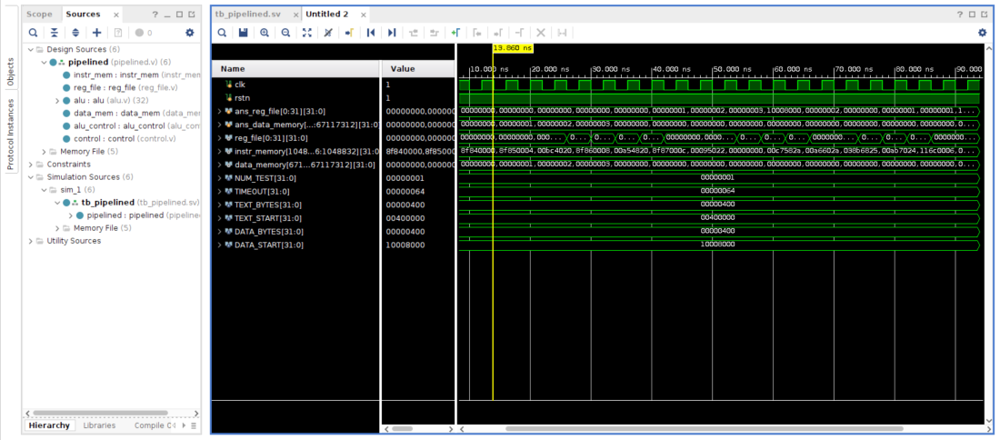

{/* =================================== */}


## Experimental Result





## Answer the Following Questions

<InfoBox>
For each code sequence below, state whether it must stall, can avoid stalls using only forwarding, or can execute without stalling or forwarding.

<Table>
|Sequence 1|Sequence 2|Sequence 3|
|--|--|--|
|`lw $t0, 0($t0)`   |`add $t1, $t0, $t0`|`addi $t1, $t0, #1`|
|`add $t1, $t0, $t0`|`addi $t2, $t0, #5`|`addi $t2, $t0, #2`|
|                   |`addi $t4, $t1, #5`|`addi $t3, $t0, #2`|
|                   |                   |`addi $t3, $t0, #4`|
|                   |                   |`addi $t5, $t0, #5`|
</Table>
</InfoBox>

{/* 

IF  ID  EX  MEM WB
    IF  ID  EX  MEM WB
*/}

- Sequence 1: Must stall.
  ```asm
                       ▼ 新的 $t0 到這裡才會出來
    lw: IF  ID  EX  MEM WB
   add:     IF  ID  EX  MEM WB
  ```
- Sequence 2: Can avoid stalls using only forwarding.
  ```asm
                    ▼ 新的 $t1 到這裡就能出來
     add: IF  ID  EX  MEM WB
  # addi:     IF  ID  EX  MEM WB
    addi:         IF  ID  EX  MEM WB
                         ▲ 這裡要的 $t1 可以透過 forwarding 解決
  ```
- Sequence 3: Can execute without stalling or forwarding. 這幾行唯一的 dependency 只有 `$t0`。


<InfoBox>
Assume we are using a standard five-stage pipeline CPU (IF, ID, EX, MEM, WB) without any Forwarding or Stall logic. To ensure the correct execution of the code sequences provided above, determine the minimum number of `nop` instructions that must be manually inserted for each sequence.
</InfoBox>

- Sequence 1: $2$ 個 `nop`
  ```asm
                          ▼ $t0 要等到寫回後才有新的值可以用
    lw: IF  ID  EX  MEM WB
   nop:     __  __  __  __  __
   nop:         __  __  __  __  __
   add:             IF  ID  EX  MEM WB
  ```
- Sequence 2: $1$ 個 `nop`
  ```asm
                          ▼ 這個 clock 的前半 $t1
     add: IF  ID  EX  MEM WB
  # addi:     IF  ID  EX  MEM WB
     nop:         __  __  __  __  __
    addi:             IF  ID  EX  MEM WB
                           ▲ 這個 clock 後半讀 $t1
  ```
- Sequence 3: $0$ 個 `nop`


<InfoBox>
A group of students were debating the efficiency of the five-stage pipeline when one student pointed out that not all instructions are active in every stage of the pipeline. After deciding to ignore the effects of hazards, they made the following statements. Which ones are correct? Explain why or why not.

1. Trying to allow some instructions to take fewer cycles will significantly increase the system throughput, since the throughput is determined by the average number of stages each instruction passes through.

2. Instead of trying to make instructions take fewer cycles, we should explore making the pipeline longer, so that instructions take more cycles, but the cycles are shorter. This could improve performance.
</InfoBox>

<InfoBox style="danger">
敘述 1 是錯的
</InfoBox>

<InfoBox style="success">
敘述 2 是對的
</InfoBox>

假設一次運行的 instructions 很多的話，Throughput 會非常接近：
$$
\text{Throughput} \approx \frac{1}{\text{Clock Period}}
$$

由於 pipelined CPU 一個 cycle 仍只能完成一個指令，因此 pipelined CPU 的決定性瓶頸是在最慢的那個 stage。
- 敘述 1 僅僅是讓部分 instructions 跳過一些 stages，沒有實質改變最慢的 stage 所需時間，最多只能改善 pipelined CPU 剛啟動時的那一點點延遲。
- 敘述 2 正確，將 stage 切得更細、使得最慢的那個 stage 要花的時間更少，才是優化 pipelined CPU 的方法。


## Problems Encountered and Solution

不用處理 hazard 的話滿簡單的，沒怎麼遇到問題。


## Feedback

助教的提示都寫得很詳細！

