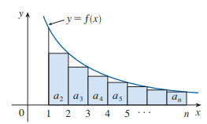
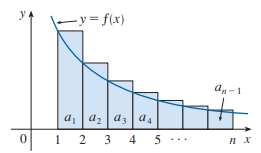
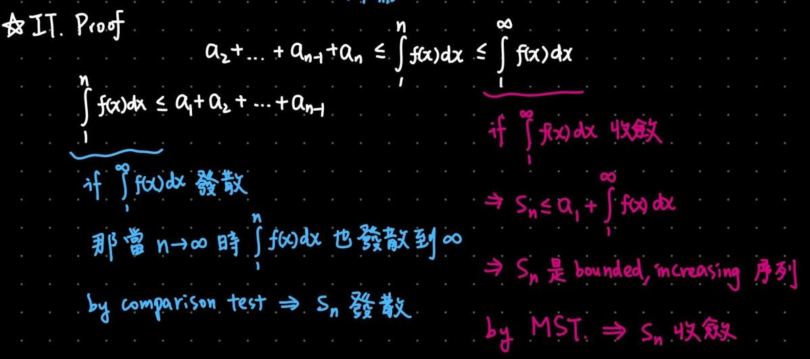
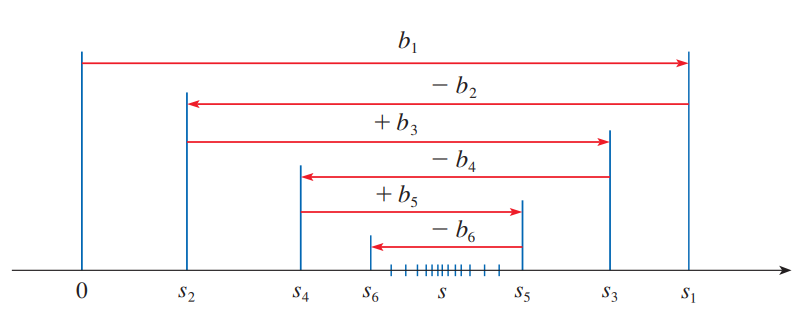

隨手做的，可能沒有很完整，有看到有趣的題目或是重要的定理或是我想記錄才會放上來。

## Sequences

### Limit of a Sequence

$$
\lim_{n \to \infty} a_n = L \iff \forall \epsilon > 0, \exists N \ s.t.\ \forall n > N, |a_n - L| < \epsilon
$$
$$
\lim_{n \to \infty} a_n = \infty \iff \forall M > 0, \exists N \ s.t.\ \forall n > N, a_n > M
$$

### Discrete v.s. Continuous

$$
\lim_{x \to \infty} f(x) = L, f(n) = a_n \ \forall n \in \mathbb{Z}^+ \implies \lim_{n \to \infty} a_n = L
$$

### Limit + Continuous Function

If $\lim_{n \to \infty} a_n = L$ and $f$ is **continuous at $L$**, then $\lim_{n \to \infty} f(a_n) = f(\lim_{n \to \infty} a_n) = f(L)$

### Monotonic / Bounded

* Increasing: $a_n < a_{n+1}$
* Decreasing: $a_n > a_{n+1}$
* Monotonic: Either Increasing or Decreasing
* Bounded Above (上面有東西擋住): $\exists M \ s.t.\ a_n \leq M \ (\forall n)$
* Bounded Below (下面有東西擋住): $\exists m \ s.t.\ m \leq a_n \ (\forall n)$
* Bounded Sequence: bounded above and below at the same time

:::default
**Monotonic Sequence Theorem**

**Increasing** and **Bounded Above** $\implies$ convergent\
**Decreasing** and **Bounded Below** $\implies$ convergent
:::

證明：由 LUB 公理得出存在最小上界 $L$，再利用柯西極限的定義證明。

Monotonic Sequence Theorem 很常出現在後續章節的定理證明，包括 Intergral Test、Comparison Test、Alternating Series Test (Even Partial Sum 收斂的證明)。

---

## Series

### Convergence Tests for Series

:::default
(1) $a_n$ 一定要收斂到 0
:::

$$
\sum_{n=1}^\infty a_n \text{ is convergent} \implies \lim_{n \to \infty} a_n = 0
$$

$$
\lim_{n \to \infty} a_n \neq 0 \implies \sum_{n=1}^\infty a_n \text{ is divergent}
$$

:::danger
$\displaystyle \lim_{n \to \infty} a_n = 0 \nRightarrow \sum_{n=1}^\infty a_n \text{ is convergent (Counter Example: } \sum_{n=1}^\infty \frac{1}{n})$
:::

:::default
(2) 最單純的級數: p 級數、幾何級數
:::

$$
\sum_{n=1}^\infty \frac{1}{n^p(\ln n)^q} \text{ is convergent if } p > 1 \text{ or } p = 1, q > 1
$$

$$
\sum_{n=1}^\infty \frac{1}{n^p(\ln n)^q} \text{ is divergent if } p < 1 \text{ or } p = 1, q \leq 1
$$

幾何級數就看公比: $|r| < 1$

:::default
(3) Integral Tests
:::

:::info
使用條件：

1. $a_n$ 是正項級數（全部都負的話就翻成正的）
2. $a_n$ **遞減**，可用 $f'(x)$ 的正負來判斷是否遞減。
:::

$\sum_{n=1}^\infty a_n$ 的斂散性和 $\int_1^\infty f(x)dx$ 相同。

證明：

收斂的部分用 DCT + MST 證：

發散的部分用 DCT 證：

數論裡面一些演算法的時間複雜度、函數成長速度就是用積分估算的。

調和級數：$\displaystyle \sum_{n=1}^N \frac{N}{n} \approx \int_1^N \frac{N}{x} dx = \Theta(N \log N)$

杜教篩：$\displaystyle N^{\frac{2}{3}} + \sum_{n=1}^{\lfloor N^{1/3} \rfloor} \sqrt{\frac{N}{n}} \approx N^{\frac{2}{3}} + \int_1^{N^{1/3}} \sqrt{\frac{N}{x}} dx = O(N^{\frac{2}{3}})$

:::default
(4) Comparison Tests
:::

:::info
使用條件：

1. $a_n$ 是正項級數（全部都負的話就翻成正的）
:::

有分成 DCT 跟 LCT，但形式都滿單純的所以就不寫上來。

DCT 證明可以用 MST，而 LCT 證明可以先設 $m < a_n / b_n < M \implies m b_n < a_n < M b_n$，得出上下界後用 DCT。

:::default
(5) Alternating Series Test
:::

:::info
使用條件：

1. $a_n$ 是交錯級數
:::

以下兩個條件都要驗證，注意不能只驗證第 2 個：

1. $|a_n|$ 非嚴格遞減，即 $|a_n| - |a_{n+1}| \geq 0$
2. $\lim_{n \to \infty} |a_n| = 0$

其實把 $s_n$ 放到數線上的話，不難發現 $s_n$ 會來回跳動，非嚴格遞減、收斂到 0 這兩個條件可以保證每次跳動的長度越來越小，振幅越小最後就會收斂在某個點上。

證明的話也很單純，以最後收斂的和 $s$ 作為分界點，會發現其中一邊是奇數另外一邊是偶數。先選擇其中一邊來證明收斂 (by MST)，最後另外一邊的證明就只要補上某一項讓奇偶性反轉，就可以不用兩邊都做 MST。

:::default
(6) Ratio/Root Test
:::

**Ratio Test:** Let $r = \lim_{n \to \infty} \left| \frac{a_{n+1}}{a_n} \right|$

**Root Test:** Let $r = \lim_{n \to \infty} \sqrt[n]{\vert a_n \vert}$

If $r < 1 \implies$ converge.

If $r > 1 \lor r = \infty \implies$ diverge.

If $r = 1 \implies$ fail.

事實上兩個 Test 等價，即：

$$
\lim_{n \to \infty} \left| \frac{a_{n+1}}{a_n} \right| = r \iff \lim_{n \to \infty} \sqrt[n]{\vert a_n \vert} = r \quad \text{(Cauchy's Second Theorem on Limits)}
$$

---

### 餘項估計

定義 $s$ 為 $\sum a_n$ 收斂到的值。

定義 $R_n = s - s_n = \sum_{k=n+1}^\infty a_k$。

有時候級數和沒有特定公式可以計算，只能取前面有限個項，餘項估計就是在考慮只取有限個項的情況下產生的誤差。

#### Integral Test

$$
\int_{n+1}^\infty f(x)dx \leq R_n \leq \int_n^\infty f(x)dx
$$

$$
s_n + \int_{n+1}^\infty f(x)dx \leq s \leq s_n + \int_n^\infty f(x)dx
$$

#### Alternating Series Test

$$
|R_n| \leq |a_{n+1}|
$$

