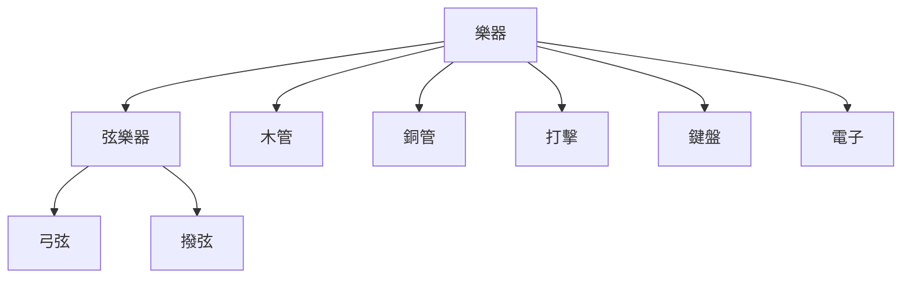

{/* +1 */}

## 樂器

## 弦樂器

### 弓弦

小提琴

中提琴

大提琴

低音大提琴

### 撥弦

吉他

豎琴 (harpsichord)

魯特琴 (lute)

曼陀林 (mandolin)

烏克麗麗 (ukulele)

## 木管

原理：藉由吹嘴、單簧片或雙簧片震動發聲

短笛 (piccolo)

長笛 (flute)

雙簧管 (oboe)
- 弦樂團調音通常是以雙簧管為基準。雙簧管的音高主要取決於簧片（Reed）的削製方式以及樂器本身的物理長度。雖然演奏者可以透過改變吹口（Embouchure）的嘴型張力或稍微調整簧片插入管身的深淺來微調，但整體能夠調整的範圍非常有限。既然雙簧管最難配合別人改變音高，樂團中其他容易調整的樂器自然就必須以它為基準。除此之外，雙簧管的音色很容易辨識，可以讓樂團的所有樂手在調音時清楚辨認。

單簧管 (clarinet)

低音管 (bassoon)

English Hora

Bass Clarinet

Contrabassoon

薩克斯風 (saxophone)

<Staff>
  X: 1
  M: 4/4
  L: 1/4
  K: C
  C D E F | G A B c |
</Staff>

## 銅管

原理：藉由嘴唇震動發聲，也被稱為 labrosones（嘴唇振動的樂器）。

小號 (trumpet)

法國號 (Horn)

長號 (trombone)

低音號 (tuba)

## 打擊

可分成有無絕對音高。

有絕對音高的打擊樂器：
- 木琴 (marimba)
- 鐵琴 (xylophone)
- 定音鼓 (tympani)
- 馬林巴琴 (marimba)

無絕對音高的打擊樂器：
- 鈴鼓 (tambourine)
- 三角鐵 (triangle)
- 沙鈴 (maracas)
- 鼓 (drum)
- 鑼 (cymbal)

## 鍵盤

