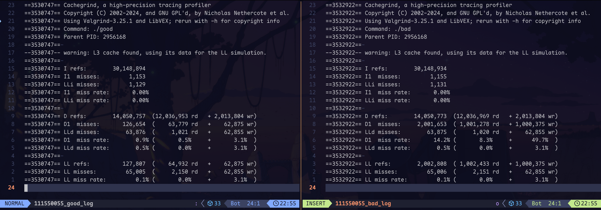
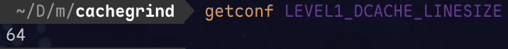
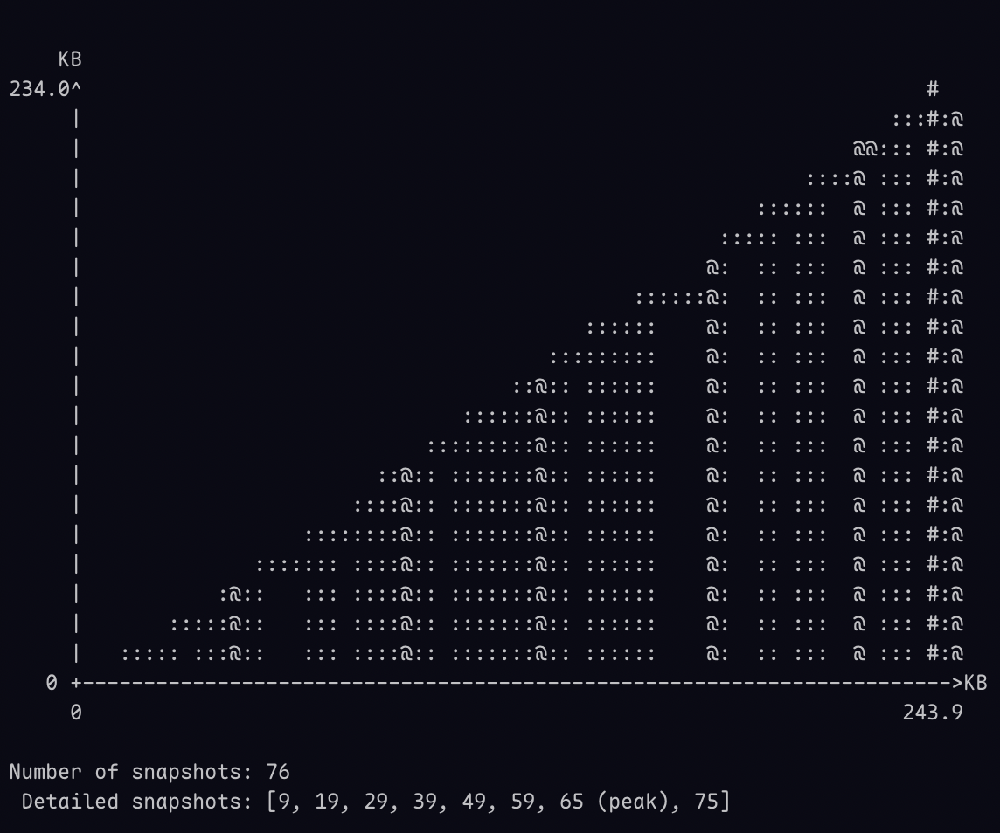
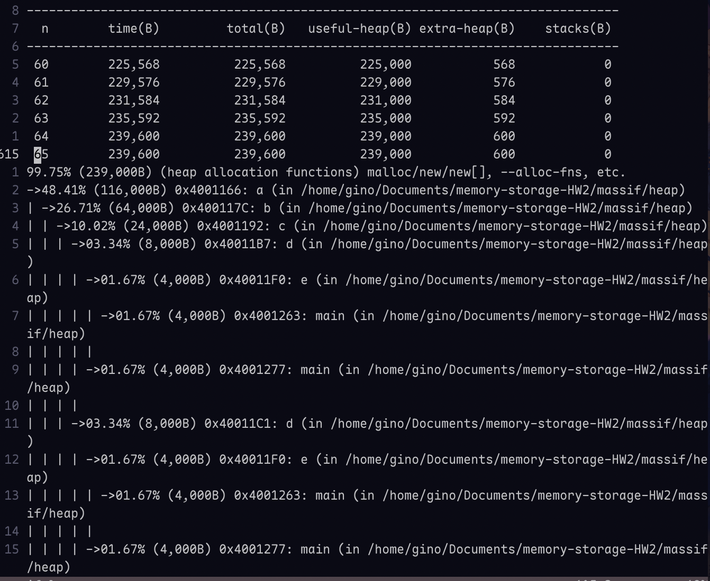
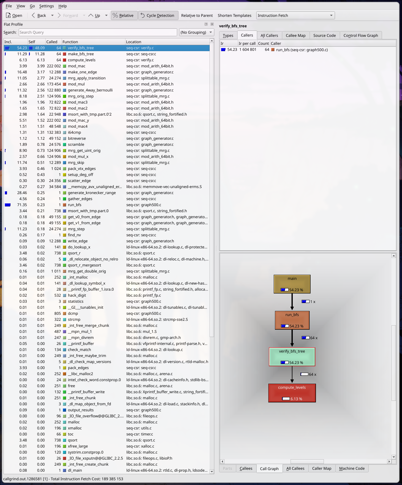
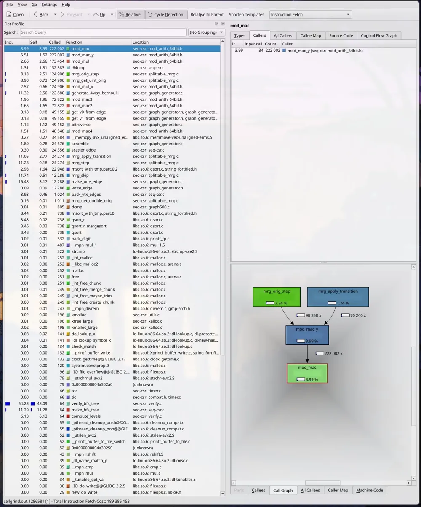
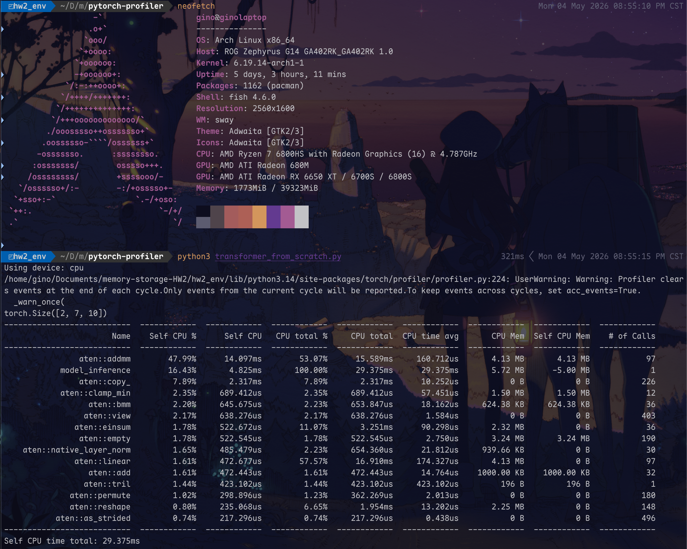
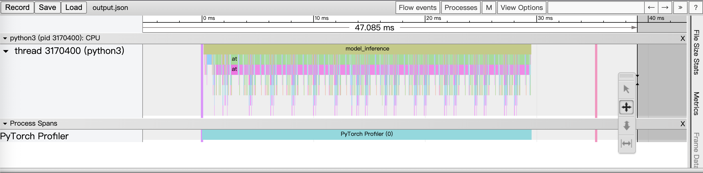

## Memcheck (30%)

<InfoBox style="success">
### Requirements

Please find out the errors from the log file. You should submit your `<student ID>_log` with annotations (see the picture below) and explain the errors in the report.
</InfoBox>


{/* ```bash
==2691530== Memcheck, a memory error detector
==2691530== Copyright (C) 2002-2024, and GNU GPL'd, by Julian Seward et al.
==2691530== Using Valgrind-3.25.1 and LibVEX; rerun with -h for copyright info
==2691530== Command: ./memleak
==2691530== Parent PID: 2633994
==2691530== 
==2691530== Invalid write of size 4
==2691530==    at 0x40011C0: main (memleak.c:49)
==2691530==  Address 0x4a9e068 is 0 bytes after a block of size 40 alloc'd
==2691530==    at 0x484E7A8: malloc (vg_replace_malloc.c:446)
==2691530==    by 0x400119E: main (memleak.c:46)
==2691530== 
==2691530== Invalid read of size 4
==2691530==    at 0x40011ED: main (memleak.c:54)
==2691530==  Address 0x4a9e068 is 0 bytes after a block of size 40 alloc'd
==2691530==    at 0x484E7A8: malloc (vg_replace_malloc.c:446)
==2691530==    by 0x400119E: main (memleak.c:46)
==2691530== 
==2691530== Use of uninitialised value of size 8
==2691530==    at 0x48E1DA2: _itoa_word (_fitoa_word.c:38)
==2691530==    by 0x48ECE8C: __printf_buffer (vfprintf-process-arg.c:155)
==2691530==    by 0x48EEFF8: __vfprintf_internal (vfprintf-internal.c:1548)
==2691530==    by 0x48E2D72: printf (printf.c:33)
==2691530==    by 0x4001214: main (memleak.c:57)
==2691530== 
==2691530== Conditional jump or move depends on uninitialised value(s)
==2691530==    at 0x48E1DA9: _itoa_word (_fitoa_word.c:38)
==2691530==    by 0x48ECE8C: __printf_buffer (vfprintf-process-arg.c:155)
==2691530==    by 0x48EEFF8: __vfprintf_internal (vfprintf-internal.c:1548)
==2691530==    by 0x48E2D72: printf (printf.c:33)
==2691530==    by 0x4001214: main (memleak.c:57)
==2691530== 
==2691530== Conditional jump or move depends on uninitialised value(s)
==2691530==    at 0x48ED33A: __printf_buffer (vfprintf-process-arg.c:186)
==2691530==    by 0x48EEFF8: __vfprintf_internal (vfprintf-internal.c:1548)
==2691530==    by 0x48E2D72: printf (printf.c:33)
==2691530==    by 0x4001214: main (memleak.c:57)
==2691530== 
==2691530== Conditional jump or move depends on uninitialised value(s)
==2691530==    at 0x48EDBA4: __printf_buffer (vfprintf-process-arg.c:208)
==2691530==    by 0x48EEFF8: __vfprintf_internal (vfprintf-internal.c:1548)
==2691530==    by 0x48E2D72: printf (printf.c:33)
==2691530==    by 0x4001214: main (memleak.c:57)
==2691530== 
==2691530== Argument 'size' of function malloc has a fishy (possibly negative) value: -40
==2691530==    at 0x484E7A8: malloc (vg_replace_malloc.c:446)
==2691530==    by 0x4001220: main (memleak.c:61)
==2691530== 
==2691530== Invalid free() / delete / delete[] / realloc()
==2691530==    at 0x48518EF: free (vg_replace_malloc.c:989)
==2691530==    by 0x400124A: main (memleak.c:65)
==2691530==  Address 0x4a9e4f0 is 0 bytes inside a block of size 40 free'd
==2691530==    at 0x48518EF: free (vg_replace_malloc.c:989)
==2691530==    by 0x400123E: main (memleak.c:64)
==2691530==  Block was alloc'd at
==2691530==    at 0x484E7A8: malloc (vg_replace_malloc.c:446)
==2691530==    by 0x400122E: main (memleak.c:63)
==2691530== 
==2691530== 
==2691530== HEAP SUMMARY:
==2691530==     in use at exit: 40 bytes in 1 blocks
==2691530==   total heap usage: 3 allocs, 3 frees, 1,104 bytes allocated
==2691530== 
==2691530== 40 bytes in 1 blocks are definitely lost in loss record 1 of 1
==2691530==    at 0x484E7A8: malloc (vg_replace_malloc.c:446)
==2691530==    by 0x400119E: main (memleak.c:46)
==2691530== 
==2691530== LEAK SUMMARY:
==2691530==    definitely lost: 40 bytes in 1 blocks
==2691530==    indirectly lost: 0 bytes in 0 blocks
==2691530==      possibly lost: 0 bytes in 0 blocks
==2691530==    still reachable: 0 bytes in 0 blocks
==2691530==         suppressed: 0 bytes in 0 blocks
==2691530== 
==2691530== Use --track-origins=yes to see where uninitialised values come from
==2691530== For lists of detected and suppressed errors, rerun with: -s
==2691530== ERROR SUMMARY: 9 errors from 9 contexts (suppressed: 0 from 0)
``` */}

{/* ```asm
高位址 (High Memory Address)
                 +---------------------------+
                 | Caller (OS) 的 Stack Frame|
                 +---------------------------+
                 | Return Address (返回位址) | <- 呼叫 main 時自動 push 進來的 (同 MIPS 的 $ra)
                 +---------------------------+
    %rbp ------> | Old %rbp (舊的 Base Ptr)  | <- push %rbp 存下來的，作為 main 的基準點
 (基準點 = 0)     +---------------------------+
                 |                           |
                 | (指標 8 bytes)            | <- rbp - 0x8  : 第三次 malloc 的位址 (後來發生 Double free)
                 |                           |
                 +---------------------------+
                 |                           |
                 | (指標 8 bytes)            | <- rbp - 0x10 : 第二次 malloc 的位址 (那個傳入 -40 的魚目混珠)
                 |                           |
                 +---------------------------+
                 |                           |
                 | arr 指標 (8 bytes)        | <- rbp - 0x18 : 第一次 malloc(40) 得到的陣列起始位址
                 |                           |
                 +---------------------------+
                 | 變數 j (int, 4 bytes)     | <- rbp - 0x1c : 第二個迴圈的計數器 (有被初始化為 0)
                 +---------------------------+
案發現場 ☠️ ---> | 變數 sum (int, 4 bytes)   | <- rbp - 0x20 : 負責累加總和的變數 (!! 從未被初始化 !!)
                 +---------------------------+
                 | 變數 i (int, 4 bytes)     | <- rbp - 0x24 : 第一個迴圈的計數器 (有被初始化為 0)
                 +---------------------------+
                 |                           |
                 | 未使用的對齊空間          | <- rbp - 0x28 到 rbp - 0x30 
                 | (Padding / Unused)        |    (編譯器為了記憶體對齊 16 bytes 所留下的空隙)
                 |                           |
                 +---------------------------+
    %rsp ------> | (Stack 頂端 / 目前最低處) | <- rbp - 0x30 (開頭 sub $0x30,%rsp 的結果)
                 +---------------------------+
                  低位址 (Low Memory Address)
``` */}

用 Valgrind 找出所有的 memory errors 之後，為了找出錯誤原因，我在終端執行了：
```bash
$ gdb -q ./memleak
(gdb) disassemble /m main
```
一一比對反組譯後的 instructions 和與之對應的 memory errors。

<InfoBox style="danger">
Error 1: Invalid Write
```asm
==2691530== Invalid write of size 4
==2691530==    at 0x40011C0: main (memleak.c:49)
==2691530==  Address 0x4a9e068 is 0 bytes after a block of size
  40 alloc'd
==2691530==    at 0x484E7A8: malloc (vg_replace_malloc.c:446)
==2691530==    by 0x400119E: main (memleak.c:46)
```
</InfoBox>

這表示程式一開始先 `malloc()` 了一個 40 bytes 的記憶體（合法的存取界線是第 0 byte 到第 39 byte），但卻嘗試寫入第 40 byte（`0x4a9e068`）。

對應的 instructions 如下，註解的部分是我認為對應的 C 程式碼：
```asm
# int* arr = malloc(10 * sizeof(int));
46	in memleak.c
   0x0000000000001195 <+12>:	mov    $0x28,%edi
   0x000000000000119a <+17>:	call   0x1090 <malloc@plt>
   0x000000000000119f <+22>:	mov    %rax,-0x18(%rbp)

# for (int i = 0; i <= 10; i++) {
47	in memleak.c
48	in memleak.c
   0x00000000000011a3 <+26>:	movl   $0x0,-0x24(%rbp)
   0x00000000000011aa <+33>:	jmp    0x11ca <main+65>
   0x00000000000011c6 <+61>:	addl   $0x1,-0x24(%rbp)
   0x00000000000011ca <+65>:	cmpl   $0xa,-0x24(%rbp)
   0x00000000000011ce <+69>:	jle    0x11ac <main+35>

#     arr[i] = 0;
# }
49	in memleak.c
   0x00000000000011ac <+35>:	mov    -0x24(%rbp),%eax
   0x00000000000011af <+38>:	cltq
   0x00000000000011b1 <+40>:	lea    0x0(,%rax,4),%rdx
   0x00000000000011b9 <+48>:	mov    -0x18(%rbp),%rax
   0x00000000000011bd <+52>:	add    %rdx,%rax
   0x00000000000011c0 <+55>:	movl   $0x0,(%rax)
```

發生的事情應該是迴圈變數的 `<` 打成 `<=`，導致越界存取陣列。


<InfoBox style="danger">
Error 2: Invalid Read

```asm
==2691530== Invalid read of size 4
==2691530==    at 0x40011ED: main (memleak.c:54)
==2691530==  Address 0x4a9e068 is 0 bytes after a block of size
  40 alloc'd
==2691530==    at 0x484E7A8: malloc (vg_replace_malloc.c:446)
==2691530==    by 0x400119E: main (memleak.c:46)
```
</InfoBox>

表示程式越界存取了 `malloc()` 外的記憶體，類似 Error 1。

對應的 instructions 如下，註解的部分是我認為對應的 C 程式碼：
```asm
# int var;
# for (int j = 0; j <= 10; j++) {
50	in memleak.c
51	in memleak.c
52	in memleak.c
53	in memleak.c
   0x00000000000011d0 <+71>:	movl   $0x0,-0x1c(%rbp)
   0x00000000000011d7 <+78>:	jmp    0x11f6 <main+109>
   0x00000000000011f2 <+105>:	addl   $0x1,-0x1c(%rbp)
   0x00000000000011f6 <+109>:	cmpl   $0xa,-0x1c(%rbp)
   0x00000000000011fa <+113>:	jle    0x11d9 <main+80>

#     var += arr[j];
# }
54	in memleak.c
   0x00000000000011d9 <+80>:	mov    -0x1c(%rbp),%eax
   0x00000000000011dc <+83>:	cltq
   0x00000000000011de <+85>:	lea    0x0(,%rax,4),%rdx
   0x00000000000011e6 <+93>:	mov    -0x18(%rbp),%rax
   0x00000000000011ea <+97>:	add    %rdx,%rax
   0x00000000000011ed <+100>:	mov    (%rax),%eax 
   0x00000000000011ef <+102>:	add    %eax,-0x20(%rbp)
```

發生的事情跟 error 1 相同，應該是迴圈變數的 `<` 打成 `<=`，導致越界存取陣列。


<InfoBox style="danger">
Error 3: Use of Uninitialised Value(s)
```asm
==2691530== Use of uninitialised value of size 8
==2691530==    at 0x48E1DA2: _itoa_word (_fitoa_word.c:38)
==2691530==    by 0x48ECE8C: __printf_buffer (vfprintf-process-arg.c:155)
==2691530==    by 0x48EEFF8: __vfprintf_internal (vfprintf-internal.c:1548)
==2691530==    by 0x48E2D72: printf (printf.c:33)
==2691530==    by 0x4001214: main (memleak.c:57)
```
</InfoBox>

對應的 instructions：
```asm
55	in memleak.c
56	in memleak.c
57	in memleak.c
   0x00000000000011fc <+115>:	mov    -0x20(%rbp),%eax 
   0x00000000000011ff <+118>:	mov    %eax,%esi
   0x0000000000001201 <+120>:	lea    0xdfc(%rip),%rax        # 0x2004
   0x0000000000001208 <+127>:	mov    %rax,%rdi
   0x000000000000120b <+130>:	mov    $0x0,%eax
   0x0000000000001210 <+135>:	call   0x1080 <printf@plt>
```

對應的 C 程式碼：
```c
printf("%d", var);
```

但是可以發現與 `var`（也就是 `-0x20(%rbp)`）有關的指令只有：
```asm
# var += arr[j];
0x00000000000011ef <+102>:	add    %eax,-0x20(%rbp)

# printf var
0x00000000000011fc <+115>:	mov    -0x20(%rbp),%eax
```

`var` 是一個 local variable 但從來都沒有初始化，所以 Valgrind 抓到了這個問題。


<InfoBox style="danger">
Error 4: Conditional Jump or Move Depends on Uninitialised Value(s)
```asm
==2691530== Conditional jump or move depends on uninitialised value(s)
==2691530==    at 0x48E1DA9: _itoa_word (_fitoa_word.c:38)
==2691530==    by 0x48ECE8C: __printf_buffer (vfprintf-process-arg.c:155)
==2691530==    by 0x48EEFF8: __vfprintf_internal (vfprintf-internal.c:1548)
==2691530==    by 0x48E2D72: printf (printf.c:33)
==2691530==    by 0x4001214: main (memleak.c:57)
==2691530== 
...
```
</InfoBox>

這個錯誤的源頭跟 Error 3 一樣，算是連鎖反應，因為 `printf()` 底層呼叫的函式也需要經過一些 `if` 跟 `while` 之類的判斷，而只要`var` 這個垃圾值每經過一次 branch，Valgrind 就會抱怨一次。


<InfoBox style="danger">
Error 5: Negative Size Value When Calling `malloc()`
```asm
## Error 5: Negative size value when calling malloc()
==2691530== Argument 'size' of function malloc has a fishy (possibly negative) value: -40
==2691530==    at 0x484E7A8: malloc (vg_replace_malloc.c:446)
==2691530==    by 0x4001220: main (memleak.c:61)
==2691530== 
```
</InfoBox>

對應的 instructions：
```asm
61	in memleak.c
   0x0000000000001215 <+140>:	mov    $0xffffffffffffffd8,%rdi
   0x000000000000121c <+147>:	call   0x1090 <malloc@plt>
   0x0000000000001221 <+152>:	mov    %rax,-0x10(%rbp)
```

相當於：
```c
int *ptr = malloc(-40);
```

`0xffffffffffffffd8` 以 signed 解讀是 $-40$，但是 `malloc()` 吃的 `size_t` 是 unsigned，如果 `malloc()` 真的拿這個值（大約是 16 Exabytes）去跟 OS 要記憶體，那 OS 一定會拒絕並回傳空指標，導致後續有可能 segmentation fault。


<InfoBox style="danger">
Error 6: Invalid Release of Memory (`free` / `delete` / `delete[]` / `realloc()`)
</InfoBox>

對應的 instructions：
```asm
62	in memleak.c
63	in memleak.c
   0x0000000000001225 <+156>:	mov    $0x28,%edi
   0x000000000000122a <+161>:	call   0x1090 <malloc@plt>
   0x000000000000122f <+166>:	mov    %rax,-0x8(%rbp)

64	in memleak.c
   0x0000000000001233 <+170>:	mov    -0x8(%rbp),%rax
   0x0000000000001237 <+174>:	mov    %rax,%rdi
   0x000000000000123a <+177>:	call   0x1070 <free@plt>

65	in memleak.c
   0x000000000000123f <+182>:	mov    -0x8(%rbp),%rax
   0x0000000000001243 <+186>:	mov    %rax,%rdi
   0x0000000000001246 <+189>:	call   0x1070 <free@plt>
```

對應的 C 程式碼：
```c
int* ptr = malloc(40);
free(ptr);
free(ptr);
```

同一塊記憶體被 free 了兩次，allocator 會把這塊空間加進 free list 兩次，可能導致 heap 結構損壞（`malloc()` 可能回傳錯誤的指標），或是被 heap exploitation。


## Cachegrind (10%)


<InfoBox style="success">
### Requirement

Please take screenshots of two logs and point out where the difference is and explain why this problem occurs in the report.
</InfoBox>

左圖為 good log，右圖為 bad log。




可以發現 `./good` 的 L1 Data Cache Miss 次數為 $126,654$，然而 `./bad` 的 L1 Data Cache Miss 次數為 $2,001,653$，顯著比 `./good`。

於是使用 GDB 的 disassemble 功能分析了一下兩個執行檔：

```asm
# Partial dump result of main() from good.c
26	in good.c
   0x0000000000001206 <+8>:	mov    $0x0,%eax
   0x000000000000120b <+13>:	call   0x1129 <set_array_rows>
27	in good.c
   0x0000000000001210 <+18>:	mov    $0x0,%eax
   0x0000000000001215 <+23>:	call   0x1191 <sum_array_rows>
```

```asm
# Partial dump result of main() from bad.c
26	in bad.c
   0x0000000000001206 <+8>:	mov    $0x0,%eax
   0x000000000000120b <+13>:	call   0x1129 <set_array_cols>
27	in bad.c
   0x0000000000001210 <+18>:	mov    $0x0,%eax
   0x0000000000001215 <+23>:	call   0x1191 <sum_array_cols>
```

```asm
# Partial dump result of sum_array_rows()

# for (int i = 0; i <= 999; i++)
18	in good.c
19	in good.c
20	in good.c
   0x0000000000001199 <+8>:	movl   $0x0,-0x8(%rbp)
   ...
   0x00000000000011f1 <+96>:	cmpl   $0x3e7,-0x8(%rbp)
   0x00000000000011f8 <+103>:	jle    0x11a2 <sum_array_rows+17>

# for (int j = 0; j <= 999; j++)
21	in good.c
   0x00000000000011a2 <+17>:	movl   $0x0,-0x4(%rbp)
   ...
   0x00000000000011e4 <+83>:	cmpl   $0x3e7,-0x4(%rbp)
   0x00000000000011eb <+90>:	jle    0x11ab <sum_array_rows+26>

# sum += arr[i][j]
22	in good.c
   0x00000000000011ab <+26>:	mov    -0x4(%rbp),%eax
   0x00000000000011ae <+29>:	movslq %eax,%rdx
   0x00000000000011b1 <+32>:	mov    -0x8(%rbp),%eax
   0x00000000000011b4 <+35>:	cltq
   0x00000000000011b6 <+37>:	imul   $0x3e8,%rax,%rax
   0x00000000000011bd <+44>:	add    %rdx,%rax
   0x00000000000011c0 <+47>:	lea    0x0(,%rax,4),%rdx
   0x00000000000011c8 <+55>:	lea    0x2e71(%rip),%rax        # 0x4040 <arr>
   0x00000000000011cf <+62>:	mov    (%rdx,%rax,1),%edx
   0x00000000000011d2 <+65>:	mov    0x3d3768(%rip),%eax        # 0x3d4940 <sum>
   0x00000000000011d8 <+71>:	add    %edx,%eax
   0x00000000000011da <+73>:	mov    %eax,0x3d3760(%rip)        # 0x3d4940 <sum>
```

```asm
# Partial dump result of sum_array_cols()

# for (int i = 0; i <= 999; i++)
18	in bad.c
19	in bad.c
20	in bad.c
   0x0000000000001199 <+8>:	movl   $0x0,-0x8(%rbp)
   0x00000000000011a0 <+15>:	jmp    0x11f1 <sum_array_cols+96>
   0x00000000000011ed <+92>:	addl   $0x1,-0x8(%rbp)
   0x00000000000011f1 <+96>:	cmpl   $0x3e7,-0x8(%rbp)
   0x00000000000011f8 <+103>:	jle    0x11a2 <sum_array_cols+17>

# for (int j = 0; j <= 999; j++)
21	in bad.c
   0x00000000000011a2 <+17>:	movl   $0x0,-0x4(%rbp)
   0x00000000000011a9 <+24>:	jmp    0x11e4 <sum_array_cols+83>
   0x00000000000011e0 <+79>:	addl   $0x1,-0x4(%rbp)
   0x00000000000011e4 <+83>:	cmpl   $0x3e7,-0x4(%rbp)
   0x00000000000011eb <+90>:	jle    0x11ab <sum_array_cols+26>

# sum += arr[j][i]
22	in bad.c
   0x00000000000011ab <+26>:	mov    -0x8(%rbp),%eax
   0x00000000000011ae <+29>:	movslq %eax,%rdx
   0x00000000000011b1 <+32>:	mov    -0x4(%rbp),%eax
   0x00000000000011b4 <+35>:	cltq
   0x00000000000011b6 <+37>:	imul   $0x3e8,%rax,%rax
   0x00000000000011bd <+44>:	add    %rdx,%rax
   0x00000000000011c0 <+47>:	lea    0x0(,%rax,4),%rdx
   0x00000000000011c8 <+55>:	lea    0x2e71(%rip),%rax        # 0x4040 <arr>
   0x00000000000011cf <+62>:	mov    (%rdx,%rax,1),%edx
   0x00000000000011d2 <+65>:	mov    0x3d3768(%rip),%eax        # 0x3d4940 <sum>
   0x00000000000011d8 <+71>:	add    %edx,%eax
   0x00000000000011da <+73>:	mov    %eax,0x3d3760(%rip)        # 0x3d4940 <sum>
```

兩個執行檔都在做「設定 $1000 \times 1000$ `int` 二維陣列初始值」、「計算 $1000 \times 1000$ `int` 二維陣列的總和」，差異在存取方向不同。
- good 做的事情是橫向遍歷陣列。
- bad 做的事情是縱向遍歷陣列。

由於縱向遍歷就等於在記憶體空間內跳著讀元素，導致 CPU 辛苦搬進 L1 Data Cache 的資料完全用不到，造成大量的 Cache Miss。

另外還有一個證據可以佐證，將兩個執行檔的 Data Cache Miss 相除，比值接近 $16$ 倍：

$$
\frac{2001653}{126654} \approx 15.8
$$

而在我的機器上查看 L1 Data Cache 的大小：



一個 `int` 大小 $4$ bytes，所以一個 cache line 會搬 16 個 int 進 cache，正好吻合相差的倍率。


## Massif (10%)

<InfoBox style="success">
### Problem 3-1

Please observe the relationship between time and memory allocation throughout the entire program execution, and provide one screenshot of the output file containing relevant information. (You must clearly display the total number of snapshots each time the system records the information in intervals).
</InfoBox>





<InfoBox style="success">
### Problem 3-2

Point out how many bytes are allocated and used at peak respectively.
</InfoBox>



Number of allocated bytes at peak: $239,000$ bytes.

Number of used bytes at peak: $239,600$ bytes.


## Callgrind (20%)

<InfoBox style="success">
### Problem 4-1

Please use kcachegrind GUI to indicate which function is most expensive in terms of time (excluding the time of their callee functions). Please include a screenshot of the call graph.
</InfoBox>

The most expensive function: `verify_bfs_tree`.




<InfoBox style="success">
### Problem 4-2

Point out which function is called most frequently, and identify its caller as well. Please include a screenshot of the call graph.
</InfoBox>

The most called function is `mod_mac`, its caller is `mod_mac_y`.

The call chain: `mrg_orig_step / mrg_apply_transition -> mod_mac_y -> mod_mac`




## Pytorch Profiler (30%)

<InfoBox style="success">
### Problem 5-1

Please provide a screenshot of the analysis result, ensuring that the username and machinename are visible in the first line. Then, identify the top 3 functions in terms of CPU time excluding the time of their callee functions, except for the model label.
</InfoBox>



The top 3 functions (in terms of CPU time excluding callee functions):

<Table>
|Rank|Function Name|Self CPU Time|
|:--:|--|--|
|1|`aten::addmm`|14.097ms（47.99%）| 
|2|`aten::copy_`|2.317ms（7.89%）|
|3|`aten::clamp_min`|689.412us（2.35%）|
</Table>

<InfoBox style="success">
### Problem 5-2

Output the profiling results to `<output>.json` and analyze in Chrome trace viewer. Take a screenshot of the visualization and point out which 2 functions (colors) appear the most (in terms of time), except for the model label.
</InfoBox>




The top 2 functions: `aten::linear` (green), `aten::addmm` (pink).