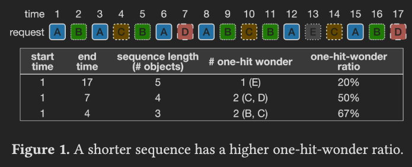
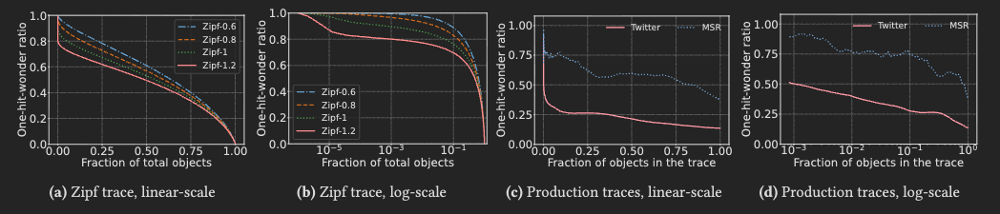
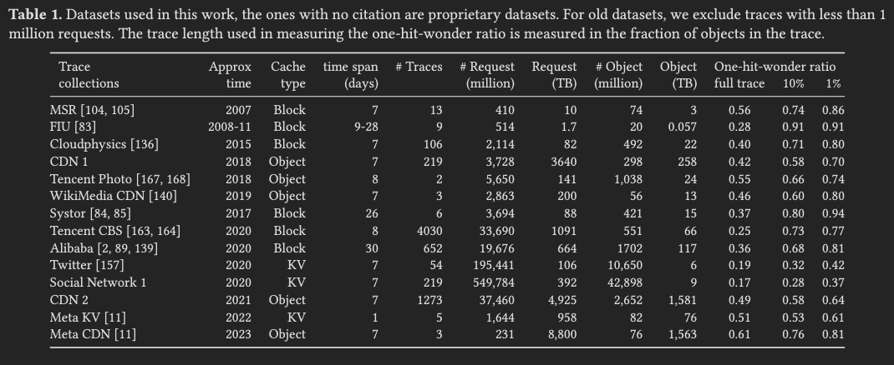
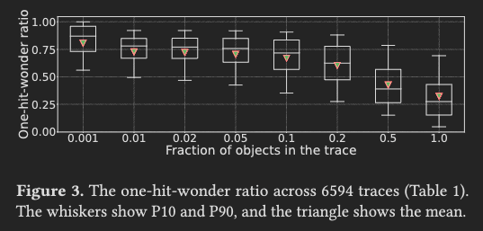
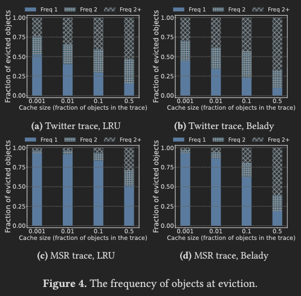
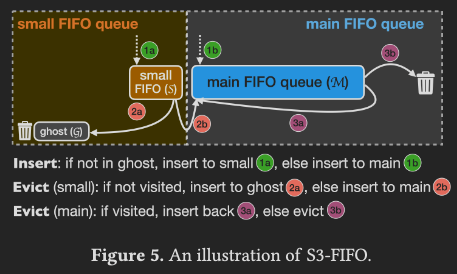

<InfoBox>
**Original Title: FIFO Queues are All You Need for Cache Eviction**

Juncheng Yang, Yazhuo Zhang, Ziyue Qiu, Yao Yue, K. V. Rashmi. 2023. FIFO Queues are All You Need for Cache Eviction. In ACM SIGOPS 29th Symposium on Operating Systems Principles (SOSP ’23), October 23–26, 2023, Koblenz, Germany. ACM, New York, NY, USA, 20 pages. https://doi.org/10.1145/3600006.3613147
</InfoBox>

<InfoBox>
**CCS Concepts**\
Information systems $\rightarrow$ Information storage systems\
Computer systems organization
</InfoBox>


## Abstract

As a cache eviction algorithm, FIFO has a lot of attractive properties, such as simplicity, speed, scalability, and flash-friendliness. The most prominent criticism of FIFO is its low efficiency (high miss ratio). In this work, we demonstrate a simple, scalable FIFO-based algorithm with three static queues (S3-FIFO). Evaluated on 6594 cache traces from 14 datasets, we show that S3-FIFO has lower miss ratios than state-of-the-art algorithms across traces. Moreover, S3-FIFO’s efficiency is robust — it has the lowest mean miss ratio on 10 of the 14 datasets. FIFO queues enable S3-FIFO to <Mark>achieve good scalability</Mark> with 6× higher throughput <Mark>compared to optimized LRU</Mark> at <Mark>16 threads</Mark>.

<Note>
S3-FIFO 的強項是在 parallelism environment。\
LRU 在 cache hit 時要把 item promote 到 list head，如果有多個 threads 共用同一個 cache，那必須要加一個 lock 保證 promotion 操作是 atomic 的。\
因此 LRU 的 scalability 很差，然而 S3-FIFO 在 cache hit 時不會有 lock contention 的問題。
</Note>

Our insight is that most objects in skewed workloads will only be accessed once in a short window, so it is critical to evict them early (also called quick demotion). The key of S3-FIFO is <Mark>a small FIFO queue that filters out most objects from entering the main cache</Mark>, which provides a guaranteed demotion speed and high demotion precision.


<InfoBox style="success">
S3-FIFO 適合的情境
1. cache-relevant window 內有明顯的 hot objects 跟 cold objects。
2. Multicore 或是 Multithread。
4. Cache size 可以足夠大，至少是 $10\%$ distinct objects 個數。
</InfoBox>

<InfoBox style="danger">
S3-FIFO 不適合的情境
1. Request pattern 大概長這樣：`A B C D E F G H ... A B C D E F G H ...`，reuse distance 超出 small queue 能觀察的範圍。
2. Cache Size 無法足夠大的環境。
3. Workload 的 reuse distance 很均勻，沒有很明顯的 hot/cold objects。
4. 極端的 workload 環境下，可能需要 S3-FIFO-d 動態調整 small queue 跟 main queue 的大小。
</InfoBox>


## 1 Introduction

Software caches, such as Memcached and Linux page cache, are widely deployed today to speed up data access and avoid repeated computation. A cache should be:

1. efficient: it should provide a low miss ratio allowing most requests to be fulfilled by the cache with short latencies.
2. performant: serving data from the cache should perform minimal operations with a high throughput; and
3. scalable: the number of cache hits it can serve per second grows with the number of CPU cores.


The heart of a cache is the eviction algorithm, which dictates a cache’s efficiency, throughput, and scalability. Many works have looked into the design of efficient eviction algorithms.  Because LRU is believed to be more efficient than FIFO, these advanced algorithms are often LRU-based, using different techniques and metrics on top of one or more LRU queues.  However, LRU suffers from two problems:

1. It requires two pointers per object, which is a significant storage overhead for workloads consisting of small objects.
    <Note>
    Doubly-linked list 的每個節點需要記錄 `node* prev` 跟 `node* next`。
    </Note>

2. It is not scalable because each cache hit requires promoting the requested object to the head of the queue guarded by locking.
    <Note>
    如果 Thread 1 要 promote object A、Thread 2 要 promote object B，那兩個人都要競爭同一把鎖，不能平行處理。
    </Note>


With the shrinking latency between the cache and the backend, and the rapid growth of CPU cores per socket, the cache’s throughput and scalability become critical. An increasing number of works have studied this in the past few years. The solution is often to trade efficiency for throughput and scalability by using simple FIFO-queue-based eviction algorithms. For example, MemC3, Tricache use CLOCK, and Segcache uses FIFO-merge.

Compared to LRU, FIFO is simpler and more scalable, with the drawback of it being <Mark>less efficient</Mark>.
<Note>
Recall: 這裡的 less efficient 指的是 cache miss rate 比 LRU 高。
</Note>

This work explores the opportunity of building a simple, scalable, yet efficient eviction algorithm with only FIFO queues. <Mark>Object popularity in the cache workloads is often skewed and follows Power-law (e.g., Zipf) distribution.</Mark> Our insight is that for any Zipf request sequence, the fraction of objects appearing once (called <Mark>one-hit wonders</Mark>) is much higher in a sub-sequence than in the full trace.

<Mark>Because a cache of size $C$ only observes a short sequence of $C$ objects before evictions, most objects will be one-hit wonders (no request after insertion) when evicted</Mark>, even though they may have more requests throughout the full trace.
<Note>
這句話的意思是在講會有這樣的 object：
```
requests: A ...... A ...... A ...... A
          |-- >C --|-- >C --|-- >C --|
```
</Note>

We confirm this observation on 6594 production traces.  The median one-hit-wonder ratio of all traces, when considering the entire trace, is 26%. <Mark>However, when focusing on sequences that comprise 10% of the unique objects in each trace, the median one-hit-wonder ratio skyrockets to 72%.</Mark>
<Note>
如果只看完整的 requests trace，那麼確實有很少東西是「真的只出現 1 次」。然而針對特定的區間來看，待在 cache 內的 one-hit object 比例會多非常多。

也就是說 Full-trace popularity 會高估某些 object 對 cache 的短期價值。\
對 cache 來說，重點不是某 object 在整份 trace 裡會不會再出現，而是它在被 evict 之前會不會再出現。如果 1 個 object 相隔很長時間才 resue 那麼這個 object 就不該佔用 cache。
</Note>

We leverage this workload property and design S3-FIFO, a simple, scalable eviction algorithm with three static (fixed-size) FIFO queues. S3-FIFO uses a small probationary FIFO queue to filter out one-hit wonders from entering the main FIFO queue so that cache space can be used for more valuable objects (called early eviction or quick demotion). 
- Objects evicted from the small FIFO queue either enter the main or ghost FIFO queue, depending on whether it has been accessed.
- The main FIFO queue reinserts some popular objects during evictions.

Many previous works have explored similar ideas to quickly demote some objects, especially for <Mark>scan and streaming workload patterns</Mark> and in hierarchical caches.
<Note>
Scan 是指掃過一大段資料。例如 sequentially 掃描一整個檔案、掃描整個檔案系統 (備份、security scan)、資料庫掃描整個表。
</Note>
<Note>
Streaming 是指資料像水一樣進入、流出，但流出去之後通常就不再需要了。例如 audio/video streaming 需要連續處理網路封包、或是一直讀新的 log。
</Note>
<Note>
如果使用 LRU，那麼 Scan 跟 Streaming 這兩種 pattern 都會把原本該留在 cache 的 hot objects 踢掉，污染 cache。
</Note>


However, to the best of our knowledge, this is the first work demonstrating the importance of quick demotion for cache workloads even when there are no scan and streaming patterns. Moreover, this work designs the first FIFO-queue-only algorithm that is more efficient than state-of-the-art algorithms. S3-FIFO is not only simple but also efficient.

- We compare S3-FIFO with 12 eviction algorithms on a large data collection of 6594 production traces from 14 sources.
- The traces overall contain 856 billion requests collected between 2007 and 2023.
- The traces cover block, key-value, and object caches.

While advanced algorithms may excel at a few particular workloads, our evaluation shows that S3-FIFO achieves better efficiency (lower miss ratios) across traces at all percentiles than state-of-the-art algorithms. Moreover, S3-FIFO’s efficiency is robust. Using <Mark>a cache size of 10% of objects</Mark> in the trace, S3-FIFO is the most efficient algorithm on <Mark>10 out of the 14 datasets</Mark> and <Mark>among the top three most efficient algorithms on 13 datasets</Mark>. As a comparison, the next best algorithm (LIRS) obtains the highest efficiency on only 2 datasets. S3-FIFO is also more scalable because <Mark>FIFO queues enable lock-free implementations</Mark>.

We implemented a prototype in Cachelib and show that S3-FIFO achieves <Mark>more than 6× higher throughput than the highly-optimized LRU implementation on 16 cores.</Mark> Compared to advanced eviction algorithms such as 2Q and TinyLFU, the throughput gap is further enlarged. The fact that filtering objects with a small FIFO queue enables better than state-of-the-art efficiency has an implication for flash cache deployments. If the small FIFO queue is in DRAM and the main FIFO queue is on flash, <Mark>then most objects evicted from DRAM do not need to be written to the flash</Mark>. This <Mark>reduces both flash writes and miss ratio</Mark>. We compare this FIFO filter with a probabilistic filter and a machine-learning-model-based filter from Flashield. The FIFO filter has the lowest miss ratio and the least flash writes evaluated on two open-source CDN traces. Moreover, in contrast to the ML model that requires a large DRAM cache (10% of total cache size) to track object access information for making good decisions, the small FIFO filter excels even when the DRAM cache is only 0.1% of the total cache size.

This work makes the following contributions.
-  We show that for cache workloads with skewed popularity, most objects are one-hit wonders at eviction. Therefore, <Mark>quick demotion</Mark> is critical for cache efficiency.
- Leveraging this observation, we designed and implemented S3-FIFO, the first FIFO-queue-only eviction algorithm with better than state-of-the-art efficiency.
- We evaluated S3-FIFO and compared with 12 state-of-the-art eviction algorithms on 6594 traces and show that S3-FIFO is more efficient, and its efficiency is also more robust.
- Our prototype in Cachelib shows that FIFO queues enable S3-FIFO to be scalable with 6× higher throughput than an optimized LRU implementation.

## 2 Background

Software caches are ubiquitously deployed today, e.g., inside end-user devices, at the edge of the Internet, and across system stacks in a data center. While the data stored in different types of caches have different names, e.g., block, page, object, and asset, we use the term “objects” for ease of discussion.

### 2.1 Metrics of a cache

The heart of a cache is the eviction algorithm, which decides the objects to store in the limited space.
- **Efficiency:** A more efficient (sometimes called more “effective”) eviction algorithm retains more useful objects in the cache and provides a lower miss ratio, which measures the fraction of requests that must be fetched from the backend. While request miss ratio is the most common efficiency metric, <Mark>some cache deployments aiming to reduce bandwidth usage</Mark>, e.g., proxy caches, also evaluate <Mark>byte miss ratio</Mark>: the fraction of bytes that need to be fetched from the origin.
    <Note>
    有些 cache 不一定都像 Linux 的 page cache 一樣每個 object 都一樣大。事實上，有非常多系統的 cache 都是 variable cache size，例如 CDN cache、KV cache (e.g. Redis)。
    </Note>
- **Throughput:** A cache’s throughput measures <Mark>the number of requests it can serve per second (QPS)</Mark>. Having higher throughput reduces the number of CPU cores required to serve a workload.
- **Scalability:** Modern CPUs have a large number of cores. For example, AMD EPYC 9654P has 192 cores. A cache’s scalability measures how its throughput increases with the number of CPU cores. Ideally, a cache’s throughput would scale linearly with the number of CPU cores. However, <Mark>in many eviction algorithms, read operations necessitate meta-data updates under locking</Mark>. Therefore, they cannot fully harness the computation power of modern CPUs.
    <Note>
    Recall Amdahl's Law: $S = 1 / ((1 - p) + p / n)$
    </Note>
- **Flash writes:** While DRAM is the most commonly used storage medium for caching, many systems today also use flash for its higher density, lower price, and lower power consumption. Flash lifetime becomes a critical metric when using flash for caching because flash only supports a limited number of writes. Moreover, small random writes on flash cause device-level write amplification, which not only reduces the flash lifetime but also increases read and write tail latency. To achieve a more manageable flash lifetime, most production flash cache systems, e.g., Apache Trafficserver, Memcached Extstore, Cachelib large object cache, and Google Colossus flash cache, use FIFO or FIFO-reinsertion.  Besides the flash eviction algorithm, many systems also employ <Mark>admission algorithms</Mark>, e.g., bloom filter or machine-learning-based algorithms, to select “good” data to write to flash.
    <Note>admission algorithms: 判斷一個 object 值不值得進入 cache 的演算法。</Note>
- **Simplicity and generality:** A cache eviction algorithm’s complexity and generality are two additional factors that play a critical role in its adoption. While complexity is often inversely correlated with throughput and scalability, a simple design can offer benefits beyond just improved performance metrics, such as fewer bugs and reduced maintenance overhead. Linux Kernel developers stated that “Predicting which pages will be accessed in the near future is a tricky task. The kernel not only often gets it wrong, but it also wastes a lot of CPU time to make the incorrect choice”. Generality is crucial for similar reasons. If the same data structure and eviction algorithm can be used for different types of caches, it can help reduce the development and maintenance overheads. A similar argument can also be found in previous work from Meta.

<Note>
好的 cache eviction algorithm 的標準：
- Efficiency: Request Miss Ratio / Byte Miss Ratio (If object sizes vary.)
- Throughput: QPS
- Scalability: Multicore / Multithread 下能不能表現更好
- Flash Writes
- Simplicity
- Generalizability
</Note>


### 2.2 Prevalence of LRU-based cache

Cache workloads exhibit <Mark>temporal locality</Mark>: recently accessed data are more likely to be re-accessed. Therefore, Least-Recently-Used (LRU) is more efficient than FIFO and is widely used in DRAM caches. Moreover, advanced eviction algorithms designed to improve efficiency are mostly built upon LRU. For example, ARC, SLRU, 2Q, EELRU, LIRS, TinyLFU, LeCaR, and CACHEUS all use one or more LRU queues to order objects. Albeit efficient, LRU and LRU-based algorithms have three problems:
1. LRU is often implemented using a doubly-linked list, requiring 2 pointers per object, which becomes a large overhead when the object is small.
    - As a result, Twitter and Meta have designed specialized compact caches for workloads having small objects.
2. LRU promotes objects to the head of the queue (called promotion) upon each cache hit, which performs <Mark>at least 6 random memory accesse</Mark>s protected by a lock, significantly limiting the cache’s scalability.
    <Note>
    ```c
    // these operations need to be atomic
    prev->next = next;        // write prev node
    next->prev = prev;        // write next node
    node->prev = NULL;        // write node
    node->next = list->head;  // write node
    list->head->prev = node;  // write old head node
    list->head = node;        // write list metadata
    ```
    </Note>
    For example, the RocksDB developers “confess” that the LRU caches in RocksDB are the scalability bottleneck. Therefore, a new cache using CLOCK eviction has been implemented to address this problem in 2022.
3. LRU is not flash-friendly. The <Mark>object eviction order in LRU is different from the insertion order</Mark>, which leads to <Mark>random writes</Mark> on flash, and reduces flash lifetime.

## 3 Motivation

While the last few decades of eviction algorithm study are centered around LRU, we believe modern eviction algorithms should be designed with FIFO queues instead of LRU queues. FIFO can be implemented using a <Mark>ring buffer</Mark> without per-object pointer metadata, and it does not promote an object upon each cache hit, thus removing the scalability bottleneck.
<Note>
Ring Buffer:
    ```c
    insert D, E, F, G, H

    index:   0   1   2   3   4   5   6   7
        +---+---+---+---+---+---+---+---+
    buf: |   | B | C | D | E | F | G | H |
        +---+---+---+---+---+---+---+---+
                ^                            ^
                |                            |
                tail                         head -> wrap to 0
    ```
</Note>

However, FIFO falls behind LRU and state-of-the-art eviction algorithms in efficiency. What does FIFO need? <Mark>The primary limitation of FIFO is its inability to retain frequently accessed objects</Mark>, so the most straightforward improvement is to insert these objects back. <Mark>FIFO-Reinsertion</Mark> is an algorithm that keeps track of object access and reinserts accessed objects during eviction.
<Note>
當 FIFO-Reinsertion 要 evict 一個 object A 時：
- 如果 `A.visited == 1` $\Rightarrow$ 代表 A 在這輪 queue 內真的有被用到過，所以把 A 重新推到 queue 內（等於是再給 A 一次機會），並且清空 `A.visited`。
- 如果 `A.visited == 0` $\Rightarrow$ 踢掉 A。
```c
void on_cache_hit(Node *x) {
    if (atomic_read(&x->visited) == 0) {
        atomic_set(&x->visited, 1);
    }
}
```
</Note>

Compared to LRU, FIFO-Reinsertion incurs a lower overhead on a cache hit, requiring no operation or just an atomic set for the first request to an object. However, reinsertion alone is insufficient, and FIFO-Reinsertion still lags behind state-of-the-art eviction algorithms on efficiency (§5.2). 

<InfoBox style="warning">
Our insight: a cache experiences more one-hit wonders (objects having no access after insertion) than what common full trace analyses suggested.
</InfoBox>

This highlights the importance of swiftly removing most new objects. Specifically, we observe a median one-hit-wonder ratio of 26% across 6594 production traces. However, for a random request sequence containing 10% of unique objects in the trace, 72% of the objects have only one request in the sequence.

### 3.1 More one-hit wonders than expected

The term “one-hit-wonder ratio” measures the fraction of objects that are requested only once in a trace. It is commonly used in content delivery networks (CDNs) due to large one-hit-wonder ratios. Although the one-hit-wonder ratio varies between different types of cache workloads, we find that shorter request sequences (consisting of fewer unique objects) often have higher one-hit-wonder ratios. In the subsequent analysis, we measure sequence length using the number of unique objects.

Fig. 1 illustrates this observation using a toy example.



The request sequence comprises 17 requests for 5 objects, out of which one object (E) is accessed once. Thus, the one-hit-wonder ratio for the sequence is 20%. Considering a shorter sequence from the $1st$ to the $7th$ request, two (C, D) of the four unique objects are requested only once, which leads to a one-hit-wonder ratio of 50%. Similarly, the one-hit-wonder ratio of a shorter sequence from the $1st$ to the $4th$ request is 67%. More formally, we make the following observation.

<InfoBox style="warning">
**Observation.** Assume that the object popularity of a request sequence follows the Zipf distribution with the least popular object having 1 request, and there are $M$ unique objects in total.  Then the one-hit-wonder ratio of the complete sequence is $\frac{1}{M}$.

<Note>
Zipf distribution: 對於第 $r$ 熱門的 object，被 request 次數 $\propto \frac{1}{r^\alpha}$
</Note>

For any sub-sequence ending with a one-hit wonder, if the sub-sequence contains $C$ unique objects, the expected one-hit-wonder ratio $F(x=C)$ monotonically decreases with the sequence length $x$ measured in the number of objects.

<Note>
$C \uparrow \ \Rightarrow \ F(C) \downarrow$
</Note>
<Note>
這篇論文的 sub-sequence 指的是一個連續的 observation window，不是演算法課的那種非連續的 subsequence。\
以及隨後提到的計算 $F(C)$ 的方式不是把所有滿足條件的區間抓出來算平均 one-hit-wonder ratio，而是隨機取樣 100 次後取平均。
</Note>
</InfoBox>

The intuition is that most objects are unpopular (rank higher than $C+1$ in Zipf distribution for a cache of size $C$) and have an expected number of requests between 0 and 1. If they show up in the sub-sequence, it is very likely that they will not get another request within the sub-sequence.

This setting can be viewed as a variant of the couponcollector problem where we have $M$ unique coupons in total, and the probability of collecting coupon $i$ follows the Zipf distribution. We would like to know the number of coupons we have collected only once when we have $C$ unique coupons.

We use Monte Carlo simulations to find how $F(x)$ changes with the sequence length $x$ (measured in the number of objects).
- We first generate Zipf request traces of different skewness $\alpha$ under independent reference model.
- We then take random sub-sequences and measure the one-hit-wonder ratios.
- We repeat 100 times and report the mean.
<Note>
    ```c
    for alpha in [0.6, 0.8, 1.0, 1.2]:
        trace = generate_Zipf_request_trace(alpha)
        M = number_of_unique_objects(trace)

        for x from 1 to M:  // conceptual; actual implementation may sample grid points
            frac_object = x / M
            ratios = []

            repeat 100 times:
                choose a random starting point l
                extend r until trace[l:r] contains x unique objects
                ratio = number_of_one_hit_wonders(trace[l:r]) / x
                ratios.append(ratio)

            F_alpha(frac_object) = mean(ratios)
    ```
</Note>

The results are plotted in Fig. 2a and Fig. 2b.


<Reference>
Figure 2. Left two: the one-hit-wonder ratio decreases with sequence length (as a fraction of the unique objects in the full sequence) for
synthetic Zipf traces. Different curves show different skewness 𝛼. We plot both linear and log-scale X-axis for ease of reading. Right two:
production traces show similar observations. Note that the X-axis shows the fraction of objects in the trace, much smaller than the number
of possible objects in the backend. Therefore, the production curves capture the left region of the Zipf curves.
</Reference>

We show both linear and log-scale X axes for clarity. The one-hit-wonder ratio decreases with increasing sequence length. Between different curves, <Mark>more skewed workloads exhibit lower one-hit-wonder ratios</Mark> at the same sequence length because <Mark>unpopular objects have a lower probability of appearing in more skewed workloads</Mark>.

We have also performed the same measurement on production traces. Fig. 2c and Fig. 2d show a block trace (MSR hm_0) and a web trace from Twitter (cluster 52). The curves look different from the Zipf curves at first glance. This is because the production traces are not long enough to capture all objects in the backend systems, and it is not possible to know the total number of objects that can be requested. As a result, the X-axis shows the fraction of objects in the trace. Therefore, <Mark>the production curves only capture the left region of the synthetic curves</Mark>, and we observe that they match the synthetic curves. For example, when comparing Fig. 2a and Fig. 2c, we see curves in both figures have <Mark>steep drops at the beginning</Mark> before slowing down. Moreover, the <Mark>Twitter trace is known to be more skewed</Mark>, and it shows a larger drop than the MSR trace, which matches the observation on the Zipf traces. Compared to the one-hit -wonder ratio of the full trace at 13% (Twitter) and 38% (MSR), a random subsequence containing 10% objects shows a one-hit-wonder ratio of 26% on the Twitter trace and 75% on the MSR trace. <Mark>The increase is more significant when the sequence length is further reduced</Mark>.


We further evaluated 6594 production traces (more details in Table 1). 



Fig. 3 shows the one-hit-wonder ratios of all traces at different sequence lengths.




Compared to the <Mark color="red">full traces</Mark> with a median one-hit-wonder ratio of <Mark color="red">26%</Mark>, sequences containing <Mark color="yellow">50%</Mark> of the objects in the trace show a median one-hit-wonder ratio of <Mark color="yellow">38%</Mark>. Moreover, sequences with <Mark color="green">10%</Mark> and <Mark color="blue">1%</Mark> of the objects exhibit one-hit-wonder ratios of <Mark color="green">72%</Mark> and <Mark color="blue">78%</Mark>, respectively. 

Because <Mark>the cache size is always much smaller than the trace footprint (the number of objects in the trace)</Mark>, evictions start after encountering a short sequence of requests. This observation suggests that <Mark>if the cache size is set as 10% or 1% of the trace footprint, approximately 72% and 78% of the objects would not be reused before eviction.</Mark> We further corroborate the observation with cache simulations. Fig. 4 shows the distribution of object frequency at eviction.



Our trace analysis (Fig. 2d) shows that the Twitter trace has a 26% one-hit-wonder ratio for sequences of 10% trace length. The simulation shows a similar result: 26% and 24% of the objects evicted by LRU and Belady are not requested after insertion at a cache size of 10% of the trace footprint. Similarly, the MSR trace exhibits a higher one-hit-wonder ratio of 75% for sequences of 10% trace length (Fig. 2d), and Fig. 4 shows that 82% and 68% of the objects evicted by LRU and Belady have no reuse. This suggests that these one-hit wonders are often good eviction candidates, and one may not need highly sophisticated eviction algorithms.

### 3.2 The need for quick demotion

Based on the observation, a cache should filter out these one-hit wonders because they occupy space without providing benefits. It is a common practice to employ Bloom Filters to <Mark>reject one-hit wonders from entering the cache in CDNs</Mark>. However, <Mark color="red">a Bloom Filter rejects objects too fast with a lack of precision</Mark> since it rejects all objects that have not been seen before. It causes the second requests to all objects to be cache misses, which often leads to mediocre efficiency (§5.2).

<Mark>Filtering out one-hit wonders</Mark> bears some resemblance to <Mark>designing scan-resistant cache eviction algorithms</Mark>, as objects requested during a scan are often one-hit wonders. Researchers have developed a variety of algorithms for storage workloads that can avoid cache pollution and <Mark>thrashing</Mark> caused by scanning requests, e.g., ARC, LRU-K, 2Q, EELRU, LIRS, LeCaR, CACHEUS, and LHD. However, existing algorithms cannot guarantee the minimum and maximum time one-hit wonders stay in the cache before being removed. We find these algorithms sometimes evict too fast or too slowly, and their complexities make it difficult to reason about the behavior (§6.1).

This raises the question: can we simply use a small probationary FIFO queue to guarantee that one-hit wonders are removed after a fixed number of objects are inserted?

## 4 Design and implementation

As mentioned in §2.1, a cache eviction algorithm needs to be simple and scalable besides being efficient. This section presents S3-FIFO, a simple and scalable eviction algorithm that consists of only static FIFO queues. We start by defining the LRU queue and FIFO queue. An LRU queue updates object ordering during cache hits by promoting the requested object to the head of the queue. A FIFO queue does not update ordering during cache hits, and objects are evicted in the insertion order. However, evicted objects may be reinserted into the queue to preserve hot objects. As mentioned in §2.2, most eviction algorithms are built with LRU queue, and only a few algorithms, e.g., FIFO-Reinsertion, use FIFO queue because conventional wisdom suggests LRU queue can provide a lower miss ratio.

### 4.1 S3-FIFO design

<Mark>S3-FIFO uses three FIFO queues: a small FIFO queue (S), a main FIFO queue (M), and a ghost FIFO queue (G).</Mark>
- We choose <Mark>S to use 10% of the cache space</Mark> based on experiments with 10 traces and find that 10% generalizes well.
- M then uses 90% of the cache space.
- The ghost queue G stores the same number of ghost entries (no data) as M.

<InfoBox style="info">
**Cache read**

- S3-FIFO uses two bits per object to track object access status similar to a capped counter with frequency up to 3.
- Cache hits in S3-FIFO atomically increment the counter by one. Note that most requests for popular objects require no update.
</InfoBox>

<InfoBox style="info">
**Cache write.**

- New objects are inserted into S if not in G.  Otherwise, it is inserted into M.
- When S is full, the object at the tail is either moved to M if it is accessed more than once or G if not. And its access bits are cleared during the move.
- When G is full, it evicts objects in FIFO order.
- M uses an algorithm similar to FIFO-Reinsertion but tracks access information using two bits. Objects that have been accessed at least once are reinserted with one bit set to 0 (similar to decreasing frequency by 1).
</InfoBox>

We illustrate the algorithm in Fig. 5 and the pseudo-code in Algo. 1.

#### Algorithm 1: S3-FIFO algorithm



```c
Input: requested object x; small FIFO queue S; main FIFO queue M; ghost FIFO queue G

function read(x)
    if x in S or x in M then          // Cache hit
        x.freq <- min(x.freq + 1, 3)  // Frequency is capped to 3
    else                              // Cache miss
        insert(x)
        x.freq <- 0

function insert(x)
    while cache is full do
        evict()
    if x in G then
        insert x to head of M
    else
        insert x to head of S

function evict()
    if S.size >= 0.1 * cache size then
        evictS()
    else
        evictM()

function evictS()
    // 一直 pop 直到 pop 到沒有價值 (freq <= 1)、
    // 該踢走的 object
    evicted <- false
    while not evicted and S.size > 0 do
        t <- tail of S
        if t.freq > 1 then
            insert t to M
            if M is full then
                evictM()
        else
            insert t to G
            evicted <- true
        remove t from S

function evictM()
    evicted <- false
    while not evicted and M.size > 0 do
        t <- tail of M
        if t.freq > 0 then
            insert t to head of M
            // FIFO-reinsertion
            t.freq <- t.freq - 1
        else
            remove t from M
            evicted <- true
```

<Note>
能進到 M 的條件只有兩種：
1. 在 S 裡面 freq >= 2 並且走到了 tail，這時如果 evictS() 那它就會被升級。
2. 曾經被 S 踢走，且被踢走的間隔足夠短（至少仍然存在 G 的記錄內），那麼再回來時就判定為之前是 too-early demotion，這很有可能是 hot object，所以直接走綠色通道進 M。

當然如果是 `M tail` $\rightarrow$ `M head`，則是收回一道免死金牌並給一次機會。
</Note>

<Note>
G 主要是記錄從 S 被 early-evict 掉的 objects，如果一個 object 被 M 踢走的話不會被記錄在 G。\
G 的目的只是為了補救 S 的 quick demotion。
</Note>


**Handling different access patterns.** One important pattern we identified in §3.1 is the large one-hit-wonder ratio a cache experiences due to the limited cache space. The small FIFO queue S can quickly evict these one-hit wonders so they do not occupy the cache for a long time. This allows S3-FIFO to save the precious cache space for more valuable objects. Besides one-hit wonders caused by unpopular objects in skewed cache workloads, many block cache workloads have scan and loop access patterns. Like one-hit wonders, <Mark>blocks accessed during scans are quickly removed to avoid cache pollution and thrashing</Mark>.

However, blocks not part of a scan but <Mark>mixed in the scan are also moved to G</Mark> in this process. Nevertheless, when these “good” blocks are requested again in the near future, they will be inserted into M and stay for a longer time.

### 4.2 Implementation

The FIFO queues can be implemented either using linked lists or ring buffers.

Linked-list-based implementation can be added to existing LRU-based caches more easily. However, it has three drawbacks.
1. It uses two pointers per object. On workloads with tiny objects, this poses a huge storage overhead.
2. Traversing through the queue requires random memory accesses.
3. Eviction and insertion in linked-list-based implementation require expensive atomic operations: compare-and-set, which reduces the scalability.

In contrast, a ring-buffer-based implementation has less overhead and is more scalable but may not be compatible with existing LRU-based caching systems.  When using a ring buffer to implement S3-FIFO, the ring buffer maintains the FIFO order, with each slot storing the object or a pointer.  Eviction requires bumping the tail pointer in the ring buffer. Although more scalable with lower storage overhead, a ring-buffer-based implementation <Mark color="red">wastes space when the workload contains many deletion operations</Mark> because the space of deleted objects cannot be reused until eviction.

Although S3-FIFO has three logical FIFO queues, it can also be implemented with one or two FIFO queue(s). Because objects evicted from S may enter M, they can be implemented using one queue with a pointer at the 10% mark. However, <Mark color="red">combining S and M reduces scalability</Mark> because <Mark color="red">removing objects from the middle of the queue requires locking</Mark>.

The ghost FIFO queue G can be implemented as part of the indexing structure. For example, we can store object fingerprint and insertion time of ghost entries in a <Mark>bucketbased hash table</Mark>.
- Fingerprint: A 4-byte hash of the object ID.
- Insertion time: A virtual timestamp, counting the number of objects inserted into G thus far.

Let $S_G$ denote the size of the ghost queue. If the current time is $N$(i.e., there were $N$ insertions into G), then all the entries whose timestamp is $\leq N - S_G$ are no longer in G.

<Note>
假設 `G.capacity = 4`，以下是依序的 insert：
```text
A at time 1
B at time 2
C at time 3
D at time 4
E at time 5
```
當 `E` insert 時，`A.time <= 5 - 4 == 1`，`A` 自動過期。
</Note>

A ghost entry is removed from the hash table when the object is requested or during hash collision — when the slot is needed to store another entry.


### 4.3 Overhead analysis

**Computation.** S3-FIFO performs an atomic write upon the first and second request to an object without locking. There is no operation after the second request. Because most requests are for popular objects (more than two requests), S3-FIFO thus performs negligible metadata updates on cache hits.

Cache miss requires evicting an object from S or M.
- Evicting from S requires inserting the tail object into M or G. 
- Evicting from M may involve reinserting the tail object back to M.

However, if an object is not accessed, it requires no reinsertion. Therefore, the number of reinsertions is much smaller than the cache hits in practice. Moreover, removing the tail object and inserting an object to the head of a queue can be implemented lock-free using atomic operations.

**Storage.** The ghost queue G stores the same number of objects (without data) as the main queue. Assuming the mean object size is 4 KB, and an object id uses 4 bytes, then G uses 0.09% of the cache size. Each cached object uses two bits to track access, consuming less than 0.01% of the cache size. Moreover, the two bits can often be piggybacked on unused bits in object metadata. If the FIFO queues are implemented using ring buffers, S3-FIFO can remove the two LRU pointers, saving 16 bytes per object or 0.4% of the cache size.


## 5 Evaluation

In this section, we evaluate S3-FIFO to answer the following questions. • How does S3-FIFO’s efficiency compare with the state-of-the-art eviction algorithms? • Is S3-FIFO more scalable compared to state-of-the-art? • Can lessons learned from S3-FIFO help flash cache design?

### 5.1 Evaluation setup

**Traces.** We evaluated S3-FIFO using a large collection of 6594 production traces from 14 datasets, including 11 open-source and 3 proprietary datasets. These traces span from 2007 to 2023 and cover key-value, block, and object CDN caches. In total, the datasets contain 856 billion requests to 61 billion objects, 21,088 TB traffic for total 3,753 TB of data. Because many large-scale distributed caching systems are multi-tenanted and the traces represent workloads served by more than one server, we split four datasets (CDN 1, CDN 2, Tencent CBS, and Alibaba) with tenant information into per-tenant traces for an in-depth study of the workloads. More details of the datasets can be found in Table 1.

**Simulator.** We implemented S3-FIFO and the state-of-the-art eviction algorithms (described in §5.2) in libCacheSim. We referenced and verified the results with multiple open-source simulator implementations. For all state-of-the-art algorithms, we used the parameters described in the original papers. LibCacheSim is designed and tuned for high-throughput cache simulations and can process up to 20 million requests on a single CPU core. We have also implemented a distributed fault-tolerant computation platform that allows us to run thousands of simulations in parallel. The platform’s design does not affect simulation accuracy and is out of the scope of this work. We describe it in a separate blog post. This distributed computation platform and the Cloudlab testbed enable us to evaluate different algorithms and cache sizes on our large datasets (Table 1). The simulation processed the datasets in close to 100 passes using different algorithms, cache sizes, and parameters. We estimated that over 80,000 billion requests were processed using a million CPU-core hours. Unless otherwise mentioned, we ignore object size in the simulator because <Mark>most production systems use slab storage for memory management, for which evictions are performed within the same slab class (objects of similar sizes)</Mark>. However, we remark that <Mark>supporting object size is non-trivial for systems that do not use slab-based memory management</Mark>. Moreover, we do not consider the metadata size in different algorithms, although S3-FIFO often requires fewer metadata than other algorithms. We evaluated the algorithms at multi-ple different cache sizes, and we present one large size using 10% of the trace footprint (number of objects in the trace) and one small size at 0.1% of the trace footprint. At 0.1% trace footprint, the cache size may be too small for some traces, so we ignore a trace if the cache size is smaller than 1000 objects.

For byte miss ratio evaluation, we considered object size and used the trace footprint in bytes instead of objects. Because the large number of traces used in the evaluation have a very wide range of miss ratios, we choose to present the miss ratio reduction compared to FIFO: $\frac{MR_{fifo} - MR_{algo}}{MR_{fifo}}$ where $MR$ stands for miss ratio. If an algorithm has a miss ratio higher than FIFO, we calculate FIFO’s miss ratio reduction compared to the algorithm and take the negative value: $- \frac{MR_{algo} - MR_{fifo}}{MR_{algo}}$, which bounds the value between -1 and 1. This avoids the impact of outliers on the mean value.

**Prototype.** We have implemented S3-FIFO in Cache-lib.
- Cachelib uses slab memory management, which pre-allocates all memory during initialization. 
- Cachelib is highly optimized for LRU-based eviction algorithms.

Its extensive usage of metaprogramming and many LRU-based optimizations (e.g., compressed pointers) <Mark>tightly couple(耦合) different components</Mark>. Therefore, we implemented <Mark>S and M using linked lists</Mark> and <Mark>G using a hash table</Mark>. We implemented a trace replay tool that replays traces in a closed loop for benchmarking. Because the backend often decides the latency and throughput of cache misses, we focus on the cache hit performance and on-demand fill cache misses using pre-generated data object value. We compared <Mark color="green">S3-FIFO</Mark> with three algorithms implemented by Cachelib developers: <Mark color="red">LRU</Mark>, <Mark color="yellow">a variant of 2Q</Mark>, and <Mark color="blue">TinyLFU</Mark>. Cachelib developers have devoted huge efforts to improving the throughput and scalability of the three algorithms with techniques such as:
- lock combining
- delayed LRU promotion
- try-lock-based promotion
- compressed pointers

Besides Cachelib, we also evaluated <Mark>Segcache, the state-of-the-art scalable key-value cache</Mark> using open-source code. Open source. We have open-sourced the code and data with more information at the end of the paper. Evaluation setup. We performed all evaluations on Cloudlab. The simulations used multiple types of nodes from the Clemson site, depending on node availability. The prototype evaluation used c6420 nodes from the Clemson site. We turned off turbo boost, pinned one thread to one core, and used numactl to allocate all memory pages on the same NUMA node.

### 5.2 Efficiency (miss ratio)

**Miss ratio.** The primary criticism of the FIFO-based eviction algorithms is their efficiency, the most important metric for a cache. We compare S3-FIFO with state-of-the-art eviction algorithms designed in the past few decades. The algorithms used in the comparison are either deployed in production or commonly used in other papers. We use all efficiency results from simulation because it allows us to (1) study different types of cache workloads, e.g., block, key-value, and object, (2) focus on and isolate the impact of the eviction algorithm, and (3) requires fewer computation resources to scale up to evaluate the huge datasets. Fig. 6 shows the (request) miss ratio reduction (compared to FIFO) of different algorithms across traces. At the large cache size, S3-FIFO has the largest reductions across almost all percentiles than other algorithms. For example, S3-FIFO reduces miss ratios by more than 32% on 10% of the traces (P90) with a mean of 14% on the large cache size. TinyLFU is the closest competitor. TinyLFU uses a 1% LRU window to filter out unpopular objects and stores most objects in a SLRU cache. TinyLFU’s good performance corroborates our observation that quick demotion is critical for efficiency. However, TinyLFU does not work well for all traces, with miss ratios being lower than FIFO on almost 20% of the traces (the P10 point is below -0.05 and not shown in the figure). This phenomenon is more pronounced when the cache size is small, where TinyLFU is worse than FIFO on close to 50% of the traces. There are two reasons why TinyLFU falls short. First, the 1% window LRU is too small, evicting objects too fast. Therefore, increasing the window size to 10% of the cache size (TinyLFU-0.1) significantly improves the efficiency at the tail (bottom of the figure). However, increasing the window size reduces its improvement on the best-performing traces (Fig. 6a). Second, when the cache is full, TinyLFU compares the least recently used entry from the window LRU and main SLRU, then evicts the less frequently used one. This allows TinyLFU to be more adaptive to different workloads. However, if the tail object in the SLRU happens to have a very high frequency, it may lead to the eviction of an excessive number of new and potentially useful objects.

LIRS uses LRU stack (reuse) distance as the metric to choose eviction candidates. Because one-hit wonders do not have reuse distance, LIRS utilizes a 1% queue to hold them. This small queue performs quick demotion and is the secret source of LIRS’s high efficiency. Similar to TinyLFU, the queue is too small, and it falls short on some cache workloads. However, compared to TinyLFU, fewer traces show higher-than-FIFO miss ratios because the inter-recency metric in LIRS is more robust than the frequency in TinyLFU. In particular, TinyLFU cannot distinguish between many objects with the same low frequency (e.g., 2), but these objects will have different inter-recency values. The downside is that LIRS requires a more complex implementation than TinyLFU. 2Q has the most similar design to S3-FIFO. It uses 25% cache space for a FIFO queue, the rest for an LRU queue, and also has a ghost queue. Besides the difference in queue size and type, objects evicted from the small queue are not inserted into the LRU queue. Having a large probationary queue and not moving accessed objects into the LRU queue are the primary reasons why 2Q is not as good as S3-FIFO. Moreover, the LRU queue does not provide observable benefits compared to the FIFO queue (with reinsertion) in S3-FIFO. SLRU uses four equal-sized LRU queues. Objects are first inserted into the lowest-level LRU queue and promoted to higher-level queues upon cache hits. An inserted object is evicted if not reused in the lowest LRU queue, which performs quick demotion and allows SLRU to show good efficiency. However, unlike other schemes, SLRU does not use a ghost queue, making it not scan-tolerant because popular objects mixed in the scan cannot be distinguished. Therefore, we observe that SLRU performs poorly on many block cache workloads (not shown). ARC uses four LRU queues: two for data and two for ghost entries. The two data queues are used to separate recent and frequent objects. Cache hits on objects in the recency queue promote the objects to the frequency queue. Objects evicted from the two data queues enter the corresponding ghost queue. The sizes of queues are adaptively adjusted based on hits on the ghost queues. When the recency queue is small, newly inserted objects are quickly evicted, enabling ARC’s high efficiency. However, ARC is less efficient than S3-FIFO because the adaptive algorithm is not sufficient. We discuss with more details in §6.2. Recent algorithms, including CACHEUS, LeCaR, LHD, and FIFO-Merge, are also evaluated. However, we find these algorithms are often less competitive than the traditional ones. In particular, FIFO-merge was designed for log-structured storage and key-value cache workloads without scan resistance. Therefore, similar to SLRU, it performs better on web cache workloads but much worse on block cache workloads. Common algorithms, such as B-LRU (Bloom Filter LRU), CLOCK, and LRU, are weaker than the ones discussed.

CLOCK and LRU do not allow quick demotion, so their miss ratio reductions are small. B-LRU rejects all one-hit wonders at the cost of the second request for all objects being cache misses. Because of these misses, B-LRU is worse than LRU in most cases. Because an object’s second request often arrives soon after the first request (temporal locality), the small FIFO queue in S3-FIFO allows these requests to be served as cache hits. Adversarial workloads for S3-FIFO. We studied the limited number of traces on which S3-FIFO performed poorly and identified one pattern. Most objects in these traces are accessed only twice, and the second request falls out of the small FIFO queue S, which causes the second request to these objects to be cache misses. We remark that these workloads are adversarial for most algorithms that partition the cache space, e.g., TinyLFU, LIRS, 2Q, and CACHEUS. Because the partition for newly inserted objects is smaller than the cache size, it is possible that the second request is a cache hit in LRU and FIFO, but not in these advanced algorithms. This request pattern resembles a scan because most objects are not requested very soon after the first request. However, it is not a typical scan because any object may show this pattern, and the objects showing this pattern may not be requested consecutively. In our large datasets, we find that the second request often arrives within one minute in these workloads. Therefore, the second request being a miss is a problem only when the cache size is very small, e.g., 1000s of objects. Moreover, using an adaptive algorithm to adjust the queue size can often mitigate the problem, and we discuss more in §6.2. Miss ratio per dataset. We have shown the results across all 6594 traces. However, the number of traces from each dataset differs, and the result could be affected by the dominating dataset. Fig. 7 shows the mean miss ratio reduction on each dataset using selected algorithms. We observe that S3-FIFO often outperforms all other algorithms by a large margin. Moreover, it is the best algorithm on 10 out of the 14 datasets using a large cache size and 7 out of the datasets using a small cache size. As a comparison, no other algorithm is the best on more than 3 datasets. Besides being the best on most datasets, S3-FIFO is also more robust than other algorithms — S3-FIFO is among the top three most efficient algorithms on 13 of the 14 datasets at the large cache size. As a comparison, TinyLFU and LIRS are among the top algorithms on some datasets, but on other datasets, they are among the worst algorithms. While it is hard to explain why S3-FIFO is more robust, we conjecture that simplicity contributes to its robustness. In conclusion, we find that quick demotion is a key factor for an efficient eviction algorithm. By leveraging this observation, S3-FIFO, a simple algorithm with only FIFO queues, can outperform state-of-the-art. Byte miss ratio. While (request) miss ratio is important for most cache deployments, CDNs also widely use byte

miss ratio to measure bandwidth reduction. We evaluated the same set of eviction algorithms on byte miss ratio. We used the object sizes from each trace and set the cache size to 10% and 0.1% of trace footprint in bytes. The results (not shown due to space limit) are not significantly different from the miss ratio in Fig. 6. Compared to other algorithms, S3-FIFO presents larger byte miss ratio reductions at almost all percentiles. We have also compared S3-FIFO with LRB, a machine-learn-based eviction algorithm designed for CDN cache workloads. We used ten random traces (LRB took too long to run on the full dataset), including the Wikimedia traces used in LRB’s evaluation. We observe that S3-FIFO and LRB have similar efficiency, although S3-FIFO is much simpler than LRB.

### 5.3 Performance (throughput)

S3-FIFO consists of only FIFO queues without locking on either read or write. As a comparison, LRU-based eviction algorithms, such as LRU, 2Q, and TinyLFU, require locking on both cache hits and cache misses. We implemented S3-FIFO in Cachelib to compare the throughput of different algorithms. Because prototype experiments run much longer and cannot be run in parallel, we only evaluated using a synthetic Zipf trace similar to previous work. Moreover, we verified that the miss ratio results from the prototype are consistent with the simulator using a few randomly selected traces. The Zipf workload contains 100·$n_{thread}$ million requests for $n_{thread}$ million 4 KB objects. Fig. 8 shows that

compared to (strict) LRU, the optimized LRU has both higher throughput and better scalability. However, it cannot scale beyond two cores. Compared to LRU, TinyLFU needs to check and update the count-min sketch on cache hits and move objects between the window LRU and the main SLRU on cache misses. Therefore, we observe a lower throughput than LRU due to the extra operations. The optimized 2Q in Cachelib has a similar result (not shown). Compared to LRU-based eviction algorithms, S3-FIFO per-forms fewer operations during cache hits, with a higher throughput on a single thread. Moreover, the lock-free implementation enables the throughput to scale with the number of CPU cores. Under both small and large cache sizes, S3-FIFO runs more than 6× faster than the optimized LRU in Cachelib with 16 threads. Segcache is the state-of-the-art key-value cache using log-structured storage with the FIFO-Merge eviction algorithm. It uses macro management and FIFO-based eviction to achieve close-to-linear scalability. The macro management enables Segcache to perform much less synchronization — Segcache needs atomic updates only when a segment-chain is changed, which is 100-1000× less frequent than cache misses. However, Segcache is slower than S3-FIFO on a single thread because the merge-based eviction needs to copy data. Moreover, Segcache does not have a comparable efficiency as S3-FIFO as we have shown in Fig. 6.

### 5.4 Flash-friendliness

In many flash cache deployments, the flash stores all the cached objects, and DRAM is used for hot objects (and in-dex). However, writing all data to the flash reduces its lifetime. The surprising finding that using a small FIFO queue to perform quick demotion can achieve the state-of-the-art miss ratio has an implication for flash cache design. Because most objects evicted from the S are not worthwhile to be kept in M, we can place S in DRAM and M on flash. Objects evicted from DRAM are not written to the flash. Only objects requested in S and G are written to the flash. This setup reduces both flash writes and miss ratio.

Because CDN caches are often deployed using flash, we compare the miss ratio and write bytes using open-source CDN traces from Wikimedia and Tencent Photo CDN. We compare with three schemes. FIFO does not use an admission control and writes everything to the flash. Probabilistic admission uses an LRU DRAM cache and a 20% probability to admit DRAM-evicted objects into the flash cache randomly. Flashield uses a machine learning model (SVM) to predict which objects are worthwhile writing to the flash. S3-FIFO uses a small FIFO and ghost queue in DRAM (0.1%, 1%, 10%) to filter objects, and objects requested at least twice in the DRAM are admitted onto flash. Because the flash cache eviction algorithm is orthogonal to the admission policy, we used FIFO in all experiments (including in S3-FIFO). We have also evaluated other flash-friendly algorithms, such as FIFO-Reinsertion, and observed similar results. We set the cache size to 10% of the trace footprint in bytes. We further normalize the write bytes to the number of unique bytes in the trace. Fig. 9 shows that compared to no admission control (FIFO), an admission policy can significantly reduce the number of write bytes. However, both probabilistic admission and Flashield trade-off the miss ratio for the reduced write bytes. In contrast, using a small FIFO queue for admission is surprisingly effective at reducing both write bytes and miss ratios. Unlike probabilistic admission, which has almost no dependency on the DRAM size, S3-FIFO and Flashield make admission decisions based on access in DRAM. With a large DRAM (10% of flash cache size), Flashield achieves close to S3-FIFO miss ratio with slightly more writes. However, when the DRAM size is small, objects do not accumulate enough access for the machine-learning model to predict accurately. Meta engineers have also made a similar observation.

## 6 Discussion

### 6.1 Why is S3-FIFO effective?

The key to S3-FIFO’s efficiency is the small probationary FIFO queue S that filters out one-hit wonders. Removing low-value items is not new. Admission algorithms, e.g., Bloom Filter, Adaptsize, are designed for a similar purpose. However, they reject objects too early and show low efficiency for most cache workloads. Besides admission algorithms, many cache eviction algorithms designed to be scan-resistant, e.g.,

ARC and 2Q, share a similar idea. They separate new and frequent objects into two queues (denote using S and M) so that popular objects are not affected by scan requests. This work shows that a small static FIFO queue, one of the simplest designs to filter out low-value objects, works better than many more advanced alternatives. But why? We take a closer look at demotion speed and precision using the same trace from §3 to get a deeper understanding. The normalized quick demotion speed measures how long objects stay in S before they are evicted or moved to M. We use the LRU eviction age as a baseline and calculate the speed as LRU eviction age

time in S. We use logical time measured in request count. The quick demotion precision measures how many objects evicted from S are not reused soon. Using an idea similar to previous work, if the number of requests till an object’s next reuse is larger than cache size

miss ratio, then we say the quick demotion results in a correct early eviction. An algorithm with both faster and more precise quick demotion exhibits a lower miss ratio. Fig. 10 shows that ARC, TinyLFU, and S3-FIFO can quickly demote new objects and have lower miss ratios compared to LRU (Table 2). ARC uses an adaptive algorithm to decide the size of S. We find that the algorithm can identify the correct direction to adjust the size, but the size it finds is often too large or too small. For example, Fig. 10a shows that ARC chooses a very small S on the Twitter trace, causing most new objects to be evicted too quickly with low precision. This happens because of two trace properties. First, objects in the Twitter trace often have many requests; Second, new objects are constantly generated. Therefore, objects evicted from M are requested very soon, causing S to shrink to a very small size (around 0.01% of cache size). Meanwhile, constantly generated new (and popular) objects in S face more competition and often have to suffer a miss before being inserted in M, which causes low precision and a high miss ratio (Table 2). On the MSR trace, ARC has a reasonable speed with relatively high precision, which correlates with its low miss ratio. TinyLFU and S3-FIFO have a predictable quick demotion speed — reducing the size of S always increases the demotion speed. When using the same S size, TinyLFU demotes slightly faster than S3-FIFO because it uses LRU, which keeps some old but recently-accessed objects, squeezing the available space for newly-inserted objects. Besides, S3-FIFO often shows higher precision than TinyLFU at a similar quick demotion speed, which explains why S3-FIFO has a lower miss ratio. TinyLFU compares the eviction candidates from S and M, then evicts the lessfrequently-used candidate. When the eviction candidate from M has a high frequency, it causes many worth-to-keep objects from S to be evicted. This causes not only a low precision but also unpredictable precision and miss ratio cliffs. For example, the precision shows a large dip at 5% and 10%

in Fig. 10a, corresponding to a sudden increase in the miss ratio (Table 2). Although S3-FIFO does not use advanced techniques, it achieves a robust and predictable quick demotion speed and precision. As S size increases, the speed decreases monotonically (moving towards the left in the figure), and the precision also increases until it reaches a peak. When S is very small, popular objects do not have enough time to accumulate a hit before being evicted, so the precision is low. Increasing S size leads to higher precision. When S is very large, many unpopular objects are requested in S and moved to M, leading to reduced precision as well. Table 2 shows that at similar quick demotion speed, higher precision always leads to lower miss ratios. In summary, S3-FIFO guarantees that newly inserted unpopular objects are evicted in a predictably short time. The quick demotion is often more precise and robust compared to existing approaches. This combination allows S3-FIFO to obtain better than state-of-the-art miss ratios.

### 6.2 How about adaptive eviction algorithms?

**Is queue size sensitive?** We chose S to use 10% of the cache size based on results from ten traces and found that it generalizes well across the 6594 traces. Fig. 11 shows how the miss ratios change with S size. We observe that a smaller S leads to larger miss ratio reductions, confirming the importance of quick demotion. For example, when the cache size is large, the best-performing traces (P90) have the largest reduction when S uses 1% of the cache size. However, a smaller S also causes more traces to have miss ratios higher than FIFO. This aligns with the observation in §6.1 where we see smaller S leads to faster quick demotion, but the precision decreases after the peak. Overall, the predictability between efficiency and S size makes it easy to choose the S size. And the efficiency does not change much for most traces if S size is between 5% and 20% of the cache size. Making queue size adaptive! We designed and implemented an algorithm that adaptively changes the FIFO queue sizes, which we call S3-FIFO-d, S3-FIFO with dynamic queue sizes. S3-FIFO-d maintains a balance between marginal hits on the evicted objects from S and M. It uses two small ghost queues to track objects evicted from S and M. Each ghost queue is sized to store 5% of the cached objects (without data). Each time the two ghost queues have more than 100 hits, and one has 2× more hits than the other, S3-FIFO-d moves 0.1% of cache space to the queue whose evicted objects receive more hits. By balancing the marginal hits on the evicted objects, S3-FIFO minimizes the gradient of hits on the evicted objects. If S is too small, its evicted objects will receive many hits causing an expansion of S. Vice versa. Besides the algorithm described above, we also experimented with another adaptive algorithm similar to ARC, which increases queue size by one upon a hit on the ghost. However, we find this algorithm less robust than S3-FIFO-d.

We compare S3-FIFO-d and S3-FIFO (not shown) and find that S3-FIFO is better than S3-FIFO-d on most traces except the 2% traces at the tail, on which using 10% cache size for S is far from optimal. In other words, the adaptive algorithm is only useful when the workload is adversarial (which is rare). We tried to tune the parameters in the adaptive algorithm. However, tuning for a few traces is easy, but obtaining good results across traces is very challenging 3. Where do adaptive algorithms fail? The parameter tuning problem is not unique to S3-FIFO-d. Most, if not all, adaptive algorithms have many parameters. For example, queue resizing requires several parameters, e.g., the frequency of resizing, the amount of space moved each time, the lower bound of queue sizes, and the threshold for trigger resizing. This is not unique for S3-FIFO-d, but also for algorithms such as ARC, whose parameters are less obvious. For example, ARC moves one slot upon a hit on the ghost. But the question remains why one slot instead of half or two? And is it better to handle the hit at the head and tail of the ghost queue differently? Besides the many hard-to-tune parameters, adaptive algorithms adapt based on observation of the past. However, the past may not predict the future. We find that small per-turbations in the workload often cause the adaptive algorithm to overreact. It is unclear how to balance between under-reaction and overreaction without introducing more parameters. Moreover, some adaptive algorithms, including S3-FIFO-d, implicitly assume that the miss ratio curve is convex because following the gradient direction leads to the global optimum. However, the miss ratio curves of scan-heavy workloads are often not convex. Although we have shown that S3-FIFO is not sensitive to S size, and the queue size is easier to choose than tuning an adaptive algorithm. We believe adaptations are still important, but how to adapt remains to be explored. For systems that need to find the best parameter, downsized simulations using spatial sampling can be used.

### 6.3 LRU or FIFO?

S3-FIFO only uses FIFO queues, but do LRU queues provide better efficiency? We experimented with different queuetype combinations by replacing both the small FIFO queue and the main FIFO queue with LRU queues. And we have also experimented with moving objects from S to M upon cache hits and during evictions. Due to space limits, the results are not shown, but we observe that LRU queues do not improve efficiency. In particular, using two LRU queues, such as in ARC, is worse than S3-FIFO most of the time. In conclusion, with quick demotion, the queue type does not matter.

## 7 Related Work

We have discussed many related works throughout the §2 and §5.2. We discuss the rest in this section. Efficiency-oriented cache design. Besides the eviction algorithms we compared with, many other algorithms are designed to improve the cache efficiency. S3-FIFO differs from existing algorithms in the following way. First, S3-FIFO uses only FIFO queues and does not require promotion on cache hits. Second, S3-FIFO explicitly guarantees the time one-hit wonders stay in the cache before testing popularity. Third, this work shows why a very small probationary cache is needed and uses a smaller probationary queue than most previous works. Quickly removing one-hit wonders is similar to removing scan/streaming/sequential/looping requests that motivated many previous works. Moreover, similar ideas have also been applied to removing low-priority blocks from lower cache layers in a cache hierarchy. Our previous work also discussed two techniques to improve cache efficiency and scalability — lazy promotion and quick demotion. S3-FIFO is an example of applying the two techniques on FIFO queues to design simple, efficient, and scalable cache eviction algorithms. SIEVE is another eviction algorithm focusing on simplicity, efficiency, and scalability. However, SIEVE is not scan-resistant and only works on web workloads. Besides eviction algorithms, several other works improved cache efficiency via removing cliffs in miss ratio curves, space partitioning, prefetching, exploiting spatial locality, compression, leveraging application hints, cooperative caching, read-write separation, reducing metadata, and removing expired objects. These works complement the eviction algorithm designs. However, we remark that integrating multiple designs, e.g., eviction and prefetching are non-trivial and requires additional exploration. Scalability-oriented cache design. Segmented FIFO was designed to achieve low overhead; however, the tradeoff is lower efficiency than LRU. Segcache improves a cache’s throughput and scalability by eliminating promotions and locking. Segcache uses log-structured storage to improve scalability. However, Segcache is more efficient for workloads using TTLs. MemC3 and Tricache use CLOCK for scalable data access. However, CLOCK has lower efficiency than S3-FIFO because it cannot quickly remove one-hit wonders. FrozenHot freezes part of the cached data to provide scalable data access and does not improve the eviction algorithm’s efficiency. Besides improving an eviction algorithm, sharding is commonly used to improve scalability. Sharding partitions the key space, and each CPU core serves a slice of the keys. However, cache workloads often follow Zipfian popularity, so sharding leads to load imbalance and limits the whole system’s throughput. Besides improving the cache eviction algorithm’s scalability, several other works have improved other parts in a key-value cache/store. Compared to these works, S3-FIFO focuses on the eviction algorithm. Flash endurance. Endurance is a well-known problem for caching on flash. Many works have designed flash-friendly cache eviction algorithms, such as RIPQ, SpatialClock, and offline algorithms. FlashTier, DIDACache, Pannier studied the flash cache design beyond eviction algorithms to improve flash cache performance and endurance. Flash cache admission control (also called selective caching in some works) has been explored in LARC, WEC, S-RAC and SieveStore, which use window-based or ghost-based frequency threshold to selectively cache objects on flash. Such designs are similar to using counting Bloom Filter LRU. However, they do not explicitly consider the role of DRAM to cache new (and unpopular) objects. This is particularly important as we have shown that B-LRU cannot achieve the optimal efficiency (§5). Flashield and ML-QP track object access in the DRAM cache and use a machine-learning model to decide admission. However, Flashield requires too much DRAM to work. Besides, several works used social features to predict object access patterns, which are only applicable in social network cache workloads. While early eviction, selective caching, and selective placement can help with flash endurance, they are also widely used in hierarchical caches to achieve exclusive caching and address the lack of locality.

Different algorithms, interfaces and systems have been designed to improve the efficiency of hierarchical caches.

## 8 Conclusion

We demonstrate that a cache often experiences a higher one-hit-wonder ratio than common full trace analysis. Our study on 6594 traces reveals that quickly removing one-hit wonders (quick demotion) is the secret weapon of many advanced algorithms. Motivated by this, we design S3-FIFO, a simple and scalable cache eviction algorithm composed of only static FIFO queues. Our evaluation shows that S3-FIFO achieves better and more robust efficiency than state-of-the-art algorithms. Meanwhile, it is more scalable than LRU-based algorithms.

## Availability

The code and data used in this work are open-sourced at https://github.com/TheSys-lab/sosp23-s3fifo. This includes the simulator, the prototype, and our fault-tolerant distributed computation platform. We have also developed cache libraries using S3-FIFO for different programming languages. More information is available at https://s3fifo.com, which provides documentation and tracks the adoptions of S3-FIFO in production systems.

## Acknowledgments

We thank the anonymous reviewers for their valuable feedback and our shepherd Gala Yadgar for her constructive suggestions. We also would like to thank the people and organizations that have open-sourced and shared production traces. We thank Cloudlab for the infrastructure support for running experiments. This work is funded in part by a Meta Fellowship, and NFS grants CNS 1901410 and CNS 1956271. We also thank the members of the PDL Consortium for their interest, insights, feedback, and support.

{/* ## References

- Adaptive replacement cache implementation in python. https://gist. github.com/pior/da3b6268c40fa30c222f. Accessed: 2023-07-28.

- Alibaba block-trace. https://github.com/alibaba/block-traces. Ac-cessed: 2023-01-12.

- Cache implementation in python. https://github.com/trauzti/cache. Accessed: 2023-07-28.

- Cacheus implementation. https://github.com/sylab/cacheus. Ac-cessed: 2023-07-28.

- Caffeine java cache package. https://github.com/ben-manes/caffeine. Accessed: 2023-07-28.

- libcachesim: a high-performance cache simulator. https://github.com/ 1a1a11a/libCacheSim. Accessed: 2023-07-28.

- Lirs implementation and discussion. https://github.com/facebook/ CacheLib/discussions/99. Accessed: 2023-07-28.

- Lrb implementation. https://github.com/sunnyszy/lrb. Accessed: 2023-07-28.

- The multi-generational lru. https://lwn.net/Articles/851184. Accessed: 2023-07-28.

- Page frame reclamation. https://www.kernel.org/doc/gorman/html/ understand/understand013.html. Accessed: 2023-02-06.

- Running cachebench with the trace workload. https://cachelib.org/ docs/Cache_Library_User_Guides/Cachebench_FB_HW_eval. Ac-cessed: 2023-02-12.

- Nitin Agrawal, Vijayan Prabhakaran, Ted Wobber, John D. Davis, Mark Manasse, and Rina Panigrahy. Design Tradeoffs for SSD Perfor-mance. In USENIX 2008 Annual Technical Conference, ATC’08, pages 57–70, USA, 2008. USENIX Association.

- AMD. Epyc™9654p. https://www.amd.com/en/products/cpu/amd-epyc-9654p. Accessed: 2023-02-06.

- Apache. Apache traffic server. https://trafficserver.apache.org/. Ac-cessed: 2023-02-06.

- Berk Atikoglu, Yuehai Xu, Eitan Frachtenberg, Song Jiang, and Mike Paleczny. Workload Analysis of a Large-Scale Key-Value Store. In Proceedings of the 12th ACM SIGMETRICS/PERFORMANCE Joint In-ternational Conference on Measurement and Modeling of Computer Systems, SIGMETRICS ’12, pages 53–64, New York, NY, USA, 2012. Association for Computing Machinery.

- Nirav Atre, Justine Sherry, Weina Wang, and Daniel S. Berger. Caching with Delayed Hits. In Proceedings of the Annual Confer-ence of the ACM Special Interest Group on Data Communication on the Applications, Technologies, Architectures, and Protocols for Computer Communication, SIGCOMM ’20, pages 495–513, New York, NY, USA, 2020. Association for Computing Machinery.

- Sung Hoon Baek and Kyu Ho Park. Prefetching with adaptive cache culling for striped disk arrays. In USENIX 2008 Annual Technical Conference, ATC’08, pages 363–376, USA, June 2008. USENIX Associ-ation.

- Sorav Bansal and Dharmendra S. Modha. CAR: Clock with Adaptive Replacement. In 3rd USENIX Conference on File and Storage Technolo-gies, FAST’04, 2004.

- Soumya Basu, Aditya Sundarrajan, Javad Ghaderi, Sanjay Shakkottai, and Ramesh Sitaraman. Adaptive TTL-Based Caching for Content Delivery. In Proceedings of the 2017 ACM SIGMETRICS / International Conference on Measurement and Modeling of Computer Systems, pages 45–46, Urbana-Champaign Illinois USA, June 2017. ACM.

- Alexandros Batsakis, Randal Burns, Arkady Kanevsky, James Lentini, and Thomas Talpey. AWOL: an adaptive write optimizations layer. In Proceedings of the 6th USENIX Conference on File and Storage Technolo-gies, FAST’08, pages 1–14, USA, February 2008. USENIX Association.

- Nathan Beckmann, Haoxian Chen, and Asaf Cidon. LHD: Improving cache hit rate by maximizing hit density. In 15th USENIX symposium on networked systems design and implementation, NSDI’18, pages 389–403, 2018.

- Nathan Beckmann and Daniel Sanchez. Talus: A simple way to remove cliffs in cache performance. In 2015 IEEE 21st International Symposium on High Performance Computer Architecture, HPCA’15, pages 64–75, Burlingame, CA, USA, February 2015. IEEE.

- L. A. Belady, R. A. Nelson, and G. S. Shedler. An anomaly in space-time characteristics of certain programs running in a paging machine. Communications of the ACM, 12(6):349–353, June 1969.

- Benjamin Berg, Daniel S. Berger, Sara McAllister, Isaac Grosof, Sathya Gunasekar, Jimmy Lu, Michael Uhlar, Jim Carrig, Nathan Beckmann, Mor Harchol-Balter, and Gregory R. Ganger. The CacheLib caching engine: Design and experiences at scale. In 14th USENIX symposium on operating systems design and implementation, OSDI’20, pages 753– 768. USENIX Association, November 2020.

- Daniel S Berger, Ramesh K Sitaraman, and Mor Harchol-Balter. Adapt-Size: Orchestrating the hot object memory cache in a content delivery network. In 14th USENIX symposium on networked systems design and implementation, NSDI’17, pages 483–498, 2017.

- Aaron Blankstein, Siddhartha Sen, and Michael J. Freedman. Hyper-bolic caching: Flexible caching for web applications. In 2017 USENIX annual technical conference, ATC’17, pages 499–511, Santa Clara, CA, July 2017. USENIX Association.

- Simona Boboila and Peter Desnoyers. Write Endurance in Flash Drives: Measurements and Analysis. In Proceedings of the 8th USENIX conference on File and stroage technologies, FAST’10, pages 115–128, 2010.

- Bradfitz. group cache. https://github.com/golang/groupcache. Ac-cessed: 2023-02-06.

- L. Breslau, Pei Cao, Li Fan, G. Phillips, and S. Shenker. Web caching and Zipf-like distributions: evidence and implications. In Proceedings. Eighteenth Annual Joint Conference of the IEEE Computer and Com-munications Societies, pages 126–134 vol.1, New York, NY, USA, 1999. IEEE.

- Lee Breslau, Pei Cao, Li Fan, Graham Phillips, and Scott Shenker. On the implications of Zipf’s law for web caching. Technical report, University of Wisconsin-Madison Department of Computer Sciences, 1998.

- Ali R. Butt, Chris Gniady, and Y. Charlie Hu. The performance impact of kernel prefetching on buffer cache replacement algorithms. In Proceedings of the 2005 ACM SIGMETRICS international conference on Measurement and modeling of computer systems, SIGMETRICS ’05, pages 157–168, New York, NY, USA, June 2005. Association for Computing Machinery.

- John Byers, Jeffrey Considine, Michael Mitzenmacher, and Stanislav Rost. Informed content delivery across adaptive overlay networks. In Proceedings of the 2002 conference on Applications, technologies, architectures, and protocols for computer communications, SIGCOMM ’02, pages 47–60, New York, NY, USA, August 2002. Association for Computing Machinery.

- Daniel Byrne, Nilufer Onder, and Zhenlin Wang. Faster slab reassign-ment in memcached. In Proceedings of the International Symposium on Memory Systems, pages 353–362, Washington District of Columbia USA, September 2019. ACM.

- Pei Cao, Edward W. Felten, Anna R. Karlin, and Kai Li. Imple-mentation and performance of integrated application-controlled file caching, prefetching, and disk scheduling. ACM Transactions on Computer Systems, 14(4):311–343, November 1996.

- Pei Cao and Sandy Irani. Cost-Aware WWW Proxy Caching Algo-rithms. In USENIX Symposium on Internet Technologies and Systems, USITS’97, Monterey, CA, December 1997. USENIX Association.

- Yunpeng Chai, Zhihui Du, Xiao Qin, and David A. Bader. WEC: Improving Durability of SSD Cache Drives by Caching Write-Efficient Data. IEEE Transactions on Computers, 64(11):3304–3316, November 2015. Conference Name: IEEE Transactions on Computers.

- Badrish Chandramouli, Guna Prasaad, Donald Kossmann, Justin Levandoski, James Hunter, and Mike Barnett. FASTER: A Concur-rent Key-Value Store with In-Place Updates. In Proceedings of the 2018 International Conference on Management of Data, pages 275–290, Houston TX USA, May 2018. ACM.

- H. Che, Z. Wang, and Y. Tung. Analysis and design of hierarchical Web caching systems. In Proceedings IEEE INFOCOM 2001. Conference on Computer Communications. Twentieth Annual Joint Conference of the IEEE Computer and Communications Society (Cat. No.01CH37213), volume 3, pages 1416–1424, Anchorage, AK, USA, 2001. IEEE.

- Zhifeng Chen, Yuanyuan Zhou, and Kai Li. Eviction-based Cache Placement for Storage Caches. In USENIX Annual Technical Confer-ence, General Track, ATC’03, pages 269–281, 2003.

- Yue Cheng, Fred Douglis, Philip Shilane, Grant Wallace, Peter Desnoy-ers, and Kai Li. Erasing Belady’s Limitations: In Search of Flash Cache Offline Optimality. In 2016 USENIX Annual Technical Conference (USENIX ATC 16), ATC, pages 379–392, 2016.

- Jongmoo Choi, Sam H Noh, Sang Lyul Min, and Yookun Cho. An implementation study of a detection-based adaptive block replace-ment scheme. In USENIX annual technical conference, ATC’99, pages 239–252, 1999.

- Asaf Cidon, Assaf Eisenman, Mohammad Alizadeh, and Sachin Katti. Dynacache: Dynamic cloud caching. In 7th USENIX workshop on hot topics in cloud computing, HotCloud’15, 2015.

- Asaf Cidon, Assaf Eisenman, Mohammad Alizadeh, and Sachin Katti. Cliffhanger: Scaling performance cliffs in web memory caches. In 13th USENIX symposium on networked systems design and implementation, NSDI’16, pages 379–392, 2016.

- Asaf Cidon, Daniel Rushton, Stephen M. Rumble, and Ryan Stutsman. Memshare: a dynamic multi-tenant key-value cache. In 2017 USENIX annual technical conference, ATC’17, pages 321–334, Santa Clara, CA, July 2017. USENIX Association.

- Fernando J Corbato. A paging experiment with the multics system. Technical report, MASSACHUSETTS INST OF TECH CAMBRIDGE PROJECT MAC, 1968.

- Michael D Dahlin, Randolph Y Wang, Thomas E Anderson, and David A Patterson. Cooperative caching: Using remote client mem-ory to improve file system performance. In Proceedings of the 1st USENIX conference on Operating Systems Design and Implementation, OSDI’94, pages 19–es, 1994.

- Meta developers. Cachelib - pluggable caching engine to build and scale high performance cache services. https://cachelib.org/. Ac-cessed: 2023-04-06.

- Pelikan developers. Pelikan. https://github.com/pelikan-io/pelikan. Accessed: 2023-02-06.

- Xiaoning Ding, Song Jiang, Feng Chen, Kei Davis, and Xiaodong Zhang. DiskSeen: Exploiting Disk Layout and Access History to En-hance I/O Prefetch. In USENIX Annual Technical Conference, volume 7, pages 261–274, 2007.

- Siying Dong. Reducing lock contention in rocksdb. https://rocksdb. org/blog/2014/05/14/lock.html. Accessed: 2023-02-06.

- Donghee Lee, Jongmoo Choi, Jong-Hun Kim, S.H. Noh, Sang Lyul Min, Yookun Cho, and Chong Sang Kim. LRFU: a spectrum of policies that subsumes the least recently used and least frequently used policies. IEEE Transactions on Computers, 50(12):1352–1361, December 2001.

- Rémi Dulong, Rafael Pires, Andreia Correia, Valerio Schiavoni, Pedro Ramalhete, Pascal Felber, and Gaël Thomas. NVCache: A Plug-and-Play NVMM-based I/O Booster for Legacy Systems. In 2021 51st Annual IEEE/IFIP International Conference on Dependable Systems and Networks (DSN), pages 186–198, June 2021. arXiv:2105.10397 [cs].

- Dmitry Duplyakin, Robert Ricci, Aleksander Maricq, Gary Wong, Jonathon Duerig, Eric Eide, Leigh Stoller, Mike Hibler, David John-son, Kirk Webb, Aditya Akella, Kuangching Wang, Glenn Ricart, Larry Landweber, Chip Elliott, Michael Zink, Emmanuel Cecchet, Snigdhaswin Kar, and Prabodh Mishra. The design and operation of CloudLab. In Proceedings of the USENIX Annual Technical Conference (ATC), pages 1–14, July 2019.

- Gil Einziger, Roy Friedman, and Ben Manes. TinyLFU: A Highly Efficient Cache Admission Policy. ACM Transactions on Storage, 13(4):1–31, December 2017.

- Assaf Eisenman, Asaf Cidon, Evgenya Pergament, Or Haimovich, Ryan Stutsman, Mohammad Alizadeh, and Sachin Katti. Flashield: a hybrid key-value cache that controls flash write amplification. In 16th USENIX symposium on networked systems design and implemen-tation, NSDI’19, pages 65–78, Boston, MA, February 2019. USENIX Association.

- Ohad Eytan, Danny Harnik, Effi Ofer, Roy Friedman, and Ronen Kat. It’s time to revisit LRU vs. FIFO. In 12th USENIX workshop on hot topics in storage and file systems, hotStorage’20. USENIX Association, July 2020.

- Bin Fan, David G Andersen, and Michael Kaminsky. MemC3: Com-pact and concurrent MemCache with dumber caching and smarter hashing. In 10th USENIX symposium on networked systems design and implementation, NSDI’13, pages 371–384, 2013.

- Bin Fan, Hyeontaek Lim, David G. Andersen, and Michael Kaminsky. Small cache, big effect: provable load balancing for randomly parti-tioned cluster services. In Proceedings of the 2nd ACM Symposium on Cloud Computing - SOCC ’11, SOCC’11, pages 1–12, Cascais, Portugal, 2011. ACM Press.

- Qilin Fan, Xiuhua Li, Jian Li, Qiang He, Kai Wang, and Junhao Wen. PA-Cache: Evolving Learning-Based Popularity-Aware Content Caching in Edge Networks, December 2020.

- Guanyu Feng, Huanqi Cao, Xiaowei Zhu, Bowen Yu, Yuanwei Wang, Zixuan Ma, Shengqi Chen, and Wenguang Chen. TriCache: A User-Transparent Block Cache Enabling High-Performance Out-of-Core Processing with In-Memory Programs. In 16th USENIX Symposium on Operating Systems Design and Implementation, OSDI’22, pages 395–411, Carlsbad, CA, July 2022. USENIX Association.

- Binny S Gill. On Multi-level Exclusive Caching: Offline Optimality and Why promotions are better than demotions. In FAST, volume 8 of FAST’08, pages 1–17, 2008.

- Binny S Gill and Luis Angel D Bathen. AMP: Adaptive multi-stream prefetching in a shared cache. In FAST, volume 7, pages 185–198, 2007.

- Mingzhe Hao, Huaicheng Li, Michael Hao Tong, Chrisma Pakha, Riza O. Suminto, Cesar A. Stuardo, Andrew A. Chien, and Haryadi S. Gunawi. MittOS: Supporting Millisecond Tail Tolerance with Fast Rejecting SLO-Aware OS Interface. In Proceedings of the 26th Sympo-sium on Operating Systems Principles, SOSP ’17, pages 168–183, New York, NY, USA, October 2017. Association for Computing Machinery.

- Mingzhe Hao, Levent Toksoz, Nanqinqin Li, Edward Edberg Halim, Henry Hoffmann, and Haryadi S Gunawi. LinnOS: Predictability on Unpredictable Flash Storage with a Light Neural Network. In Proceedings of the 14th USENIX Symposium on Operating Systems Design and Implementation, OSDI, 2020.

- Yu-Ju Hong and Mithuna Thottethodi. Understanding and mitigating the impact of load imbalance in the memory caching tier. In Proceed-ings of the 4th annual Symposium on Cloud Computing, pages 1–17, Santa Clara California, October 2013. ACM.

- Xiameng Hu, Xiaolin Wang, Yechen Li, Lan Zhou, Yingwei Luo, Chen Ding, Song Jiang, and Zhenlin Wang. LAMA: Optimized locality-aware memory allocation for key-value cache. In 2015 USENIX Annual Technical Conference, ATC’15, pages 57–69, 2015.

- Qi Huang, Ken Birman, Robbert van Renesse, Wyatt Lloyd, Sanjeev Kumar, and Harry C. Li. An analysis of Facebook photo caching. In Proceedings of the Twenty-Fourth ACM Symposium on Operating Systems Principles, SOSP ’13, pages 167–181, New York, NY, USA, November 2013. Association for Computing Machinery.

- Qi Huang, Helga Gudmundsdottir, Ymir Vigfusson, Daniel A. Freed-man, Ken Birman, and Robbert van Renesse. Characterizing Load Imbalance in Real-World Networked Caches. In Proceedings of the 13th ACM Workshop on Hot Topics in Networks, HotNets’14, pages 1–7, Los Angeles CA USA, October 2014. ACM.

- Sai Huang, Qingsong Wei, Dan Feng, Jianxi Chen, and Cheng Chen. Improving Flash-Based Disk Cache with Lazy Adaptive Replacement. ACM Transactions on Storage, 12(2):8:1–8:24, February 2016.

- Andhi Janapsatya, Aleksandar Ignjatovic, Jorgen Peddersen, and Sri Parameswaran. Dueling CLOCK: Adaptive cache replacement policy based on the CLOCK algorithm. In 2010 Design, Automation & Test in Europe Conference & Exhibition (DATE 2010), pages 920–925, Dresden, March 2010. IEEE.

- R. Jauhari, Michael J. Carey, and Miron Livny. Priority-hints: an algorithm for priority-based buffer management. In Proceedings of the sixteenth international conference on Very large databases, pages 708–721, San Francisco, CA, USA, September 1990. Morgan Kaufmann Publishers Inc.

- Yichen Jia, Zili Shao, and Feng Chen. SlimCache: Exploiting Data Compression Opportunities in Flash-Based Key-Value Caching. In 2018 IEEE 26th International Symposium on Modeling, Analysis, and Simulation of Computer and Telecommunication Systems (MASCOTS), pages 209–222, Milwaukee, WI, September 2018. IEEE.

- S. Jiang and X. Zhang. ULC: a file block placement and replace-ment protocol to effectively exploit hierarchical locality in multi-level buffer caches. In 24th International Conference on Distributed Com-puting Systems, 2004. Proceedings., pages 168–177, March 2004. ISSN: 1063-6927.

- Song Jiang, Feng Chen, and Xiaodong Zhang. CLOCK-Pro: an effec-tive improvement of the CLOCK replacement. In Proceedings of the annual conference on USENIX Annual Technical Conference, ATC’05, page 35, USA, April 2005. USENIX Association.

- Song Jiang, Xiaoning Ding, Feng Chen, Enhua Tan, and Xiaodong Zhang. DULO: an effective buffer cache management scheme to exploit both temporal and spatial locality. In Proceedings of the 4th conference on USENIX Conference on File and Storage Technologies, volume 4 of FAST’05, pages 8–8, 2005.

- Song Jiang, F. Petrini, Xiaoning Ding, and Xiaodong Zhang. A Locality-Aware Cooperative Cache Management Protocol to Improve Network File System Performance. In 26th IEEE International Confer-ence on Distributed Computing Systems (ICDCS’06), pages 42–42, July 2006. ISSN: 1063-6927.

- Song Jiang and Xiaodong Zhang. LIRS: an efficient low inter-reference recency set replacement policy to improve buffer cache performance. In ACM SIGMETRICS Performance Evaluation Review, volume 30 of SIGMETRICS’02, pages 31–42, June 2002.

- Wenjie Jiang, Rui Zhang-Shen, Jennifer Rexford, and Mung Chiang. Cooperative content distribution and traffic engineering in an ISP network. In Proceedings of the eleventh international joint conference on Measurement and modeling of computer systems, SIGMETRICS ’09, pages 239–250, New York, NY, USA, June 2009. Association for Computing Machinery.

- Theodore Johnson and Dennis Shasha. 2Q: A Low Overhead High Performance Buffer Management Replacement Algorithm. In Pro-ceedings of the 20th International Conference on Very Large Data Bases, VLDB’94, pages 439–450, San Francisco, CA, USA, September 1994. Morgan Kaufmann Publishers Inc.

- R. Karedla, J.S. Love, and B.G. Wherry. Caching strategies to improve disk system performance. Computer, 27(3):38–46, March 1994.

- Hyojun Kim, Moonkyung Ryu, and Umakishore Ramachandran. What is a good buffer cache replacement scheme for mobile flash storage? ACM SIGMETRICS Performance Evaluation Review, 40(1):235– 246, 2012.

- Jong Min Kim, Jongmoo Choi, Jesung Kim, Sam H. Noh, Sang Lyul Min, Yookun Cho, and Chong Sang Kim. A low-overhead high-performance unified buffer management scheme that exploits sequen-tial and looping references. In 4th USENIX Symposium on Operating Systems Design and Implementation, OSDI’00, USA, 2000. USENIX Association.

- Ricardo Koller and Raju Rangaswami. I/o deduplication: Utilizing content similarity to improve i/o performance. ACM Transactions on Storage (TOS), 6(3):1–26, 2010.

- Chunghan Lee, Tatsuo Kumano, Tatsuma Matsuki, Hiroshi Endo, Naoto Fukumoto, and Mariko Sugawara. Systor ’17 traces (SNIA IOTTA trace 5102). In Geoff Kuenning, editor, SNIA IOTTA Trace Repository. Storage Networking Industry Association, March 2016.

- Chunghan Lee, Tatsuo Kumano, Tatsuma Matsuki, Hiroshi Endo, Naoto Fukumoto, and Mariko Sugawara. Understanding storage traffic characteristics on enterprise virtual desktop infrastructure. In Proceedings of the 10th ACM International Systems and Storage Conference, SYSTOR ’17, pages 1–11, New York, NY, USA, May 2017. Association for Computing Machinery.

- Cheng Li, Philip Shilane, Fred Douglis, and Grant Wallace. Pannier: Design and Analysis of a Container-Based Flash Cache for Compound Objects. ACM Transactions on Storage, 13(3):1–34, October 2017.

- Cong Li. CLOCK-pro+: improving CLOCK-pro cache replacement with utility-driven adaptation. In Proceedings of the 12th ACM Interna-tional Conference on Systems and Storage, SYSTOR ’19, pages 1–7, New York, NY, USA, May 2019. Association for Computing Machinery.

- Huaicheng Li, Mingzhe Hao, Stanko Novakovic, Vaibhav Gogte, Sri-ram Govindan, Dan R. K. Ports, Irene Zhang, Ricardo Bianchini, Haryadi S. Gunawi, and Anirudh Badam. LeapIO: Efficient and Portable Virtual NVMe Storage on ARM SoCs. In Proceedings of the Twenty-Fifth International Conference on Architectural Support for Programming Languages and Operating Systems, ASPLOS ’20, pages 591–605, New York, NY, USA, March 2020. Association for Computing Machinery.

- Jinhong Li, Qiuping Wang, Patrick PC Lee, and Chao Shi. An in-depth analysis of cloud block storage workloads in large-scale production. In 2020 IEEE International Symposium on Workload Characterization (IISWC), pages 37–47. IEEE, 2020.

- Xuhui Li, Ashraf Aboulnaga, Kenneth Salem, Aamer Sachedina, and Shaobo Gao. {Second-Tier} Cache Management Using Write Hints. 2005.

- Zhenmin Li, Zhifeng Chen, Sudarshan M. Srinivasan, and Yuanyuan Zhou. C-Miner: mining block correlations in storage systems. In Pro-ceedings of the 3rd USENIX conference on File and storage technologies, FAST’04, page 13, USA, March 2004. USENIX Association.

- Yu Liang, Riwei Pan, Tianyu Ren, Yufei Cui, Rachata Ausavarung-nirun, Xianzhang Chen, Changlong Li, Tei-Wei Kuo, and Chun Jason Xue. CacheSifter: Sifting Cache Files for Boosted Mobile Perfor-mance and Lifetime. In 20th USENIX Conference on File and Storage Technologies, FAST’22, pages 445–459, 2022.

- Hyeontaek Lim, Dongsu Han, David G. Andersen, and Michael Kamin-sky. MICA: A holistic approach to fast In-Memory Key-Value storage. In 11th USENIX symposium on networked systems design and imple-mentation, NSDI’14, pages 429–444, Seattle, WA, April 2014. USENIX Association.

- Xin Liu, Ashraf Aboulnaga, Kenneth Salem, and Xuhui Li. CLIC: CLient-Informed Caching for Storage Servers. In FAST, pages 297– 310, 2009.

- Zaoxing Liu, Zhihao Bai, Zhenming Liu, Xiaozhou Li, Changhoon Kim, Vladimir Braverman, Xin Jin, and Ion Stoica. DistCache: Prov-able load balancing for Large-Scale storage systems with distributed caching. In 17th USENIX conference on file and storage technologies, FAST’19, pages 143–157, Boston, MA, February 2019. USENIX Asso-ciation.

- Bruce M. Maggs and Ramesh K. Sitaraman. Algorithmic Nuggets in Content Delivery. ACM SIGCOMM Computer Communication Review, 45(3):52–66, July 2015.

- Adnan Maruf, Ashikee Ghosh, Janki Bhimani, Daniel Campello, Andy Rudoff, and Raju Rangaswami. MULTI-CLOCK: Dynamic Tiering for Hybrid Memory Systems. In 2022 IEEE International Symposium on High-Performance Computer Architecture (HPCA), pages 925–937, April 2022. ISSN: 2378-203X.

- Sara McAllister, Benjamin Berg, Julian Tutuncu-Macias, Juncheng Yang, Sathya Gunasekar, Jimmy Lu, Daniel S. Berger, Nathan Beck-mann, and Gregory R. Ganger. Kangaroo: Caching billions of tiny objects on flash. In Proceedings of the ACM SIGOPS 28th symposium on operating systems principles, SOSP ’21, pages 243–262, New York, NY, USA, 2021. Association for Computing Machinery.

- Sara McAllister, Benjamin Berg, Julian Tutuncu-Macias, Juncheng Yang, Sathya Gunasekar, Jimmy Lu, Daniel S. Berger, Nathan Beck-mann, and Gregory R. Ganger. Kangaroo: Theory and practice of caching billions of tiny objects on flash. In ACM Transactions on Storage, volume 18 of TOS’22, August 2022.

- Nimrod Megiddo and Dharmendra S Modha. ARC: A self-tuning, low overhead replacement cache. In 2nd USENIX conference on file and storage technologies, FAST’03, 2003.

- Memcached. Extstore. https://github.com/memcached/memcached/ wiki/Extstore. Accessed: 2023-02-06.

- Memcached. Memcached - a distributed memory object caching system. http://memcached.org/. Accessed: 2023-02-06.

- Kianoosh Mokhtarian and Hans-Arno Jacobsen. Caching in video CDNs: building strong lines of defense. In Proceedings of the Ninth European Conference on Computer Systems - EuroSys ’14, EuroSys’14, pages 1–13, Amsterdam, The Netherlands, 2014. ACM Press.

- Dushyanth Narayanan, Austin Donnelly, and Antony Rowstron. MSR Cambridge traces (SNIA IOTTA trace set 388). In Geoff Kuenning, editor, SNIA IOTTA Trace Repository. Storage Networking Industry Association, March 2007.

- Dushyanth Narayanan, Austin Donnelly, and Antony Rowstron. Write off-loading: Practical power management for enterprise storage. In 6th USENIX Conference on File and Storage Technologies (FAST 08), San Jose, CA, February 2008. USENIX Association.

- Raymond Ng, Christos Faloutsos, and Timos Sellis. Flexible buffer allocation based on marginal gains. ACM SIGMOD Record, 20(2):387– 396, April 1991.

- Yuanjiang Ni, Ji Jiang, Dejun Jiang, Xiaosong Ma, Jin Xiong, and Yuangang Wang. S-RAC: SSD Friendly Caching for Data Center Workloads. In Proceedings of the 9th ACM International on Systems and Storage Conference, pages 1–12, Haifa Israel, June 2016. ACM.

- Rajesh Nishtala, Hans Fugal, Steven Grimm, Marc Kwiatkowski, Her-man Lee, Harry C Li, Ryan McElroy, Mike Paleczny, Daniel Peek, Paul Saab, and others. Scaling memcache at facebook. In 10th USENIX Sym-posium on Networked Systems Design and Implementation, NSDI’13, pages 385–398, 2013.

- Erik Nygren, Ramesh K. Sitaraman, and Jennifer Sun. The Akamai network: a platform for high-performance internet applications. ACM SIGOPS Operating Systems Review, 44(3):2–19, August 2010.

- Elizabeth J. O’Neil, Patrick E. O’Neil, and Gerhard Weikum. The LRU-K page replacement algorithm for database disk buffering. ACM SIGMOD Record, 22(2):297–306, June 1993.

- Cheng Pan, Yingwei Luo, Xiaolin Wang, and Zhenlin Wang. pRedis: Penalty and Locality Aware Memory Allocation in Redis. In Proceed-ings of the ACM Symposium on Cloud Computing, SOCC’19, pages 193–205, Santa Cruz CA USA, November 2019. ACM.

- Anastasios Papagiannis, Giorgos Xanthakis, Giorgos Saloustros, Manolis Marazakis, and Angelos Bilas. Optimizing memory-mapped I/O for fast storage devices. In Proceedings of the 2020 USENIX Con-ference on Usenix Annual Technical Conference, pages 813–827, 2020.

- R. H. Patterson, G. A. Gibson, E. Ginting, D. Stodolsky, and J. Zelenka. Informed prefetching and caching. In Proceedings of the fifteenth ACM symposium on Operating systems principles, SOSP ’95, pages 79–95, New York, NY, USA, December 1995. Association for Computing Machinery.

- Timothy Pritchett and Mithuna Thottethodi. SieveStore: a highly-selective, ensemble-level disk cache for cost-performance. In Pro-ceedings of the 37th annual international symposium on Computer architecture, ISCA ’10, pages 163–174, New York, NY, USA, June 2010. Association for Computing Machinery.

- Ziyue Qiu, Juncheng Yang, Juncheng Zhang, Cheng Li, Xiaosong Ma, Qi Chen, Mao Yang, and Yinlong Xu. FrozenHot Cache: Rethinking Cache Management for Modern Hardware. In Proceedings of the Eigh-teenth European Conference on Computer Systems, EuroSys ’23, pages 557–573, New York, NY, USA, May 2023. Association for Computing Machinery.

- KV Rashmi, Mosharaf Chowdhury, Jack Kosaian, Ion Stoica, and Kannan Ramchandran. EC-Cache:load-balanced,low-latency cluster caching with online erasure coding. In 12th USENIX symposium on operating systems design and implementation, OSDI’16, pages 401–417, 2016.

- RocksDB. Lock-free clock cache. https://github.com/facebook/ rocksdb/issues/10306. Accessed: 2023-02-06.

- Liana V. Rodriguez, Alexis Gonzalez, Pratik Poudel, Raju Rangaswami, and Jason Liu. Unifying the data center caching layer: Feasible? Profitable? In Proceedings of the 13th ACM workshop on hot topics in storage and file systems, HotStorage ’21, pages 50–57, New York, NY, USA, 2021. Association for Computing Machinery.

- Liana V. Rodriguez, Farzana Yusuf, Steven Lyons, Eysler Paz, Raju Rangaswami, Jason Liu, Ming Zhao, and Giri Narasimhan. Learning Cache Replacement with CACHEUS. In 19th USENIX Conference on File and Storage Technologies, FAST’21, pages 341–354. USENIX Association, February 2021.

- Prasenjit Sarkar and John Hartman. Efficient Cooperative Caching Using Hints. 1996.

- Mohit Saxena, Michael M. Swift, and Yiying Zhang. FlashTier: a lightweight, consistent and durable storage cache. In Proceedings of the 7th ACM european conference on Computer Systems - EuroSys ’12, page 267, Bern, Switzerland, 2012. ACM Press.

- Kyle Schomp, Onkar Bhardwaj, Eymen Kurdoglu, Mashooq Muhaimen, and Ramesh K. Sitaraman. Akamai DNS: Providing Au-thoritative Answers to the World’s Queries. In Proceedings of the Annual conference of the ACM Special Interest Group on Data Commu-nication on the applications, technologies, architectures, and protocols for computer communication, SIGCOMM ’20, pages 465–478, New York, NY, USA, July 2020. Association for Computing Machinery.

- Zhaoyan Shen, Feng Chen, Yichen Jia, and Zili Shao. DIDACache: An Integration of Device and Application for Flash-based Key-value Caching. ACM Transactions on Storage, 14(3):26:1–26:32, October 2018.

- Yannis Smaragdakis, Scott Kaplan, and Paul Wilson. EELRU: simple and effective adaptive page replacement. ACM SIGMETRICS Perfor-mance Evaluation Review, 27(1):122–133, May 1999.

- Hyunsub Song, Shean Kim, J. Hyun Kim, Ethan JH Park, and Sam H. Noh. First Responder: Persistent Memory Simultaneously as High Performance Buffer Cache and Storage. pages 839–853, 2021.

- Zhenyu Song, Daniel S Berger, Kai Li, Anees Shaikh, Wyatt Lloyd, Soudeh Ghorbani, Changhoon Kim, Aditya Akella, Arvind Krishna-murthy, Emmett Witchel, and others. Learning relaxed belady for content distribution network caching. In 17th USENIX symposium on networked systems design and implementation, NSDI’20, pages 529–544, 2020.

- Gokul Soundararajan, Madalin Mihailescu, and Cristiana Amza. Context-aware prefetching at the storage server. In USENIX 2008 Annual Technical Conference, ATC’08, pages 377–390, USA, June 2008. USENIX Association.

- Aditya Sundarrajan, Mingdong Feng, Mangesh Kasbekar, and Ramesh K. Sitaraman. Footprint Descriptors: Theory and Practice of Cache Provisioning in a Global CDN. In Proceedings of the 13th International Conference on emerging Networking EXperiments and Technologies, CoNEXT’17, pages 55–67, Incheon Republic of Korea, November 2017. ACM.

- Linpeng Tang, Qi Huang, Wyatt Lloyd, Sanjeev Kumar, and Kai Li. RIPQ: Advanced photo caching on flash for facebook. In 13th USENIX Conference on File and Storage Technologies, FAST’15, pages 373–386, 2015.

- Rollins Turner and Henry Levy. Segmented FIFO page replacement. ACM SIGMETRICS Performance Evaluation Review, 10(3):48–51, Sep-tember 1981.

- Cristian Ungureanu, Biplob Debnath, Stephen Rago, and Akshat Aranya. TBF: A memory-efficient replacement policy for flash-based caches. In 2013 IEEE 29th International Conference on Data Engineering (ICDE), pages 1117–1128, April 2013. ISSN: 1063-6382.

- Giuseppe Vietri, Liana V. Rodriguez, Wendy A. Martinez, Steven Lyons, Jason Liu, Raju Rangaswami, Ming Zhao, and Giri Narasimhan. Driving cache replacement with ML-based LeCaR. In 10th USENIX workshop on hot topics in storage and file systems, hotStorage’18, Boston, MA, July 2018. USENIX Association.

- Vimeo. Galaxy cache. hhttps://github.com/vimeo/galaxycache. Ac-cessed: 2023-02-06.

- Geoffrey M. Voelker, Eric J. Anderson, Tracy Kimbrel, Michael J. Feeley, Jeffrey S. Chase, Anna R. Karlin, and Henry M. Levy. Imple-menting cooperative prefetching and caching in a globally-managed memory system. In Proceedings of the 1998 ACM SIGMETRICS joint international conference on Measurement and modeling of computer systems, SIGMETRICS ’98/PERFORMANCE ’98, pages 33–43, New York, NY, USA, June 1998. Association for Computing Machinery.

- Carl Waldspurger, Trausti Saemundsson, Irfan Ahmad, and Nohhyun Park. Cache modeling and optimization using miniature simulations. In 2017 USENIX annual technical conference, ATC’17, pages 487–498, Santa Clara, CA, July 2017. USENIX Association.

- Carl A. Waldspurger, Nohhyun Park, Alexander Garthwaite, and Irfan Ahmad. Efficient MRC construction with SHARDS. In 13th USENIX conference on file and storage technologies, FAST’15, pages 95–110, Santa Clara, CA, February 2015. USENIX Association.

- Hua Wang, Xinbo Yi, Ping Huang, Bin Cheng, and Ke Zhou. Efficient SSD Caching by Avoiding Unnecessary Writes using Machine Learn-ing. In Proceedings of the 47th International Conference on Parallel Processing, ICPP’18, pages 1–10, Eugene OR USA, August 2018. ACM.

- Hua Wang, Jiawei Zhang, Ping Huang, Xinbo Yi, Bin Cheng, and Ke Zhou. Cache What You Need to Cache: Reducing Write Traf-fic in Cloud Cache via “One-Time-Access-Exclusion” Policy. ACM Transactions on Storage, 16(3):1–24, August 2020.

- Qiuping Wang, Jinhong Li, Tao Ouyang, Chao Shi, and Lilong Huang. Separating data via block invalidation time inference for write am-plification reduction in {Log-Structured} storage. In 20th USENIX Conference on File and Storage Technologies (FAST 22), pages 429–444, 2022.

- wikimedia. Analytics/data lake/traffic/caching. https://wikitech. wikimedia.org/wiki/Analytics/Data_Lake/Traffic/Caching. Accessed: 2023-02-06.

- WikiMedia. Better handling for one-hit-wonder objects. https:// phabricator.wikimedia.org/T144187. Accessed: 2023-02-06.

- Theodore M Wong and John Wilkes. My cache or yours?: Making storage more exclusive. In USENIX Annual Technical Conference, ATC’02, pages 161–175, 2002.

- Kan Wu, Zhihan Guo, Guanzhou Hu, Kaiwei Tu, Ramnatthan Alagap-pan, Rathijit Sen, Kwanghyun Park, Andrea C. Arpaci-Dusseau, and Remzi H. Arpaci-Dusseau. The storage hierarchy is not a hierarchy: Optimizing caching on modern storage devices with orthus. In 19th USENIX conference on file and storage technologies, FAST’21, pages 307–323. USENIX Association, February 2021.

- Kan Wu, Kaiwei Tu, Yuvraj Patel, Rathijit Sen, Kwanghyun Park, Andrea Arpaci-Dusseau, and Remzi Arpaci-Dusseau. NyxCache: Flexible and Efficient Multi-tenant Persistent Memory Caching. pages 1–16, 2022.

- Xingbo Wu, Li Zhang, Yandong Wang, Yufei Ren, Michel Hack, and Song Jiang. zExpander: a key-value cache with both high perfor-mance and fewer misses. In Proceedings of the Eleventh European Conference on Computer Systems, Eurosys’16, pages 1–15, London United Kingdom, April 2016. ACM.

- Gala Yadgar, Michael Factor, Kai Li, and Assaf Schuster. MC2: Mul-tiple Clients on a Multilevel Cache. In 2008 The 28th International Conference on Distributed Computing Systems, pages 722–730, June 2008. ISSN: 1063-6927.

- Gala Yadgar, Michael Factor, Kai Li, and Assaf Schuster. Management of Multilevel, Multiclient Cache Hierarchies with Application Hints. ACM Transactions on Computer Systems, 29(2):5:1–5:51, May 2011.

- Gala Yadgar, Michael Factor, and Assaf Schuster. Karma: Know-it-All Replacement for a Multilevel Cache. 2007.

- Gala Yadgar, Michael Factor, and Assaf Schuster. Cooperative caching with return on investment. In 2013 IEEE 29th Symposium on Mass Storage Systems and Technologies (MSST), pages 1–13, May 2013. ISSN: 2160-1968.

- Gang Yan and Jian Li. RL-Bélády: A Unified Learning Framework for Content Caching. In Proceedings of the 28th ACM International Conference on Multimedia, pages 1009–1017, Seattle WA USA, October 2020. ACM.

- Gang Yan and Jian Li. Towards Latency Awareness for Content Delivery Network Caching. ATC’22, pages 789–804, 2022.

- Shiqin Yan, Huaicheng Li, Mingzhe Hao, Michael Hao Tong, Swami-nathan Sundararaman, Andrew A. Chien, and Haryadi S. Gunawi. Tiny-Tail Flash: Near-Perfect Elimination of Garbage Collection Tail Latencies in NAND SSDs. ACM Transactions on Storage, 13(3):1–26, October 2017.

- Juncheng Yang, Reza Karimi, Trausti Sæmundsson, Avani Wildani, and Ymir Vigfusson. Mithril: mining sporadic associations for cache prefetching. In Proceedings of the 2017 Symposium on Cloud Com-puting, SoCC ’17, pages 66–79, New York, NY, USA, September 2017. Association for Computing Machinery.

- Juncheng Yang, Ziming Mao, Yao Yue, and K. V. Rashmi. GL-Cache: Group-level learning for efficient and high-performance caching. In 21st USENIX Conference on File and Storage Technologies (FAST 23), FAST’23, pages 115–134, 2023.

- Juncheng Yang, Ziyue Qiu, Yazhuo Zhang, Yao Yue, and K. V. Rashmi. FIFO can be Better than LRU: the Power of Lazy Promotion and Quick Demotion. In Proceedings of the 19th Workshop on Hot Topics in Operating Systems, HOTOS ’23, pages 70–79, New York, NY, USA, June 2023. Association for Computing Machinery.

- Juncheng Yang, Anirudh Sabnis, Daniel S. Berger, K. V. Rashmi, and Ramesh K. Sitaraman. C2DN: How to harness erasure codes at the edge for efficient content delivery. In 19th USENIX symposium on networked systems design and implementation, NSDI’22, pages 1159– 1177, Renton, WA, April 2022. USENIX Association.

- Juncheng Yang, Yao Yue, and K. V. Rashmi. A large scale analysis of hundreds of in-memory cache clusters at Twitter. In 14th USENIX symposium on operating systems design and implementation, OSDI’20, pages 191–208. USENIX Association, November 2020.

- Juncheng Yang, Yao Yue, and Rashmi Vinayak. Segcache: a memory-efficient and scalable in-memory key-value cache for small objects. In 18th USENIX Symposium on Networked Systems Design and Im-plementation, NSDI’21, pages 503–518. USENIX Association, April 2021.

- Tzu-Wei Yang, Seth Pollen, Mustafa Uysal, Arif Merchant, and Homer Wolfmeister. CacheSack: Admission Optimization for Google Data-center Flash Caches. In 2022 USENIX Annual Technical Conference, ATC’22, pages 1021–1036, Carlsbad, CA, July 2022. USENIX Associa-tion.

- Lei Zhang, Reza Karimi, Irfan Ahmad, and Ymir Vigfusson. Optimal Data Placement for Heterogeneous Cache, Memory, and Storage Systems. In Proceedings of the ACM on Measurement and Analysis of Computing Systems, volume 4 of SIGMETRICS’20, pages 1–27, May 2020.

- Lei Zhang, Juncheng Yang, Anna Blasiak, Mike McCall, and Ymir Vigfusson. When is the Cache Warm? Manufacturing a Rule of Thumb. 2020.

- Yazhuo Zhang, Juncheng Yang, Yao Yue, Ymir Vigfusson, and K.V. Rashmi. Sieve is simpler than lru: an efficient turn-key eviction algorithm for web caches. In 21st USENIX Symposium on Networked Systems Design and Implementation (NSDI 24). USENIX Association, 2024.

- Yu Zhang, Ping Huang, Ke Zhou, Hua Wang, Jianying Hu, Yongguang Ji, and Bin Cheng. Tencent block storage traces (SNIA IOTTA trace set 27917). In Geoff Kuenning, editor, SNIA IOTTA Trace Repository. Storage Networking Industry Association, October 2018.

- Yu Zhang, Ping Huang, Ke Zhou, Hua Wang, Jianying Hu, Yongguang Ji, and Bin Cheng. OSCA: An Online-Model based cache allocation scheme in cloud block storage systems. In 2023 U2ENIX Annual Techni-cal Conference (USENIX ATC 20), pages 785–798. USENIX Association, July 2023.

- Yu Zhang, Ke Zhou, Ping Huang, Hua Wang, Jianying Hu, Yangtao Wang, Yongguang Ji, and Bin Cheng. A Machine Learning Based Write Policy for SSD Cache in Cloud Block Storage. In 2020 De-sign, Automation & Test in Europe Conference & Exhibition (DATE), DATE’20, pages 1279–1282, Grenoble, France, March 2020. IEEE.

- Chen Zhong, Xingsheng Zhao, and Song Jiang. LIRS2: an improved LIRS replacement algorithm. In Proceedings of the 14th ACM Inter-national Conference on Systems and Storage, SYSTOR’21, pages 1–12, Haifa Israel, June 2021. ACM.

- Ke Zhou, Si Sun, Hua Wang, Ping Huang, Xubin He, Rui Lan, Wenyan Li, Wenji Liu, and Tianming Yang. Tencent photo cache traces (SNIA IOTTA trace set 27476). In Geoff Kuenning, editor, SNIA IOTTA Trace Repository. Storage Networking Industry Association, February 2016.

- Ke Zhou, Si Sun, Hua Wang, Ping Huang, Xubin He, Rui Lan, Wenyan Li, Wenjie Liu, and Tianming Yang. Demystifying cache policies for photo stores at scale: A tencent case study. In Proceedings of the 2018 International Conference on Supercomputing, ICS ’18, page 284–294, New York, NY, USA, 2018. Association for Computing Machinery.

- Yuanyuan Zhou, James Philbin, and Kai Li. The multi-queue replace-ment algorithm for second level buffer caches. In Proceedings of the annual conference on USENIX Annual Technical Conference, ATC’01, pages 91–104, USA, 2001. USENIX Association. */}
