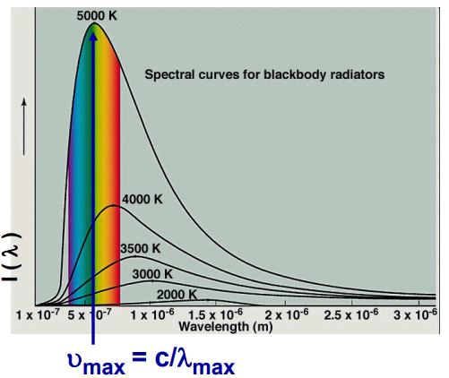
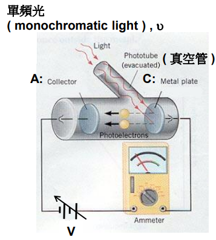
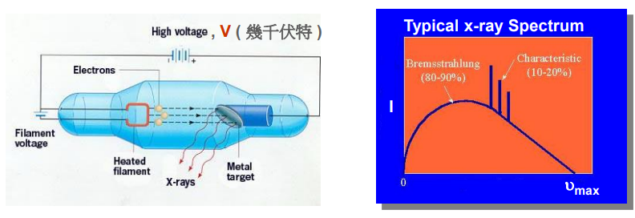
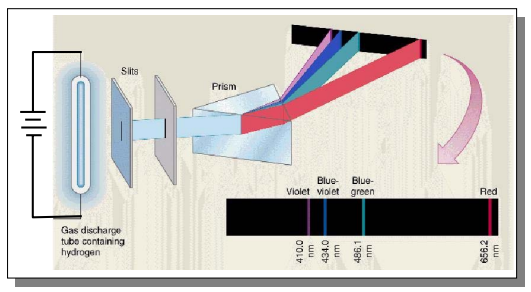
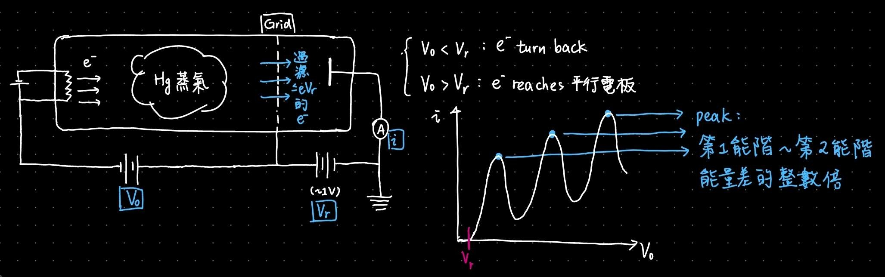
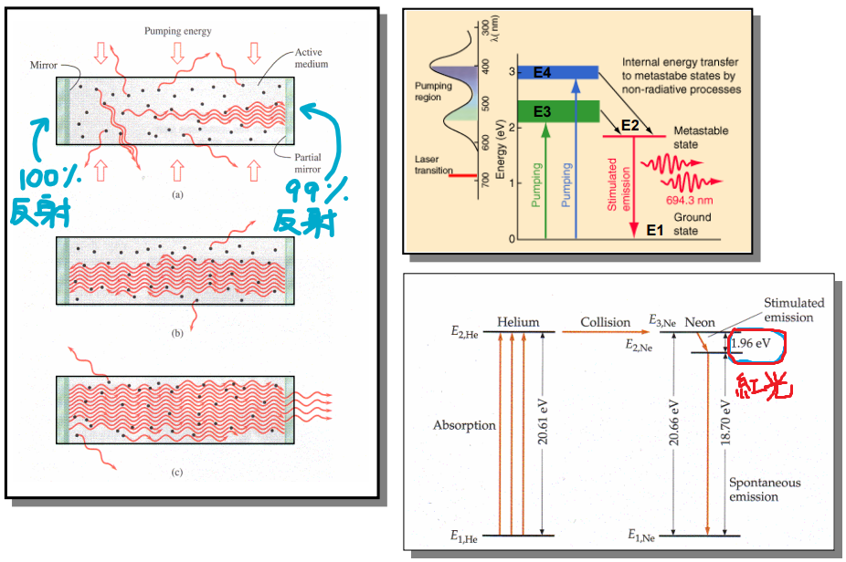

這篇是交大李威儀的普物 (二) 的課程筆記，第一次學量子力學想說概念頗多就隨手整理一下。寫得很隨興，內容如有誤請不吝賜教！

:::success
此篇筆記有續集：[量子力學正篇：德布羅伊假設、海森堡不確定性原理、波函數、薛丁格方程式、無限高位能井](/post/coursenote/quantum-physics-ii)\
兩篇皆可獨立閱讀。
:::

## 常用常數列表

波茲曼常數 $\sigma = 5.67 \times 10^{-8}$

普朗克常數 $h = 6.63 \times 10^{-34}$

約化普朗克常數 $\hbar = 1.05 \times 10^{-34}$

質子質量 $\approx$ 中子質量 $\approx 1.672 \times 10^{-27}\ kg$

電子質量 $= \frac{1}{1836}$ 質子質量 $\approx 9.1 \times 10^{-31}$

芮得柏常數 $R = 1.096 \times 10^7$

氫原子基態能階能量大小 $E_0 = 13.56\ eV$

庫侖常數 $k = \frac{1}{4\pi\epsilon_0} \approx 9 \times 10^9$

---

## Ch.17 The Beginning of Quantum Story

近代物理包含相對論與量子力學的探討、研究。自 1900 年開始，物理學家大多認為物理已經發展完備，僅剩一些問題尚未解決，然而這些問題不僅無法用古典物理完整詮釋，更導致了全新的觀念、知識架構的誕生：

* Blackbody Radiation
* Photoelectric Effect
* X-ray Production
* Compton Effect

### Blackbody Radiation (黑體輻射)

所有溫度大於 0K 的物體皆會放出輻射。一個物體如果是良好的電磁波吸收體，那它也是良好的放射體，反之亦然。

黑體定義為電磁波的完全吸收體和完全放射體，為理想模型，現實中尚未存在。

恆星非常近似黑體。實驗室模擬黑體的方法很簡單，製造一個有小洞的空腔。

黑體放射出的電磁波有很多種，而各波長的電磁波與其輻射率分布圖如下：

從圖可以發現不同溫度下的黑體會有不同的曲線。古典物理無法給出一個可以擬合這些曲線的模型，要不就是長波長無法吻合，要不就是短波長無法吻合 (紫外災變)。

1900 年普朗克提出的能量量子化模型，成功解決了這個問題，也是量子力學的開山始祖。

#### 普朗克的模型

:::default
1. 黑體可以想像成一大堆原子大小的震盪體，每個震盪體皆做簡諧運動，同時吸收、放射電磁波。
2. 震盪體的能量不為連續，為特定最小值的整數倍，這些震盪體的放射電磁波的能量亦同。
:::

震盪體的能量公式：

$$
E = nh\nu \qquad n \in \mathbb{N}, h = 6.6 \times 10^{-34}\ \text{(普朗克常數)}, \nu = \text{震盪頻率}
$$

定義 $I(\nu, T)$ 為黑體溫度為 $T$ 時，頻率 $\nu$ 的電磁波輻射率，則有 Planck Law：

$$
I(\nu, T) = \frac{2h\nu^3}{c^2} \frac{1}{e^{\frac{h\nu}{kT}} - 1}
$$

這條公式不會考。把所有頻率的電磁波輻射率套上面那條公式再積分起來會得到只和溫度相關的公式 (Stefan-Boltzmann Law)：

$$
I_T = \sigma T^4 \qquad \sigma = 5.67 \times 10^{-8}
$$

$I_T$ 是黑體單位面積的輻射功率，單位 $W/m^2$，和溫度四次方成正比。

普朗克常數是為了擬合曲線才湊出來的，非常小，這就是日常生活中看不到能量量子化現象的原因。

:::info
10kg 彈力係數 1000 震幅 0.1m 的彈簧總力學能和頻率如下：

$$
E = \frac{1}{2}kA^2 = 5J
$$
$$
f = \frac{1}{2\pi} \sqrt{\frac{k}{m}} \approx 1.59Hz
$$

一個能量量子 $\Delta E = hf \approx 10^{-33}J$，極微小，因此會誤以為能量是連續的。
:::

另外補充，黑體輻射曲線圖中，強度最高的電磁波頻率 $\nu_{max} \propto T$，波長 $\lambda_{max} \propto \frac{1}{T}$

---

### Photoelectric Effect (光電效應)

光電效應在量子力學出現之前就已經被赫茲發現，只是當時尚無法解釋，一直到 1905 年由愛因斯坦提出光子的概念才完美詮釋。

:::danger
古典物理的錯誤觀點：

1. 光是電磁波，能量和電場震幅大小有關 ($I \propto \epsilon^2$)，但其實是和光波頻率有關。
2. 電子吸收能量需要時間，但如果按照古典物理模型計算，得到的結果是約需數秒至數天才能產生反應，但光電效應是立即發生。
:::

:::success
光子理論：假設光能量為不連續，一個單位的能量可以假想為光子。光是波動這件事毫無疑問 (楊氏雙狹縫干涉)，但在這裡又必須把光想像成粒子，此即光的波粒二象性。
:::

光電效應的裝置如下：由一單頻光 $\nu$ 射入真空管內的金屬板陰極，陰極會射出電子至陽極，射出電子稱為光電子。

$\bar{V}$ 為減速電壓 (retarding voltage)，當電壓大到一定程度時，電子會停止移動，電流降為 0，此時電壓稱為遏止電壓 $\bar{V}_0$ (stopping voltage)。

電子克服價帶而發射出去所需要的能量為功函數 (work function)，令其為 $\Phi$。

利用遏止電壓可以測量電子的最大動能 $E_k$、功函數。

光子能量 $E_p = h\nu$，光電效應的方程式：

$$
E_p = E_k + \Phi
$$
$$
h\nu = e\bar{V}_0 + \Phi
$$

光強度正比於光子密度，可以想成有多少顆光子。

得到以下結論：

1. $E_k = h\nu - \Phi$
2. $\bar{V}_0 = \frac{h}{e}\nu - \frac{\Phi}{e}$

定義遏止頻率 $\nu_0$ 為克服功函數至少需要的光波頻率，$\Phi = h\nu_0$。

#### 光子動量

狹義相對論方程式：$E = mc^2$，$m$ 為相對質量，適用於光子 (靜止質量為 0)。

光子能量 $h\nu$，動量 $p = mc$，由相對論方程式：

$$
h\nu = pc \implies p = \frac{h\nu}{c} = \frac{h}{\lambda}
$$

---

### X-ray Production

X 光的產生有點像是光電效應的逆反應，由電子產生電磁波。

Crookes Tube:

電壓夠大時，真空管內的熱金屬絲會發射電子，撞擊金屬靶後會產生 X-ray。

X-ray 光譜可以分成兩部分：

1. **Characteristic X-ray**: 電子撞飛金屬原子內的電子，剩下的空洞由高能階的電子躍遷來填補。特徵 X 光光譜和金屬原子有關，因為不同原子會有不同的能階組合。特徵 X 光和電壓大小無關。
2. **Braking Radiation (Bremsstrahlung) Spectrum**: 電子經過原子核附近，受庫侖力影響而減速，損失的能量以 X 光的形式向外輻射。

輻射出來的 X 光有最大頻率 $\nu_{max}$，是一個有限值，和電壓 $\bar{V}$ 成正比。

:::danger
古典物理的錯誤觀點：按照圓周運動的模型來解釋 X 光的產生，但問題在於，如果電子逃離不了原子核的吸引，最終會繞核旋轉、越貼越近直至墜入原子核，過程中電子震盪頻率越來越快，因此 $\nu_{max}$ 應該會 $\to \infty$。
:::

:::success
量子理論：假設電子原有動能 $E_k = e\bar{V}$，損失動能 $\Delta E_k$，若輻射出 $n$ 個光子，則有：

$$
\Delta E_k = \sum_{i=1}^{n} h\nu_i
$$

考慮最大損失的動能 $\Delta E_k = E_k$ 全部轉移至同一個光子，則可以計算 X 光最大頻率：

$$
E_k = e\bar{V} = h\nu_{max} \implies \nu_{max} = \frac{e}{h}\bar{V}
$$

的確和電壓成正比。
:::

倫琴研究 X 光並在無意間發現可以利用 X 光掃描物體結構。於 1901 年獲得第一屆諾貝爾獎。X 光在醫療的應用之一便是電腦斷層掃描 (Computer-Assisted Tomography, CAT)，原理是利用 X 光很強的穿透性。

----

## Ch. 18 波耳的原子模型

### 湯姆森西瓜模型

1897 年，湯姆森整合了陰極射線的研究結果，提出陰極射線的組成為比原子更小的帶負電粒子，稱其為電子，而又透過陰極射線在電場與磁場的偏轉 (Lorentz Force)，測得電子的荷質比，獲得諾貝爾獎。

湯姆森認為，電子在原子中的分布類似西瓜與西瓜籽的關係，帶正電的部分均勻分布，帶負電的電子鑲嵌在其中，稱為西瓜模型。

### 拉塞福行星模型

湯姆森的學生拉塞福在進行 $\alpha$ 粒子散射實驗時，發現 $\alpha$ 粒子約有 1/8000 的機率產生大角度散射 (大於 90 度)，證明了湯姆森的西瓜模型是錯誤的，並提出行星模型。

:::danger
西瓜模型錯誤的點：把原子核質量均勻分布的話，每個區域的質量會比 $\alpha$ 粒子小非常多，當 $\alpha$ 粒子打上去的時候，由於質量差距懸殊，理論上會必定穿透，大角度散射機率遠小於 1/8000 (實際值約為 $1/10^{3500}$)，類似灑一團麵粉在空氣中，然後拿一顆球往那團麵粉砸。
:::

:::warning
行星模型：正電的部分是集中在原子中心，半徑約為 $10^{-5} \text{ \AA}$，稱為原子核。電子以庫侖力為向心力繞核作圓周運動，是為行星模型。

行星模型實際上也是錯誤的，按照古典物理來解釋的話會有無法解釋清楚的部分。

1. 行星模型內的電子是作圓周運動，固定一個水平軸來看的話即是作簡諧震盪。按照古典物理，帶電粒子作簡諧運動會產生電場與磁場的震盪，必定會輻射出電磁波。電子若輻射電磁波則會損失能量，能量損失會造成電子軌道半徑越來越小，最終墜毀在原子核。這樣的話所有原子都不可能穩定存在。
2. 延續上文，當軌道半徑越來越小時，電子繞核旋轉的頻率會越來越高，電場與磁場震盪頻率也隨之增加，輻射出的電磁波波長越短，並且這是連續變化，因此原子的光譜應該要呈現連續變化。然而實際上並非如此。
:::

---

### 氫原子光譜

萊曼系列：紫外光，為電子躍遷回第 1 能階輻射出的光譜。

巴耳末系列：可見光，為電子躍遷回第 2 能階輻射出的光譜。

帕申系列：紅外光，為電子躍遷回第 3 能階輻射出的光譜。

芮得柏公式：

$$
\frac{1}{\lambda} = R(\frac{1}{n_a^2} - \frac{1}{n_b^2}), \quad R \approx 1.096 \times 10^7 \quad \text{(芮得柏常數)}
$$

---

### 波耳氫原子模型

波耳受普朗克的量子化觀念啟發，嘗試修正拉塞福的行星模型，以這些為基礎提出了一些不符合古典物理的假設。很神奇的是推導出來的結果竟然能完美地解釋氫原子光譜。

:::success
**Bohr Postulates**

1. 電子只能在特定軌道運動，即角動量量子化：$L = mvr = n\hbar$。$\hbar = \frac{h}{2\pi}$ 為約化普朗克常數。
2. 電子繞核圓周運動時不會輻射電磁波。
3. 電子只有在轉換軌道時才會輻射能量。假設兩軌道之間的位能差為 $\Delta E$，則 $\Delta E = h\nu$。
:::

利用波耳的假設與古典物理，可推算電子動能與位能，進一步推算每個能階的能量大小。

利用向心力 = 庫侖力，列出聯立方程：

$$
mvr = n\hbar, \quad \frac{mv^2}{r} = \frac{ke^2}{r^2}
$$

:::info
**電子動能**

化簡聯立方程第 2 式：
$$
mvr = n\hbar, \quad mv^2r = ke^2
$$

2 式除以 1 式可得：
$$
\begin{aligned}
v &= \frac{ke^2}{n\hbar} \implies v^2 = \frac{k^2e^4}{n^2\hbar^2} \\
E_k &= \frac{1}{2}mv^2 = \frac{mk^2e^4}{2n^2\hbar^2} \quad (k = \frac{1}{4\pi\epsilon_0}, \hbar = \frac{h}{2\pi}) \\
E_k &= \frac{me^4}{8n^2\epsilon_0^2h^2}
\end{aligned}
$$
:::

:::info
**電子位能**

化簡聯立方程第 2 式：
$$
mv^2 = \frac{ke^2}{r}
$$

接著由位能公式可得動能與位能的關係式：
$$
U = -\frac{ke^2}{r} = -mv^2 = -2E_k
$$
:::

原子核—電子系統並無外力作用，故力學能守恆，而一個軌道的能量為：

$$
E = E_k + U = -E_k = \frac{-me^4}{8n^2\epsilon_0^2h^2} = -\frac{1}{n^2} \cdot \frac{me^4}{8\epsilon_0^2h^2} = -\frac{1}{n^2} E_0
$$

$n$ 取多少就是第幾個能階，此結果完美吻合芮得柏公式。

利用波耳模型計算芮得柏常數的話，會得到 ($R = \frac{E_0}{hc} \approx 1.097 \times 10^7$)，有些許誤差，這是因為波耳的模型假設原子核靜止不動。實際上並非如此，用古典物理解釋的話原子核會和電子進行雙星運動，只是原子核運動幅度非常小（質量太大）。

:::default
1. 軌道半徑 $r \propto n^2$，即 $r_n = n^2 r_0$。
2. 軌道能量 $E \propto -\frac{1}{n^2}$，即 $E_n = -\frac{1}{n^2}E_0$。
3. 兩能階能量差 $\Delta E = E_0(\frac{1}{n_i^2} - \frac{1}{n_j^2})$，電子游離能 $= E_0(\frac{1}{n^2} - \frac{1}{\infty^2}) = \frac{E_0}{n^2}$。
4. 基態軌道能量為 $-13.56\ eV$。
:::

---

### Franck-Hertz 實驗

---

### 雷射

LASER = Light Amplification by Stimulated Emission of Radiation

產生雷射的條件：

1. Stimulated Emission
2. Population Inversion (增加 Stimulated Emission 產生機會)
3. Metastable State (防止 Spontaneous Emission)

Stimulated Emission 特徵：

1. Light Amplification
2. 同調、同向、同相

雷射特徵：

1. 單向 (Unidirectional)
2. 高強度 (High Intensity)
3. 近似單色 (Nearly Monochromatic)
4. 同調 (Coherent)

雷射可以分成固態雷射 (Ex. 紅寶石雷射)、氣態雷射 (Ex. 氦氖雷射)。現代的雷射多用半導體製成。

雷射應用：光碟 (CD, DVD, BD)

:::success
此篇筆記的下一篇：[量子力學正篇：德布羅伊假設、海森堡不確定性原理、波函數、薛丁格方程式、無限高位能井](/post/coursenote/quantum-physics-ii)
:::

