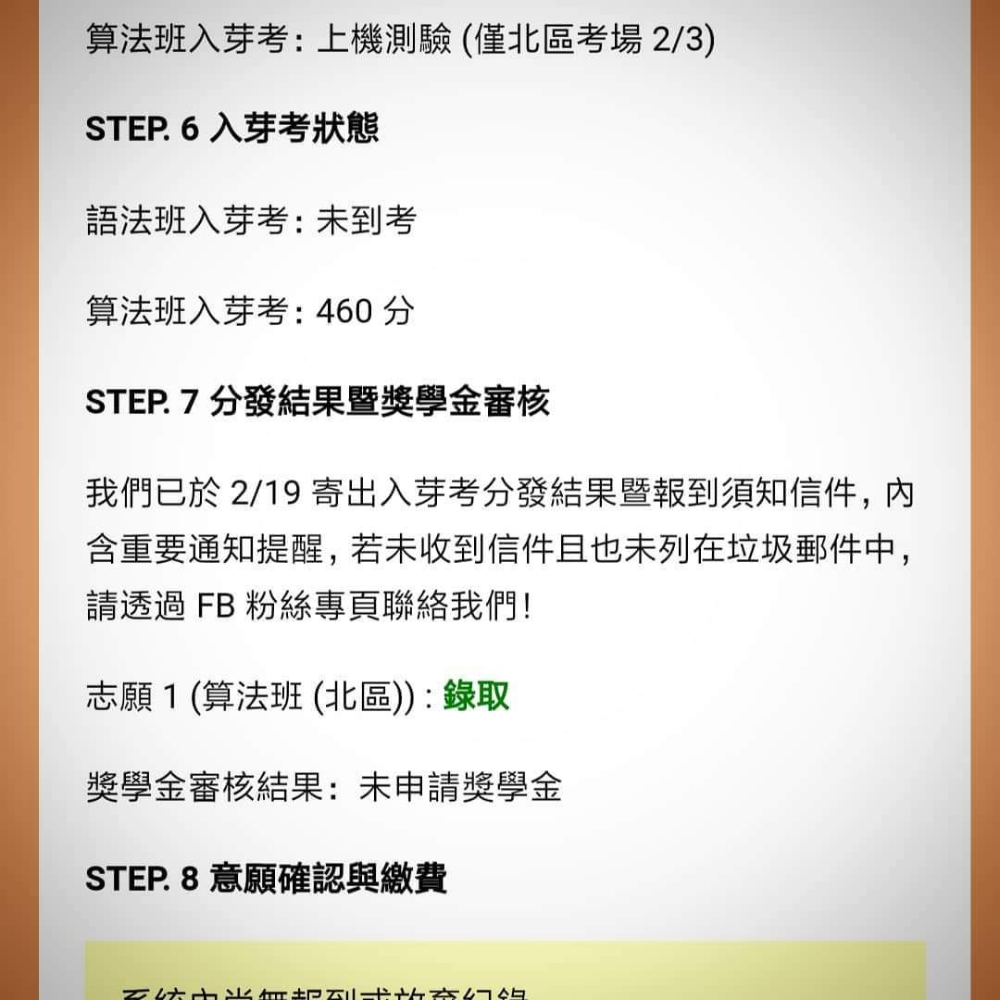
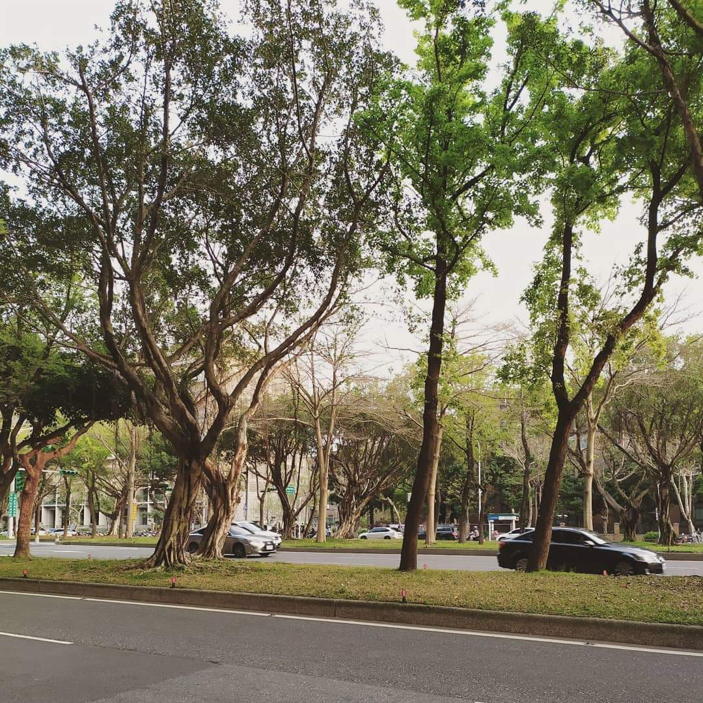
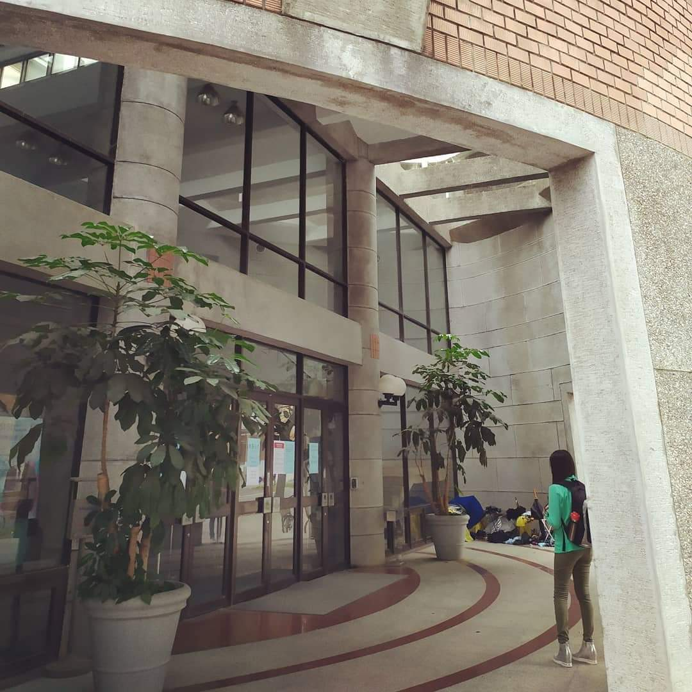
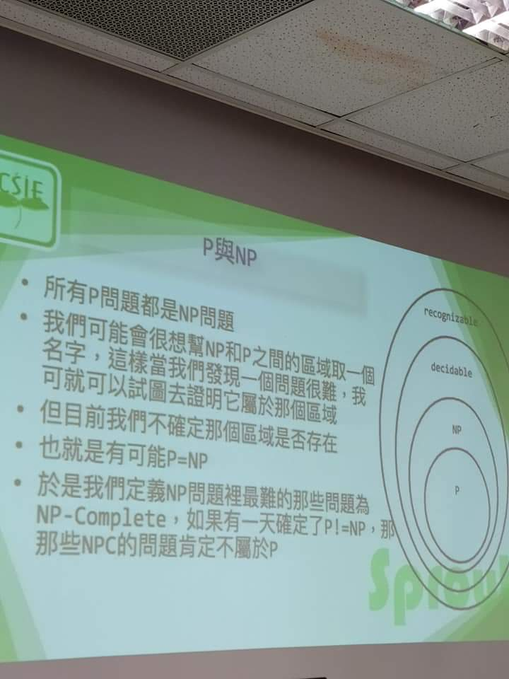
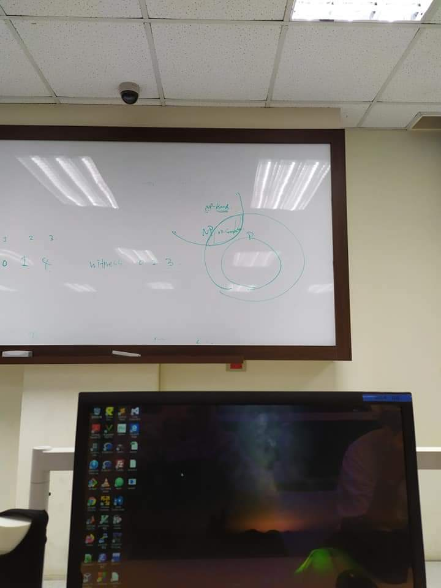
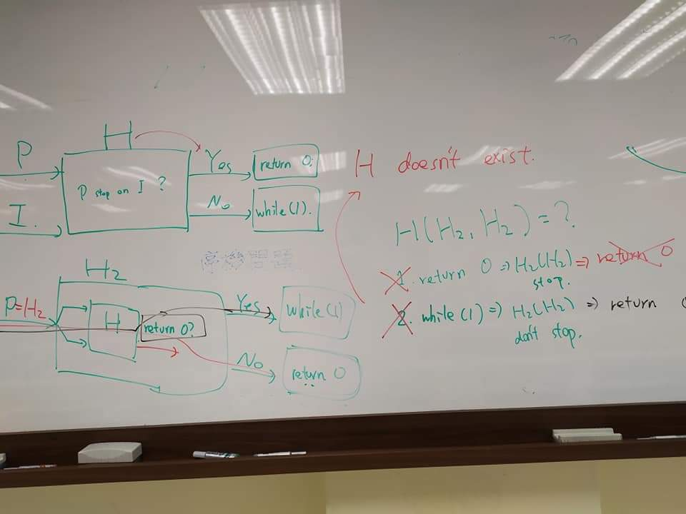
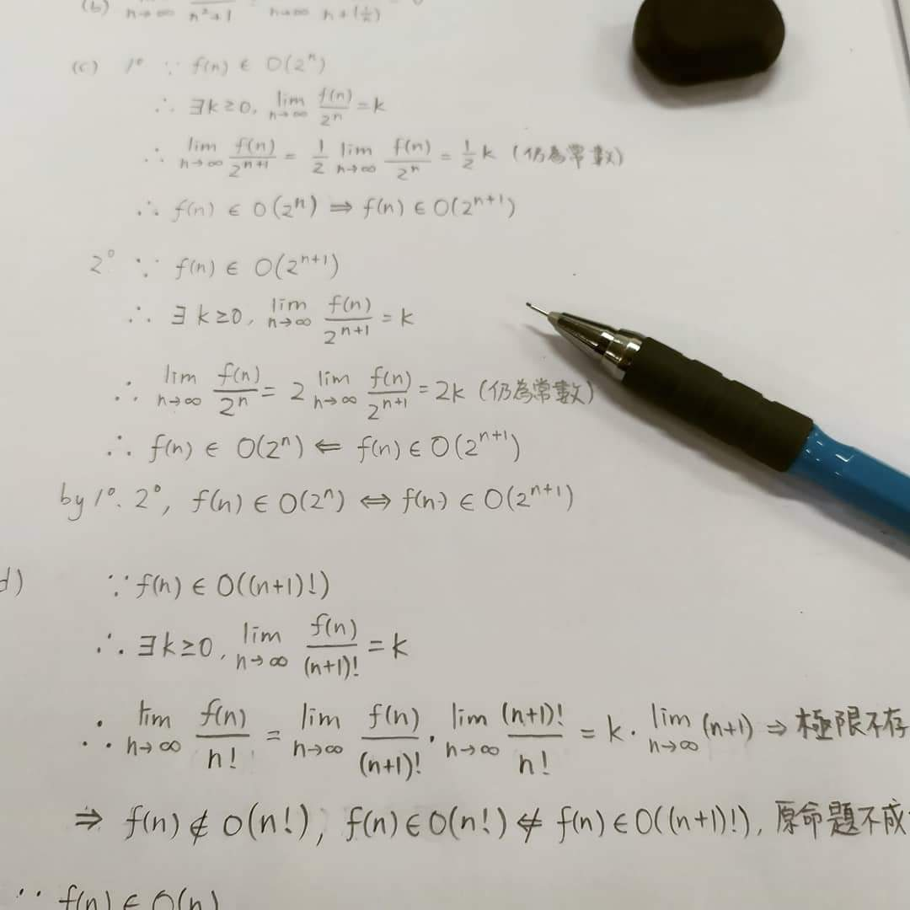
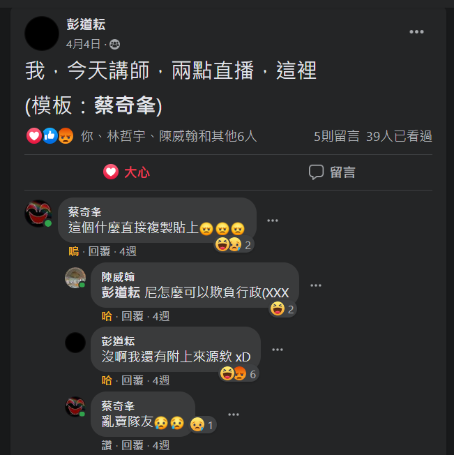
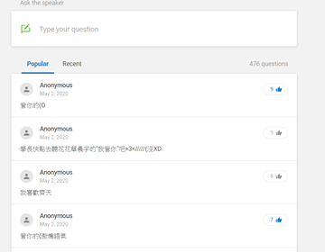
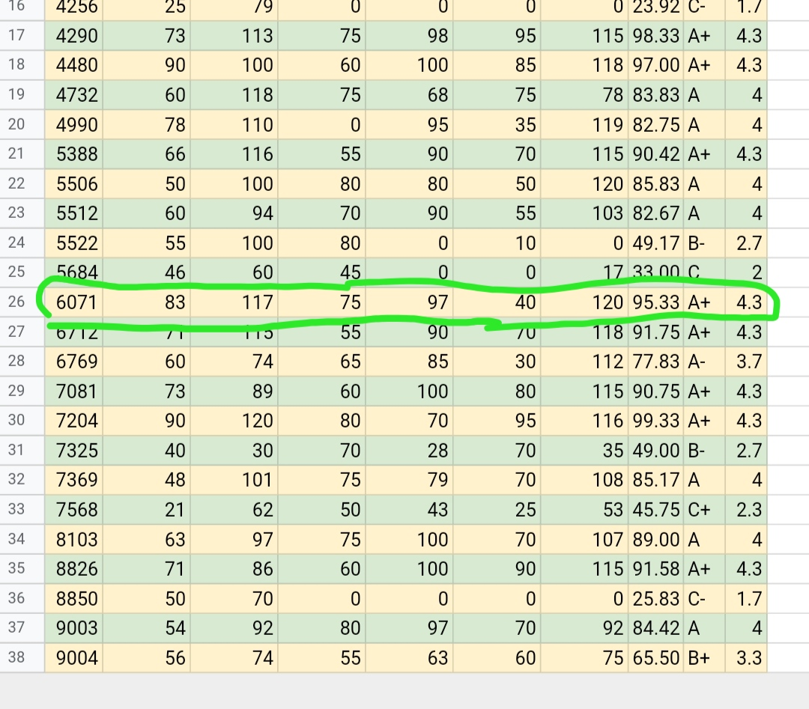

## Day0 楔子
> 進入課程前的試煉

入芽考意外的很順，居然有 460XD\
(還好只有序列題沒有圖論 ww

一個月之後收到了一封信\
打開來發現大大的綠字->錄取\
那時候好開心+激動 XD

從半年前一個只會用 scratch 的菜雞\
一直學習、熟悉 python，C++\
到成為資芽算法班學員\
就這樣不知不覺地\
一頭栽進演算法的世界

## Day1 萌芽
> 因為是最簡單的課程，也是剛開始 -> 萌芽

第一次參加這麼特別的課程\
先看完課程影片\
然後課堂上講師會引入更深的知識\
(都是國手欸偶像>///< 第一天就是講簡單的資料結構(沒有圖論\
最大的收穫就是單調隊列>///<終於看懂ㄌ\
但是作業爆多又爆難(手寫證明題+上機題\
到現在還是會把指標的 linked list 寫爛\
重點是我不知道為什麼 QwQ... 手寫倒是還滿有趣ㄉ最好玩的是歸納法\
然後還引起了 wiwi 的注意跟興趣 XD\
他還花了一個早上想某一題投票問題

作業完成度 OuO: 手寫 5/5 題，上機 8/10 題

## Day2 灌溉
> 演算法分析是程式設計不可或缺的一環 -> 灌溉

第二天的主題是樹跟演算法分析\
樹的部分沒有講太深還滿友善的:D\
(目前\
後半堂課講的是複雜度分析\
這裡真的好抽象+聽得很吃力 QwQ\
還是搞不太懂 NPhard, NPC, NP, P 的關係\
總之就是只要有人證明了 P 跟 NP 的關係\
就會得到一大筆懸賞\
這個世界也會發生巨變甚至會大爆炸(喂

上機的部分滿友善的\
唯一沒看過的是找樹的重心\
戳了一下講師->get 提示->思考很久才寫掉

手寫作業就是算極限跟證明遞迴函數\
比上禮拜的還有趣:D\
遞迴真的好好玩<3

作業完成度 OuO: 手寫 7/7 題，上機 4/4 題

## Day.3 陽光
> 枚舉就像陽光一樣，非常和藹，充滿溫暖

第三週的主題是暴力(X\
可是是有智慧的、溫柔的暴力\
所以換個優美的名稱->“枚舉”(O

今天ㄉ講師是波路特石 aka 波路電石 aka 波路特神\
aka 宇宙冠軍 aka 好多好多綽號<(_ _)>

枚舉演算法本身的核心並不難（暴力作誰不會 XD\
但精采的地方在於怎麼想出剪枝的方法\
還有可以利用單調的性質做一些優化\
（最經典的就是二分搜了 -> O(n) 壓到 O(log n)

這禮拜的上機題有點難度\
都是需要思考然後在紙上畫畫才能知道作法（至少我都需要 QQ\
順便提一下最讓我興奮的地方\
他們居然把馬力歐賽車搬進題目裡吔 XDDD\
玩好幾年都玩不膩的遊戲<3

手寫作業是上課以來最簡單的一次\
（2020.4/26Edited：整個 1!課程最簡單的一次\
主題是 C++運行時的記憶體布局，還有各種變數如何儲存的\
基本上只要閱讀能力沒有障礙都可以拿很高分\
但我最後一題耍了小智障，\
題目是問 main 的儲存區域在哪，而不是 main()函式\
（看的出來差別嗎 XD

作業完成度 OuO: 手寫 13/13 題，上機 6/6 題

## Day.4 枝葉
> 圖論帶領著我進入更上一層的演算法領域 -> 長出枝葉

淹水問題(BFS)、堆積 Heap、基礎圖論\
這禮拜開始進入了嶄新的領域 - 圖\
本來還想說今天會被電爛\
可是其實也還好還算可以理解(?\
或許這只是圖論的剛開始吧\
（2020.4/26Edited：不被電爛也只到這堂課而已 QQ

上機的部分最難的一題就是 IOI2014 考古題了\
我到現在還是想不出來 QWQ...\
相較於上機手寫的部分就輕鬆許多\
主題是字串匹配+排序\
只要畫畫圖就可以寫完ㄌ（對，真的就是畫圖><

再來是今天的精華\
講師是 Lawfung 他真的好可愛>///<\
三字箴言 -- 管你的\
然後 slido 上也有一堆莫名其妙的留言 XD\
OwO\
OAO\
OwwwwO\
QwwwwwwwQ\
QAQAQ\
QwwwwwwwwwwwwwwwwwwwwwwwwQ

作業完成度 OuuO: 手寫 3/3 題，上機 5/6 題

## Day.5 肥料
> 對於一株很 Greedy 的植物來說，肥料越多越好

台大已經開始管制跟封校了\
所以這周之後都不能去台大上課改在家裡看直播 QwQ\
（我想去台大 QwwwQ

課堂直播開始之前似乎在 fb 上有一些小插曲(?\
看圖就知道ㄌ（行政被講師欺負幫 QQ

今天的主題是 Greedy\
Greedy 難的地方在於想出作法以後要怎麼證明這是最佳解\
（證明好難 QwQ，要想出正確的 Greedy 也好難 QwwQ\
從這周開始我感受到了課程難度明顯增加許多\
因為要想出最佳的做法\
通常需要神來一筆或是刷題的經驗（很顯然我不夠

手寫作業是 Greedy 的證明\
只有兩題卻花了我快 5 個小時才完成\
一直把時間用在證明自己的證明是可以證明 Greedy 的正確性\
下次上課前 5 分中才趕在死線前繳交 OAO 好險\
還好總算寫完了 w

作業完成度 OuO: 手寫 2/2 題，上機 5/6 題

## Day.6 風雨
> 分治就像狂風暴雨，考驗著一株植物的韌性和堅毅

這次的主題是分治\
也是一階的課程裡面最難的一堂\
不僅要觀察出該怎麼切割問題\
還要知道如何由小問題合併成大問題，最後得到答案\
講師語重心長地告訴我們想要掌握好分治演算法\
不二法門便是不斷、不斷、不斷的練習累積經驗

第一次接觸分治的我\
對於上機題非常地不熟練，尤其是實作方面\
太多太多要注意的細節，像是遞迴的邊界條件\
還有合併問題時要小心處理的計算過程\
（喔對了我在寫逆序數對時被 int overflow 陰了好久 QwQ\
簡單來說就是一題至少得花 3~4 個小時\
還一度因為 WA 吃太多甚至到了敲鍵盤跟撞牆的地步（認真\
真是昏天暗地=w=

相較於上機\
這次的手寫作業似乎友善許多\
（雖然我也花了快 5 個小時=w=\
最有趣的是最後一題\
竟然可以利用二進位的性質把複雜度從 O(QN)變成 O(QlogN)\
（還好我最後有寫出來：D

作業完成度 OuO: 手寫 3/3 題，上機 5/6 題

## Day.7 茁壯
> DP 激盪著我的腦力，同時也讓這株植物加速成長

經過上禮拜的風風雨雨\
這周的課程總算開朗了許多\
（順帶一題講師又欺負行政了 XD（幫 QQ\
DP 其實就是先分析問題->設計狀態->推導轉移式->處理邊界條件\
->建表記錄子問題的答案->……->得到最後的答案\
好啦其實 DP 還滿難的=w=最難的就是如何推導轉移式\
畢竟是構造出遞迴式，講師也說 DP 要好也只能靠經驗法則（刷題\
除非天資聰穎，碰到 DP 都能通靈出解（顯然我不是 QQ

至於上機題……簡單的很簡單，難的很難（加分題都不會 QwQ\
只好厚臉皮的拿去戳班上同學>u<（偉哉 wiwiho\
他真的好強，除了 DP 題凱瑞之外，連其他題目都難不倒他>///<

這禮拜沒有手寫作業，因為下周就要認證考了 QwQ\
是時候要驗收這兩個月的努力ㄌ，希望不要燒雞>///<\
（台大依舊沒有開放->只能在家打比賽 QQ

作業完成度 OuO: 上機 5/7 題

## 驗收時刻 - 一階認證考
> 小植物的考驗

認證考下午才開始，想說趁早上寫一下先前沒完成的上機 bonus\
結果一寫就中毒，一題弄了一整個早上都還沒寫完\
於是渾渾噩噩地抱著很差的心情開始打認證考

開場打好模板，載好題目後，就把所有題目看過一次\
那時我認為既然是認證考，理所當然地至少要拿 400 甚至滿分\
才算是證明自己參加這個課程有學到東西、\
沒有白白浪費學費跟每個禮拜快 20 個小時的時間\
結果……\
pA 不會 pB 不會 pC 不會 pD 不會\
只有 pE 是講師教 greedy 的時候有提到的例題\
到這裡心情整個跌到谷底\
提早交卷、關掉電腦然後放棄的想法不斷在我腦中浮現\
然後因為幾乎所有題目都不會，加上早上那題目該死的 RE\
我開始覺得自己是個廢物，什麼都不會，只會抄模板\
資芽教過的演算法連用都不會用，沒有資格考認證考，沒有資格上第二階段的課，浪費父母的錢，也浪費我的時間……

到這裡我決定開始振作\
從 pE 開始嘗試起，大概過了 20 分鐘，上傳了第一份程式碼\
編譯中…… 執行中…… 評分中…… 已評分

Wrong Answer

我試著保持冷靜，回去乖乖地 debug\
第二份、第三份、第四份程式碼、……全部 Wrong Answer\
兩個小時過去了……
- 剩下時間: 01:10，分數: 0/500

這時候忽然覺得再慘也不能 0 分收場…… 開始暴力亂做\
中間發現(現在才發現)pC 的 60 分子題是上課教過的，寫！\
十五分鐘，丟上去，60 分！\
然後看到 pA 最 naïve 的暴力 O(n^3)可拿 20 分，寫！\
十分鐘，壓線丟上去，編譯中…… 執行中…… 然後比賽就結束了。\
後來成績公布，發現那 20 分也沒拿到……\
- 成績: 60/500

考完試的這個禮拜心情很差，做事都覺得非常無力，作業不想弄、訊息不想回（有人想問我成績->不想理他），甚至開始暴食、焦慮\
然後因為比賽中做的一些不正常的事，頭痛了好幾天才好

最近稍微恢復一些，我開始反省、思考，\
1. 賽前根本不應該寫題目或是複習先前上課內容，不只影響思緒，題目寫不出來也會讓心情變得很差
2. 對自己的標準太高了。一直以為拿滿分才算合格（結果計分板公布後才發現最高分的 385，然後一堆 0），然後比賽時不斷灌輸自己「一定要想出正解」、「一定要拿滿分」的想法。
3. 心態問題+刷題經驗太少：到現在還是沒掌握比賽時的節奏，然後想不出題目或是一直寫錯的時候就會崩潰，根本原因就是題目刷太少，碰到比賽才會卡這麼久。
一直以來想打 CF，偏偏比賽時間全都是 10 點半之後，\
而且我只要稍微熬夜隔天上課就整個撐不下去（（\
於是我決定這學期先顧好課業，暑假再開始刷題+CF。

## 結語
負面情緒好像有點多，那來個開心一點的好了 XD。\
就在今天晚上我收到了一封資芽的信\
「第一階段分數：上機成績 A，手寫成績 A+」\
雖然過程中有許多挫折，但是一階還是順利結業了！！:D\
謝謝資芽的行政&講師們\
備課、上課、改作業\
還有幫助我們解答疑惑、甚至是 debug、……\
這段時間辛苦你們了>//w//<\
謝謝 joy, wiwi\
願意抽出時間教我程式、解決我的障礙\
謝謝你們願意幫我>///<你們真的好強

明天二階就要開始了\
希望明天的我，能找回最初的熱忱、帶著那時的夢想，\
繼續下一段精彩的旅程！:D

:::info
**幼芽日記 第一部 終**
:::

（對了，如果可以的話，在 IG 或 FB 留言的地方留個愛心吧！\
（我只是想知道有誰看完ㄌ我的心得文

## 照片
### **錄取通知** :heart

### **台大前的綠蔭大道**

### **德田館 - 三年後我一定要來這裡！**

### **神奇的 P 與 NP 問題**

### **白板**

### **停機問題**

### **手寫作業剪影**

### **講師欺負行政**

### **講師的三字箴言：管你的**

### **手寫作業成績**

