這篇筆記是我參考【演算法圖鑑】和網路資源所製作。如果內容有誤，還請不吝賜教!

## **05-0 傳輸數據時的問題**

:::danger
**竊聽 Eavesdrop**：資料可能被第三方讀取
:::

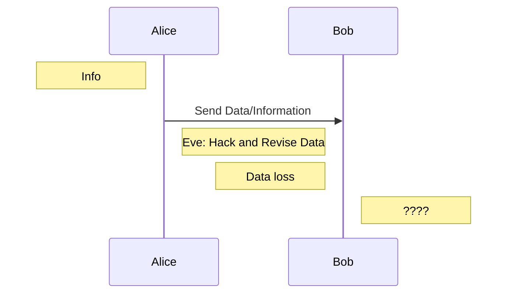
```mermaid
sequenceDiagram
    Note left of Alice: Info
    Alice->>Bob: Send Data/Information
    Note left of Bob: Eve: Hack and Revise Data
    Note left of Bob: Data loss
    Note right of Bob: ????
```

:::danger
**竄改 Falsification**：資料被第三方擷取並竄改，或是通訊中發生不明原因而造成數據損毀，都稱為「竄改」。
:::

```mermaid
sequenceDiagram
    Note left of Alice: Info
    Alice->>Bob: Send Data/Information
    Note left of Bob: Eve: Hack and Revise Data
    Note left of Bob: Data loss
    Note right of Bob: ????
```

:::danger
**電子欺騙 Spoofing**：傳輸訊息的兩端用戶其中一方有可能是偽裝的駭客，稱為電子欺騙。
:::

一般來說，電子欺騙可能有兩種情況：

- **(1) 接收端是駭客 -** 最常見的事件就是騙取個資
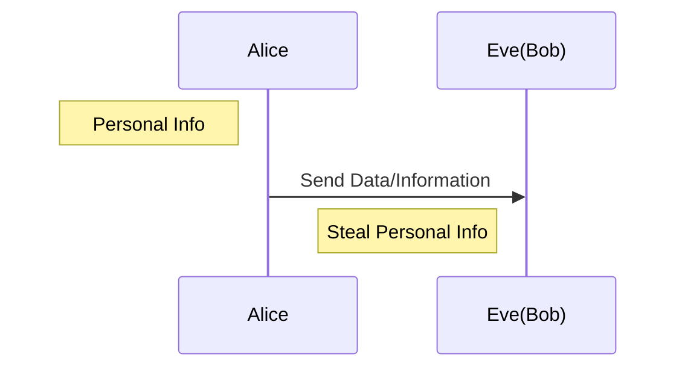
```mermaid
sequenceDiagram
    Note left of Alice: Personal Info
    Alice->>Eve(Bob): Send Data/Information
    Note left of Eve(Bob): Steal Personal Info
```
- **(2) 發送端是駭客 -** 常見的情形包括釣魚網站或是可能藏有病毒的不明檔案。
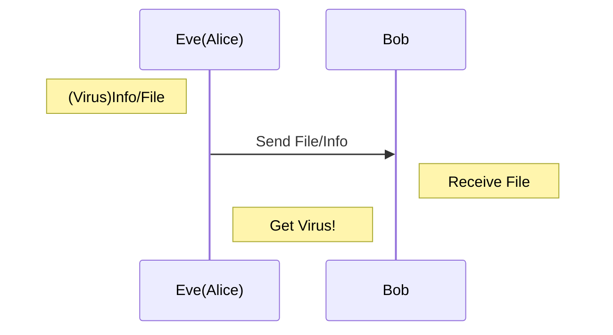
```mermaid
sequenceDiagram
  note left of Eve(Alice): (Virus)Info/File
  Eve(Alice)->>Bob: Send File/Info
  note right of Bob: Receive File
  note left of Bob: Get Virus!
```

:::danger
**抵賴 Repudiation**：若訊息發送用戶不懷好意，在訊息送出後主張自己沒有送出該訊息，稱為抵賴。抵賴最大的問題在於**網路上契約或商業交易**不易成立，甚至會有詐騙的事件發生。
:::

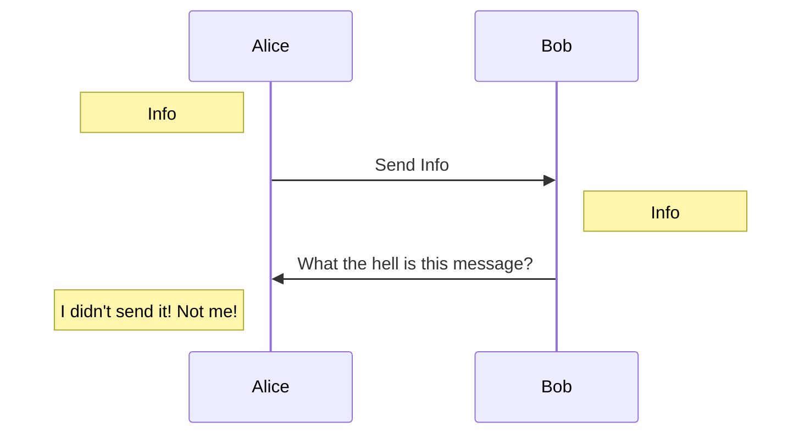
```mermaid
sequenceDiagram
  Note left of Alice: Info
  Alice->>Bob: Send Info
  Note right of Bob: Info
  Bob->>Alice: What the hell is this message?
  Note left of Alice: I didn't send it! Not me!
```

而對於這些問題，我們有以解決辦法：
| 問題     | 解決方法               |
|:-------- |:---------------------|
| 竊聽     | 加密              |
| 竄改     | 訊息鑑別碼 or 數位簽章 |
| 電子欺騙  | 訊息鑑別碼 por 數位簽章 |
| 抵賴     | 數位簽章            |

以下將介紹各種安全性演算法

## **05-1 雜湊函數 Hash Function**
雜湊函數在我先前的筆記 [「演算法圖鑑第 2 章 - Data Structures」](/post/cp/algo-illust-2) 裡有提到，摘要如下：

> Hash function is a function that turns given data into a fixed-length value, called "hash code".
> 
> Hash function has the following features:
> 1. **Fixed Length of Hash Code** - No matter how massive the given data is, the length of hash code is always fixed.
> 2. **Same Data, Same Hash Code**
> 3. **Similar Data, Different Hash Code**
> 4. **Unidirectional** - It's impossible to infer the original data from its hash code.
> 5. **Hash Collision** - Different data might have the same hash > > code, when this occurs, we call it "hash collision". However, > > chances of collision are extremely slim.

雜湊函數因為它的**單向性**、**單一性**及**不可辨讀性**，被廣泛地運用在加密及製作數位簽章上。而雜湊驗算法則又有許多種，常見的有 MD5, SHA-1, SHA-2 等。現在大多使用 SHA-2，因為 MD5 和 SHA-1 都曾有被破解的事件，存在一定的風險。

:::default
註：
- MD5 - Message Digest Algorithm 5
- SHA - Securing Hash Algorithm
:::

## **05-2 加密 Encryption**
### **加密的基本原理**
- **明文 - plain text, 可直接被解讀的訊息**
傳輸數據時若以明文直接傳輸，極有可能被第三方直接偷窺，因此數據傳輸時大多以密文的形式傳輸。
- **密文 - cipher text, 經加密後的訊息, 無法直接被電腦或人解讀**

以下解釋了明文是如何被傳輸的。
:::info
**加密**(encryption)就是將明文和金鑰進行計算而產生密文
而**解密**(decryption)就是對密文和金鑰再進行運算還原成原本的訊息
:::
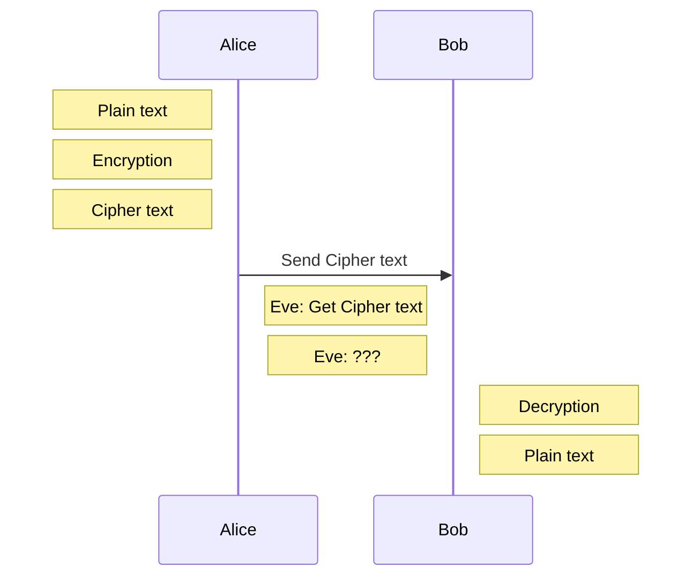
```mermaid
sequenceDiagram
  Note left of Alice: Plain text
  Note left of Alice: Encryption
  Note left of Alice: Cipher text
  Alice->>Bob: Send Cipher text
  Note left of Bob: Eve: Get Cipher text
  Note left of Bob: Eve: ???
  Note right of Bob: Decryption
  Note right of Bob: Plain text
```
加密的方式又可根據金鑰的性質分為兩種：**對稱加密**和**非對稱加密**。

**對稱加密**指的是雙方都使用相同的金鑰進行加密、解密，好處是運算速度非常快，但是它有一個致命的缺點 -- 安全性的缺陷。**非對稱加密**則相反，雙方使用不同的金鑰進行加密、解密，它和對稱加密是互補的 -- 一方的優點即是另一方的缺點。

|        | 對稱性加密 | 非對稱加密 |
|:------:|:----------:|:----------:|
| 安全性   |   [Unsafe]{.red}    | [Safe]{.green} |
| 運算速度 |  [Fast]{.green} | [Slow]{.red} |

現在來談談對稱性加密的大問題。

假設 Alice 要用這種演算法傳遞訊息給 Bob，顯然如果雙方都知道金鑰的話，那是一件很美好的事。問題就在於多數時候雙方先前是沒有相互往來的，意即兩方都沒有共同金鑰。這種時候，我們有以下的解決辦法：
### **共用金鑰系統 shared-key cryptosystem**
Alice 在傳送訊息給 Bob 前，要先傳送金鑰給 Bob，接著再傳送密文給 Bob。
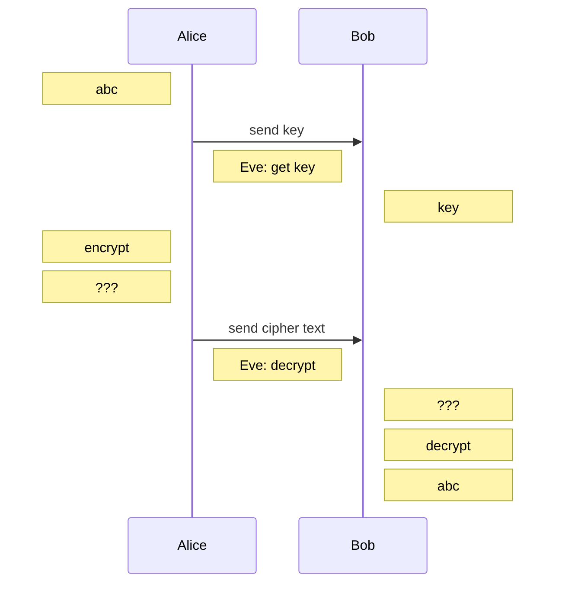
```mermaid
sequenceDiagram
    note left of Alice: abc
    Alice->>Bob: send key
    note left of Bob: Eve: get key
    note right of Bob: key
    note left of Alice: encrypt
    note left of Alice: ???
    Alice->>Bob: send cipher text
    note left of Bob: Eve: decrypt
    note right of Bob: ???
    note right of Bob: decrypt
    note right of Bob: abc
```
共用金鑰系統其實在兩千年前就已經存在，最著名的莫過於凱薩加密系統。現今常用的為 AES 加密演算法。

問題來了，在傳送金鑰的過程中，金鑰還是有可能被偷窺(**金鑰傳送困難**)，這不就又回到最一開始的問題了嗎？而且隨著傳輸的對象越多，管理金鑰的數量也會越來越多。這些都是共用金鑰系統最大的問題。

### **公開金鑰系統 public-key cryptosystem**
公開金鑰系統彌補了共用金鑰系統的缺點，因為訊息只能用公鑰加密也**只能用私鑰解密**，即使公鑰和密文被偷窺，第三方也因為沒有**解密的關鍵 -- 私鑰**而無法獲取原始明文，安全性相對提升。

以下將解釋這個加密演算法是如何運作的：
1. Bob 先準備兩個金鑰 -- **公鑰**和**私鑰**，公鑰可公開到網路上，但私鑰必須被保管好而不能外流。接著將公鑰傳送給 Alice。
2. Alice 用 Bob 傳來的公鑰將訊息加密。
3. Alice 將密文傳給 Bob。
4. Bob 用私鑰來解密，得到明文。
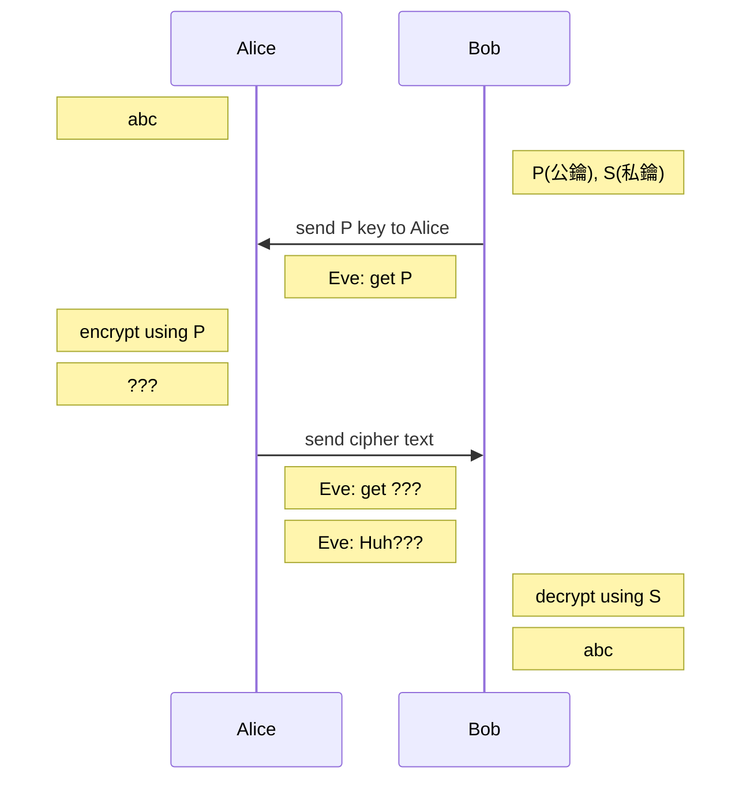
```mermaid
sequenceDiagram
Note left of Alice: abc
Note right of Bob: P(公鑰), S(私鑰)
Bob->>Alice: send P key to Alice
Note right of Alice: Eve: get P
Note left of Alice: encrypt using P
Note left of Alice: ???
Alice->>Bob: send cipher text
Note left of Bob: Eve: get ???
Note left of Bob: Eve: Huh???
Note right of Bob: decrypt using S
Note right of Bob: abc
```
然而公鑰加密也有存在公鑰可信度的問題。換句話說，我們無法確定 Alice 是否不懷好意，又或者公鑰傳輸的過程，很有可能被第三者替換，這樣第三者便能取得訊息而雙方仍渾然不覺，稱為中間人攻擊。

以下將說明中間人攻擊的過程：
1. **Eve**製作了自己的公鑰 Px 和私鑰 Sx。
2. **Bob**公開了他的公鑰 P，但是在 P 傳到**Alice**之前，**Eve**攔截了這條通道，並將 P 改為 Px。
3. **Alice**以為她收到的公鑰是**Bob**的，於是她用這隻公鑰 Px 加密訊息，並送出密文 Tx。
4. **Eve**再度攔截，將密文用 Sx 解密取得明文。
5. **Eve**再用**Bob**公開的公鑰將原文加密成新密文 T，再將 T 傳輸給**Bob**。
6. **Bob**收到密文 T，用自己的私鑰 S 解密，但卻完全不知道**Eve**動過手腳...。
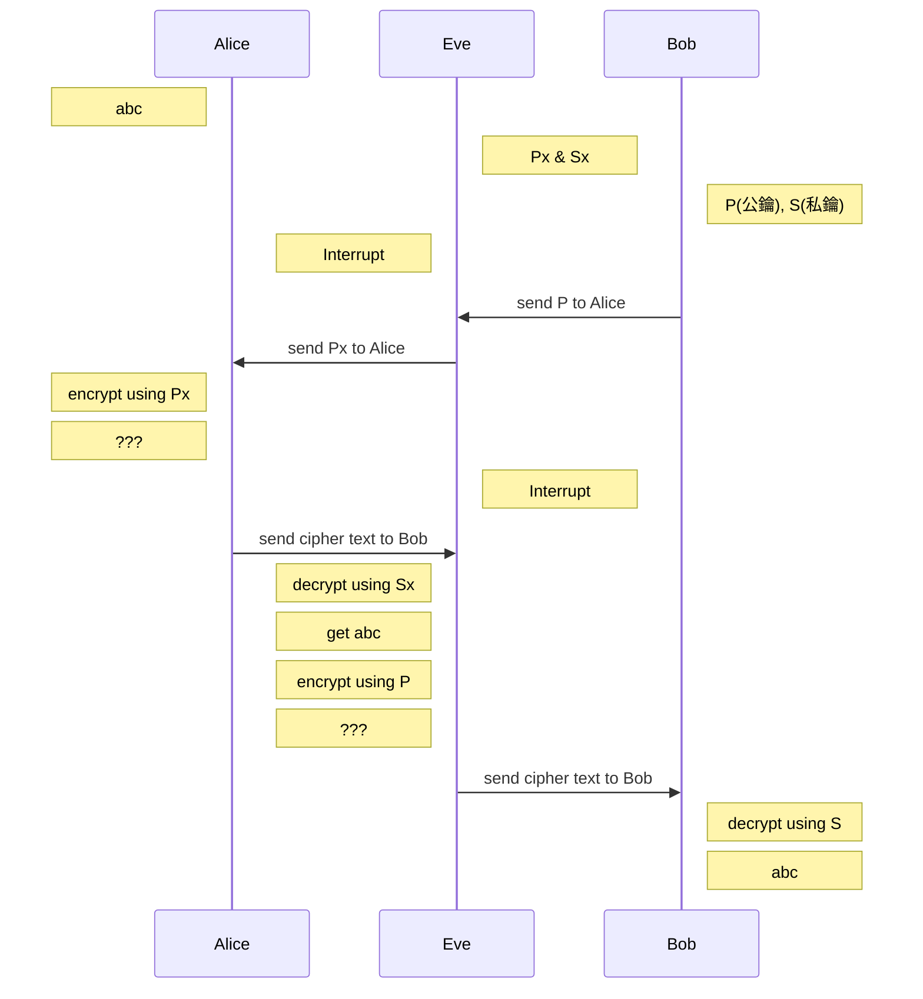
```mermaid
sequenceDiagram
Note left of Alice: abc
note right of Eve: Px & Sx
Note right of Bob: P(公鑰), S(私鑰)
note left of Eve: Interrupt
Bob->>Eve: send P to Alice
Eve->>Alice: send Px to Alice
Note left of Alice: encrypt using Px
Note left of Alice: ???
note right of Eve: Interrupt
Alice->>Eve: send cipher text to Bob
note left of Eve: decrypt using Sx
note left of Eve: get abc
note left of Eve: encrypt using P
note left of Eve: ???
Eve->>Bob: send cipher text to Bob
Note right of Bob: decrypt using S
Note right of Bob: abc
```
這個時候，解決方案便是**數位憑證**，之後的筆記將會介紹。
### **混成密碼系統 Hybrid Cryptosystem**
混成密碼系統是共用金鑰和公共金鑰的加強版。將金鑰再進行一次公鑰加密，使得雙方能夠安全的傳遞共同金鑰。這個方法不只兼備了共用金鑰系統的快速，更解決了**金鑰傳送困難**的問題，一舉數得。

以下將說明混成密碼系統的運作過程：
1. Alice 準備共同金鑰 K，並將訊息用 K 加密成密文 T。
2. Bob 利用公鑰加密的方法，讓 Alice 取得 Bob 的公鑰 P。
3. Alice 用 P 將 K 加密並傳送給 Bob。
4. Bob 用私鑰 S 解密，如此一來兩人都有了金鑰 K。
5. Alice 傳送 T 給 Bob，Bob 就可以用 K 解密。
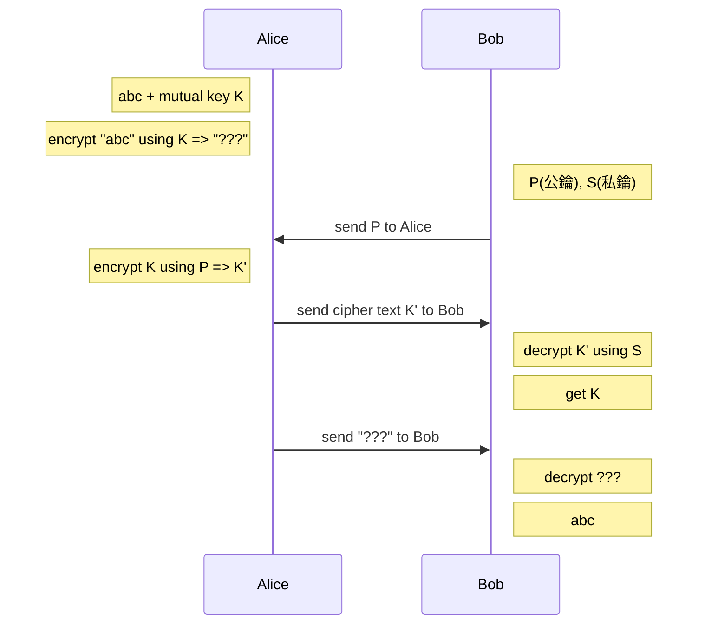
```mermaid
sequenceDiagram
note left of Alice: abc + mutual key K
note left of Alice: encrypt "abc" using K => "???"
note right of Bob: P(公鑰), S(私鑰)
Bob->>Alice: send P to Alice
note left of Alice: encrypt K using P => K'
Alice->>Bob: send cipher text K' to Bob
note right of Bob: decrypt K' using S
note right of Bob: get K
Alice->>Bob: send "???" to Bob
note right of Bob: decrypt ???
note right of Bob: abc
```
:::info
**SSL 憑證**

混成密碼系統最被廣泛應用的地方，就是 SSL 安全憑證。我們每天用電腦或手機瀏覽網站時，和遠端伺服器幾乎都是以 http(HyperText Transfer Protocal, 超文本傳輸協定)傳輸資料，而 SSL 憑證的目的是為了確保我們的裝置(client 端)和伺服器(server 端)皆是安全的。大部分的時候我們都會在網址看到*https*，那個 s 就代表這個網站有 SSL 憑證，是安全的。
:::
### **迪菲-赫爾曼金鑰交換 Diffle-Hellmen Key Exchange**
#### **金鑰性質**
迪菲-赫爾曼金鑰交換所交換的金鑰有一些特殊的運算性質：
1. 兩個金鑰可以透過一些運算合成一把新的金鑰。
2. 金鑰合成並無先後順序。
3. 合成的金鑰不能被分解、還原成原來的金鑰。
#### **運作模式和安全性**
現在來看看這種交換方式是如何運作的：
1. Alice 跟 Bob 各自準備自己的私鑰 A 和 B。
2. 再準備一隻公鑰 P。
3. 兩人各自將私鑰和公鑰合成 PA 和 PB。
4. 兩人互相交換新合成的金鑰。
5. 兩人各自將**收到的金鑰**和**自己的私鑰**再合成一次。
6. 這樣兩人都有共同金鑰 PAB 了。
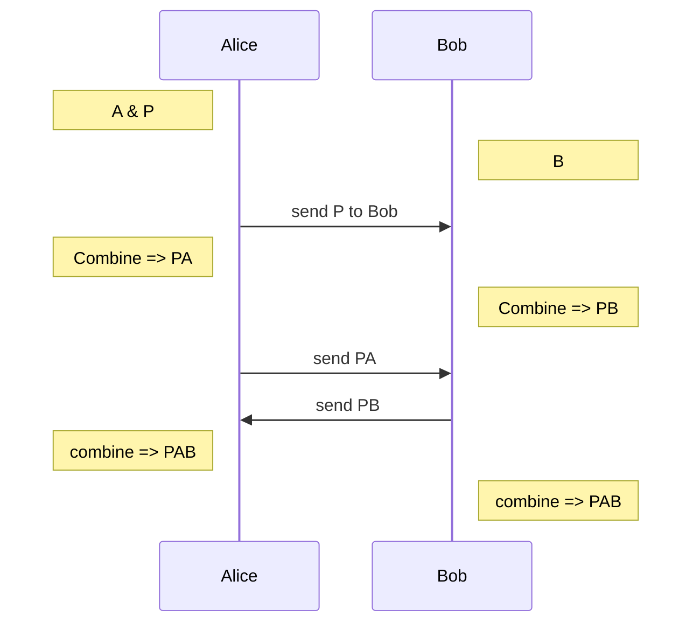
```mermaid
sequenceDiagram
note left of Alice: A & P
note right of Bob: B
Alice->>Bob: send P to Bob
note left of Alice: Combine => PA
note right of Bob: Combine => PB
Alice->>Bob: send PA
Bob->>Alice: send PB
note left of Alice: combine => PAB
note right of Bob: combine => PAB
```
由於 Eve 只可能偷取 P、PA 或 PB，又因為這種金鑰的特性，Eve 不可能合成出 PAB。因此這種演算法具有高度的安全性。

## **05-3 身分、訊息鑑別 Authentication**
### **鑑別的重要性**
傳輸訊息時可能發生好幾種狀況：
1. 即使是密文，在傳輸的過程中也會遭到惡意竄改，造成傳訊的兩方解讀有誤。這種狀況尤其在商業交易上是最不容許發生的。
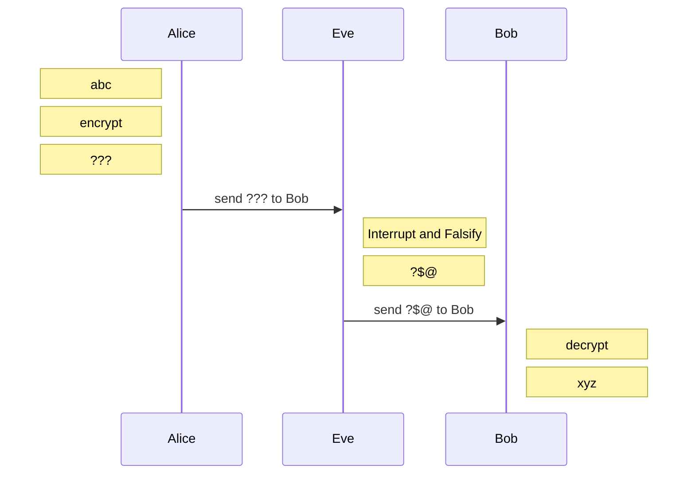
```mermaid
sequenceDiagram
    Note left of Alice: abc
    Note left of Alice: encrypt
    Note left of Alice: ???
    Alice->>Eve: send ??? to Bob
    Note right of Eve: Interrupt and Falsify
    Note right of Eve: ?$@
    Eve->>Bob: send ?$@ to Bob
    Note right of Bob: decrypt
    Note right of Bob: xyz
```
2. 訊息傳輸的來源無法被確定。如果訊息是由駭客送出，那收到訊息的接收端怎麼確定這個訊息是從他信任的發送端送出呢?

以下將逐一介紹解決這些問題的演算法。
### **訊息鑑別碼 Message Authentication Code (MAC)**
#### **運作過程**
1. **Alice**先將解密的金鑰$K_t$傳送給**Bob**(**公開金鑰系統** 或 **迪菲-赫爾曼金鑰交換**)。並將訊息用$K_t$加密。
2. **Alice**再準備另外一把產生 MAC(訊息鑑別碼)的金鑰$K_m$，並再度用安全的方法傳送給**Bob**。
3. **Alice**將$K_m$和密文一起進行運算，得到 MAC。
:::info
根據**運算過程**可將**MAC 的產生方式**分成許多種，如 HMAC，OMAC 和 CMAC。
現在普遍使用**HMAC**，它是利用**hash function**產生 MAC。
:::
4. **Alice**將密文和 MAC 傳送給**Bob**。
5. 和**Alice**一樣，**Bob**使用收到的$K_m$和密文一起進行相同運算得到**新 MAC**。
6. **Bob**檢查新的 MAC 是否和**Alice**傳來的一樣，如果一樣則表示**Alice**傳來的密文沒有被竄改，並將密文用$K_t$解密。反之，**Bob**發出請求請**Alice**再傳一次直到正確為止。
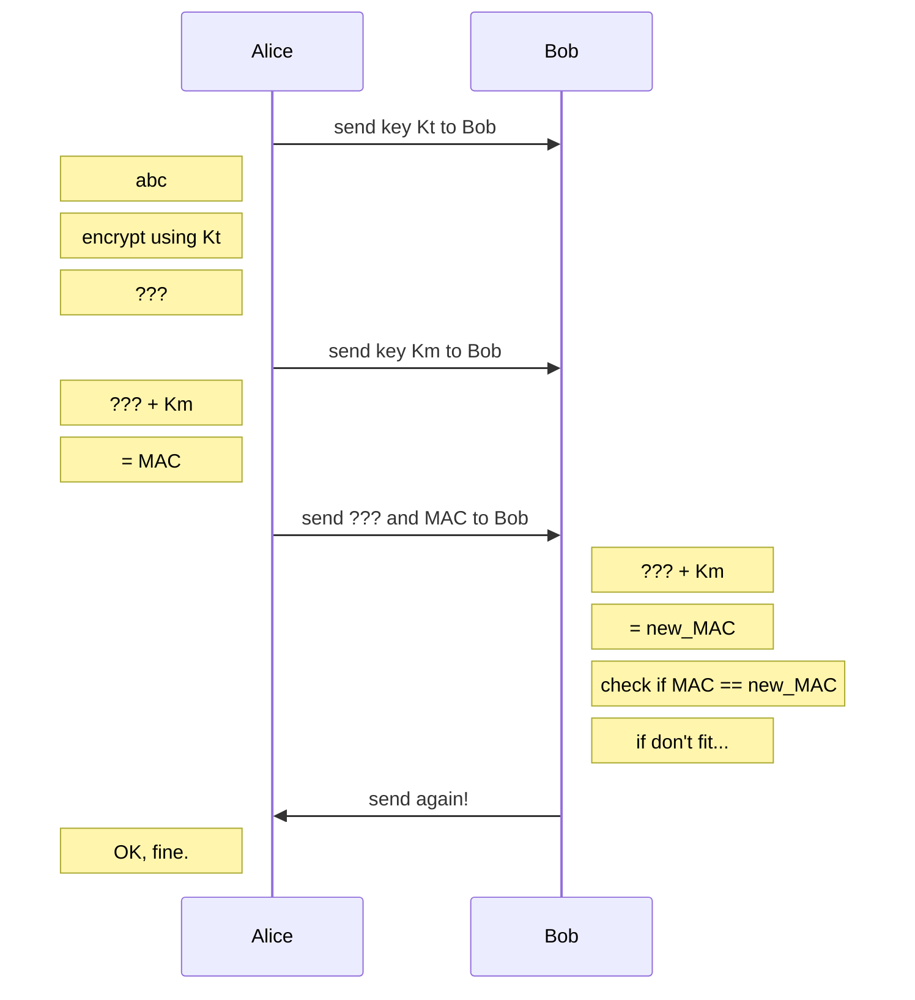
```mermaid
sequenceDiagram
Alice->>Bob: send key Kt to Bob
note left of Alice: abc
note left of Alice: encrypt using Kt
note left of Alice: ???
Alice->>Bob: send key Km to Bob
note left of Alice: ??? + Km
note left of Alice: = MAC
Alice->>Bob: send ??? and MAC to Bob
note right of Bob: ??? + Km
note right of Bob: = new_MAC
note right of Bob: check if MAC == new_MAC
note right of Bob: if don't fit...
Bob->>Alice: send again!
note left of Alice: OK, fine.
```
#### **MAC 的安全性**
如果這個時候第三方 Eve 想竄改任何訊息，訊息鑑別碼都能發揮作用，讓 Bob 能夠收到安全且正確的訊息。
1. 如果 Eve 竄改了密文，Bob 便能在檢查的時候發現**MAC**和**新的 MAC**不相符，並要求 Alice 再傳一次。
2. 如果 Eve 竄改了密文和**鑑別碼**，由於 Eve 並不擁有密鑰$K_m$，因此即使他變更了 MAC 和密文也**無法使這兩者相對應**。所以 Bob 還是能夠發現訊息被竄改，要求 Alice 再傳一次。
#### **MAC 的痛點**
由於 Alice 和 Bob 手中都握有產生 MAC 的金鑰，雙方都能對訊息進行加密。然而這會產生一個問題。如果今天 Alice 或 Bob 不懷好意 **(比方說 Alice 可以主張訊息是 Bob 捏造的，又或者 Bob 可以自行製作訊息然後說這是 Alice 傳來的)**，這個時候因為 MAC 的來源沒辦法確定，造成**抵賴**的發生，這也是 MAC 無法解決的問題。

接下來將介紹解決抵賴的演算法 -- **數位簽章**。
### **數位簽章 Digital Signature**
#### **目的&優點**
現實生活中的簽章目的是為了確認一個人的身分，數位簽章也一樣，目的是為了確認訊息是否真的由某人發送，解決了訊息來源的不確定性。

#### **運作模式**
數位簽章的運作模式大致如下：
1. Alice 先準備兩把金鑰 -- **P**(公鑰)和**S**(私鑰)。值得注意的是，訊息是用**S**加密，用**P**解密。
2. Alice 先將訊息雜湊，得到 hash value，並用**S**將 hash value 加密，產生的結果即是 Alice 的簽章 -- **Sign**。
3. Alice 公開自己的簽章**Sign**和**P**，提供給 Bob 甚至是其他人查證。
4. Alice 將訊息用其他加密方式傳送給 Bob。
5. Bob 收到訊息後，開始查證是否為 Alice 傳送。查證方法如下：將訊息丟進相同的雜湊函數，得到新的 hash value。接下來 Bob 用**P**解密 Alice 的簽章**Sign**，還原出 Alice 的 hash value。如果兩人的雜湊值吻合，代表訊息就是 Alice 傳來的。
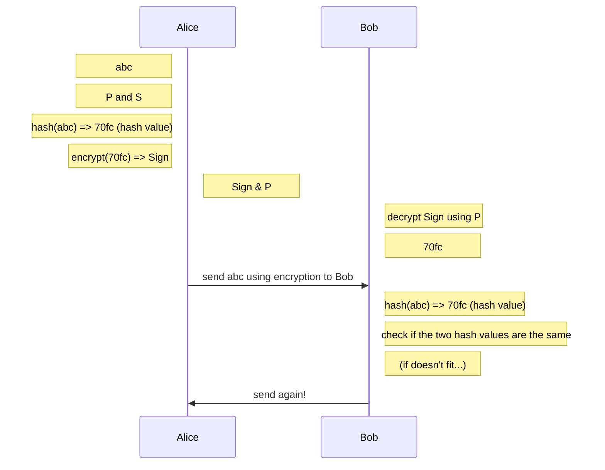
```mermaid
sequenceDiagram
note left of Alice: abc
note left of Alice: P and S
note left of Alice: hash(abc) => 70fc (hash value)
note left of Alice: encrypt(70fc) => Sign
note right of Alice: Sign & P
note right of Bob: decrypt Sign using P
note right of Bob: 70fc
Alice->>Bob: send abc using encryption to Bob
note right of Bob: hash(abc) => 70fc (hash value)
note right of Bob: check if the two hash values are the same
note right of Bob: (if doesn't fit...)
Bob->>Alice: send again!
```
因為數位簽章是透過私鑰**S**加密形成，加上只有 Alice 擁有私鑰，因次這種演算法確保了製作出來的簽章具有**唯一性**，即簽章不能夠被偽造。

#### **迷思澄清**

:::info
**Q1: 數位簽章跟公鑰加密系統都有用到公私鑰的概念吔，那到底差在哪呢?**

先從運作方式切入，我們會發現這兩種演算法**完全不同**。
(假設發送訊息的是 Alice，接收訊息的是 Bob。)
(再假設公鑰是 P，私鑰是 S)

|          | 加密 | 解密 |
|:--:|:----:|:----:|
| 數位簽章 | S~A~ | P~A~ |
| 公鑰加密 | P~B~ | S~B~ |

完全相反的原因是因為這兩種演算法背後的**意義**截然不同。公鑰加密系統是為了**安全、不被偷窺**地傳輸訊息，而數位簽章則是**向大眾證明**訊息是由自己傳送的。兩種演算法的**目的**不同，自然就有許多差別。

(別把這兩種演算法搞混了!!!)
:::

:::info
**Q2: 為甚麼還要先將訊息經過雜湊，而不是直接將訊息用私鑰加密?**

最主要是為了**壓縮訊息**，**降低耗費時間**。

公鑰加密運算量龐大，直接用訊息進行運算非常沒效率。**雜湊函數**這時也派上用場了。因為雜湊函數可以幫我們為一筆資料產生一獨有的「身分證」 -- **雜湊值**(忽略機率極低的雜湊碰撞!)，所以利用這個雜湊值產生簽章，就跟用原來的訊息一樣沒有差別。又因為相較於原本的訊息，**雜湊值的資料量極小**，因此對它進行公鑰加密速度便提升許多。
:::
#### **數位簽章的缺陷**
數位簽章其實還存在著一個問題，那就是 Alice 有可能是不懷好意的 Eve 偽裝的。根本的問題在於**公鑰本身並沒有任何證據證明公鑰製作者是安全的一方**。因此接下來我們將介紹解決這個問題的演算法 -- **數位憑證**。
### **數位憑證 Digital Certificate**
#### **目的&優點**
使用公鑰加密系統或數位簽章時，公鑰本身因缺乏認證機制而有可能被替換。而數位憑證的出現，則確保了公開金鑰的真實性。
#### **運作過程**
1. Alice 想要傳送自己的公鑰 P~A~給 Bob。為了證明 P~A~真的是 Alice 自己的，在此之前 Alice 要先向憑證機構(Certificate Authority, CA)申請憑證。
2. Alice 將 P~A~和自己的電子郵件一起傳送給 CA。
3. 憑證機構 CA 確認資料無誤後，再用自己的私鑰 S~C~將 Alice 的資料加密，產生簽章。
4. CA 將這份簽章的電子檔傳送給 Alice，而這份檔案就是 Alice 的數位憑證。
5. Alice 將憑證傳送給 Bob。
6. Bob 收到後，利用 CA 公開的金鑰 P~C~解開憑證。解開後 Bob 會獲得 Alice 的 email 和 P~A~。
7. Bob 確認電子郵件真的是 Alice 的，這樣代表那個憑證具有真實性，因此 Bob 可以信任 Alice 傳來的公鑰 P~A~。
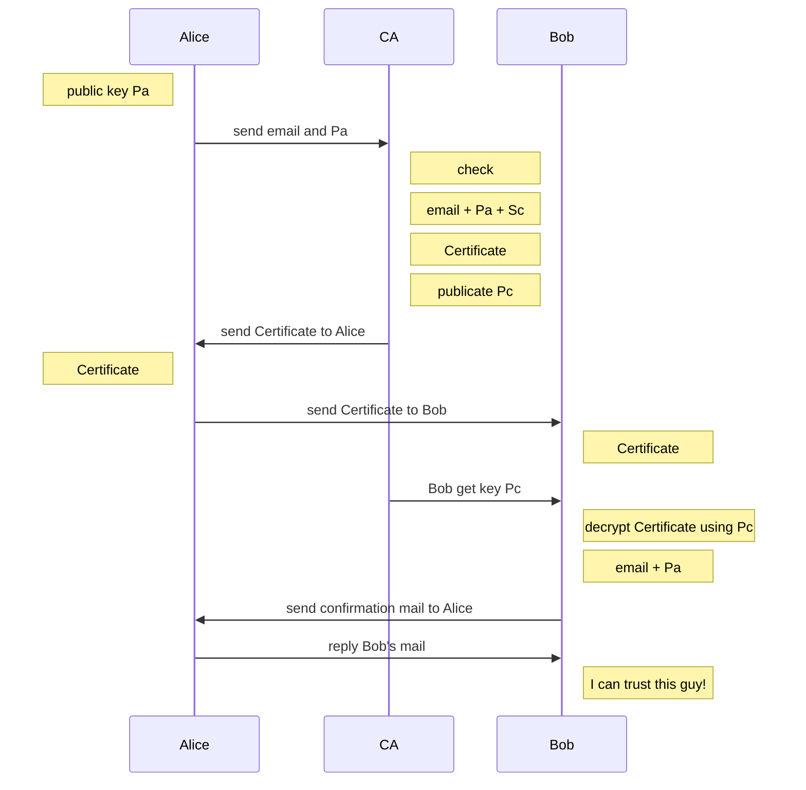
```mermaid
sequenceDiagram
note left of Alice: public key Pa
Alice->>CA: send email and Pa
note right of CA: check
note right of CA: email + Pa + Sc
note right of CA: Certificate
note right of CA: publicate Pc
CA->>Alice: send Certificate to Alice
note left of Alice: Certificate
Alice->>Bob: send Certificate to Bob
note right of Bob: Certificate
CA->>Bob: Bob get key Pc
note right of Bob: decrypt Certificate using Pc
note right of Bob: email + Pa
Bob->>Alice: send confirmation mail to Alice
Alice->>Bob: reply Bob's mail
note right of Bob: I can trust this guy!
```
利用這個機制，Bob 不需要去相信第三方惡意傳送的假公鑰，因為那些公鑰並未擁有數位憑證。
#### **迷思澄清**
Q1: 假設有第三人 Eve 取得了 Alice 的憑證，並用 CA 的公鑰解開憑證竊取 Alice 的 email，那這個時候 Eve 不就可以拿著 Alice 的電郵申請假憑證，然後傳送給 Bob 了嗎?
:::info
遇到這種情況，在憑證階段就能被發現。

首先，Eve 根本就不能單靠 Alice 的 email 申請憑證，Eve 如果沒有 Alice 的裝置，要申請憑證是不可能的。

就算 Eve 真的成功申請到假憑證，在 Bob 檢查信箱的階段就會被察覺。

Bob 可以寄確認信給 Alice，Alice 本人可以親自回覆。多虧了現今電子郵件系統的防禦措施，如果 Eve 為了回覆確認信而嘗試登入 Alice 的信箱，系統會發一封簡訊到 Alice 的裝置確認是否讓外來裝置登入。

因此 Eve 不可能申請到假憑證，就算 Eve 擁有假憑證，但 Bob 終究能夠分辨而不會相信。
:::
Q2: 因為公鑰本身不具備來源確定性，必須透過憑證機構 CA 做擔保。那如果 Eve 偽裝成 CA，製作假憑證，該怎麼辦?該怎麼確定 CA 的公鑰是可信的?這樣不就又回到最初的問題了嗎?
:::info
事實上，這個憑證機構所製作的公鑰還有上層的機構給予憑證、做擔保。而上層的機構還有更上層的憑證機構做擔保...如此向上追溯，我們發現了最上層的機構 -- 稱為「**根憑證機構**」(Root CA, RCA)，而這些機構不是政府機關就是大企業等深受社會信任的組織。而子機構的產生，也是先向這些大機構申請憑證，這些較大的組織便會替較小的組織的信用度做擔保，形成了層層下推的樹狀結構。
:::
#### **數位憑證的延伸應用**
網站進行通訊時也會用到數位憑證。不同於個人的憑證是和電子信箱綁在一起，網站背後的伺服器則是用**網域**(Domain Name, 透過 DNS 的解析可和該網頁的 IP 位址相互對應)申請憑證，確保管理此網站資訊的組織及伺服器相符。

