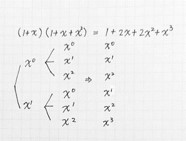
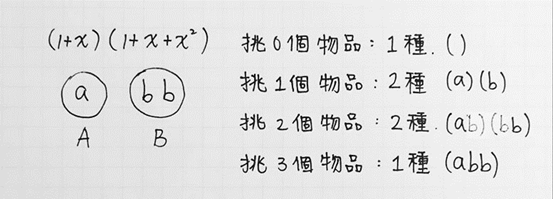

## 先備知識

### 1. 生成函數 (Generating Function)

在做多項式乘法的時候，每一個多項式都可以視為一個集合，乘法就是從每個集合裡各自挑出一個元素，接著枚舉所有組合並合併、化簡。舉例來說，將多項式 $(1+x)(1+x+x^2)$ 展開，用上述的方法可將展開過程以樹狀圖表示如下：




而用直式乘法也可得 $(1+x)(1+x+x^2)=1+2x+2x^2+x^3$。

既然多項式乘法能夠轉化為計數問題了，組合問題當然也能夠轉化為多項式乘法，例如以下問題：現有三個元素 $a, b, b$，求從中挑出 $0～3$ 個元素的組合數有多少種？

將 $a$ 歸類為 $A$ 集合，兩個 $b$ 歸類為 $B$ 集合。對於 $A$ 集合來說，會發現 $a$ 只有不取（$0$）或取（$1$）兩種可能，而對於 $B$ 集合，會發現 $b$ 有不取（$0$）、取 1 個（$1$）或取 2 個（$2$）三種可能，觀察到可以將問題轉化成求 $(1+x)(1+x+x^2)$ 展開式，其中取 $i$ 個元素的組合數即為 $(1+x)(1+x+x^2)$ 的 $x^i$ 項係數，記為 $[x^i](1+x)(1+x+x^2)$。




像這種為一個問題產生一個多項式函數，並利用這個函數求解問題的技巧即為多項式生成函數。

### 2. 多項式插值唯一定理 (Uniqueness of Interpolating Polynomial)

:::info
平面上有 $n+1$ 個相異點 $(x_0, y_0)$、$(x_1, y_1)$、……、$(x_n, y_n)$，則必定存在唯一一個多項式 $P(x)$ 使得 $\forall 0 \leq i \leq n,\ P(x_i)=y_i$，並且 $P(x)$ 最高次項的次數 $\leq n$，i.e. $deg(P(x)) \leq n$。
:::


此定理的證明使用了范德蒙矩陣的性質（其行列式不為 $0$ 等價於證明了唯一定理）：[維基百科 - 多項式插值](https://zh.wikipedia.org/wiki/%E5%A4%9A%E9%A1%B9%E5%BC%8F%E6%8F%92%E5%80%BC)

回想一下國中數學課所教的線型函數和二次函數，平面上兩個點便能決定唯一一條直線；同樣地對於二次函數來說，只需要在平面上找三個點便能知道這個二次函數長怎樣；這個定理告訴我們這些結論可以推廣到任意 $n$ 次多項式，而且也和接下來介紹的的傅立葉變換有關。

### 3. 離散傅立葉變換 (DFT, Discrete Fourier Transform)

多項式插值為一定理告訴我們，$n+1$ 個點便能表達唯一一個 $n$ 次多項式。舉例來說，$x^2 + x + 1$ 便可用 $\{(0, 1), (1, 3), (2, 7)\}$ 這三個點來表示，像這樣以點表達多項式的方法便稱作點值表達法。

因此，將某 $n$ 次多項式 $f(x)$ 從我們已經看膩的係數表達法轉換成點值表達法，便只要找出任意 $n+1$ 個 $x$ ，代入多項式之後得到 $y$，這 $n+1$ 個 $(x, y)$ 便可代表 $f(x)$ 了。上述將我們已經看膩的係數表達法轉換成點值表達法，就是**離散傅立葉變換（DFT）**。

而將 $n+1$ 個點轉化為原本係數形式的多項式，可使用高一教的拉格朗日插值法或牛頓插值法還原，此步驟稱作 **IDFT（DFT 的反運算）**

你也許會問，為什麼要用點來表示多項式。回想一下平時計算多項式乘法 $A \times B$ 的過程，是不是都要 $A$ 的每一項和 $B$ 的每一項相乘，最後合併、化簡。但如果是平面上的點，計算乘法便只要把對應點的 $y$ 值相乘就行了！（但先決條件是表達 $A$ 的點的 $x$ 座標要和表達 $B$ 的點的 $x$ 座標一一對應）

具體來說，設 $C = A \times B,\ deg(A) = n,\  deg(B) = m$，由於 $deg(C) = n \times m$，所以對 $A$ 和 $B$ 做 **DFT** 時皆必須找 $n \times m + 1$ 個點，才能對 $C$ 做 **IDFT**。 

$A = \{(\ x_i, A(x_i)\ )\ |\ 0 \leq i \leq nm\}$

$B = \{(\ x_i, B(x_i)\ )\ |\ 0 \leq i \leq nm\}$

$C = \{(\ x_i, A(x_i) \times B(x_i)\ )\ |\ 0 \leq i \leq nm\}$

如此一來便能省去一直配對要花的時間。

總結來說，現在我們已經知道另外一種更快的方法做多項式乘法了。如果要計算 $n$ 次多項式 $A$ 乘上 $m$ 次多項式 $B$ ，則先找任意 $nm+1$ 個 $x$ 將 $A$、$B$ 轉換為點值表達法。接著做上述的乘法得到 $C$ ，最後將 $C$ 轉換為係數表達法便完成乘法了！

但關鍵還是卡在 **DFT** 和 **IDFT**，因為還是要一個點一個點慢慢代入啊！這樣做還是不夠快（不會過這題），所以我們需要用到複數的一些性質加速轉換的步驟，也就是今天的主角——**FFT**。

### 4. 單位根 (Root of Unity)

考慮以下方程式：$\omega^n=1$，稱此方程式的所有解 $\omega$ 為 $n$ 次單位根，記為 $\omega_n$。

$n$ 次單位根共有 $n$ 個，接著將這 $n$ 個單位根畫在複數平面上，會發現他們會落在單位圓上(半徑為 1，圓心位於 $0+0i$ )，且會圍出一個正 $n$ 邊形，第一個點 $\omega_0$ 位於 $1+0i$ ，從實數正軸開始逆時針旋轉，依序會經過 $\omega_1$ 、 $\omega_2$、...、 $\omega_{n-1}$ 。


下圖由左至右依序為二次、三次、四次單位根。


根據這張圖，再由歐拉公式將這些根極坐標化，可得：

$\omega^k = e^{\frac{2\pi ik}{n}}, k=0, 1, 2, ..., n-1$

接著再觀察仔細一點，會發現 $n$ 為偶數時，任意 $\omega^k$ 對原點的對稱點皆為 $\omega^{k+n/2}$，意即 $\omega^k = -\omega^{k+n/2}$，這是個非常漂亮而且重要的性質！也是 FFT 之所以能那麼快的重要關鍵！


## FFT (Fast Fourier Transform) 與 Cooley-Tukey 演算法

方便起見以下假設 $n$ 為 $2$ 的冪次。並且接下來介紹實作 **FFT** 的方法為常見的演算法—— **Cooley-Tukey Algorithm**。

有了單位根的概念，接下來我們要想辦法優化 **DFT**，關鍵仍是卡在要決定 $n$ 個 $x$ 座標並一一代入 $n-1$ 次多項式 $f(x)$ 尋找 $y$ 座標。想要短時間內就知道一個 $x$ 的 $f(x)$ 值似乎不太可能。於是我們把焦點轉向這個問題：能不能不要做那麼多次代入運算？也就是如果已經知道某個點 $(x_i, f(x_i))$，能不能立刻產生出另外一個點 $(x_j, f(x_j))$？

可以！而且這件事情國中數學就已經提過了！觀察 $f(x) = x^2$。如果已經知道 $(3, 9)$ 在 $f(x)$ 的圖形上，便可馬上知道 $(-3, 9)$ 也在 $f(x)$ 上。（成功快速找出第二個點了！）

沿用這個概念，對於一個多項式 $P(x)=a_0+a_1x+...a_{n-1}x^{n-1}$，先將其奇數項和偶數項拆開來並將奇數的那一組提出 $x$，令偶數項那組為 $P_e(x^2)$，奇數項那組提出 $x$ 後為 $P_o(x^2)$：

$$
P_e(x^2)=a_0+a_2x^2+...a_{n-2}x^{n-2}
$$

$$
P_o(x^2)=a_1+a_3x^2+...a_{n-1}x^{n-2}
$$

則 $P(x)=P_e(x^2)+xP_o(x^2)$。

基於 $P_e(x^2)$ 和 $P_o(x^2)$ 是 $x$ 的偶函數，利用正負成對的性質，這裡所選要代入的 $x$ 為 $\pm x_1, \pm x_2, ..., \pm x_{n/2}$。則對於每一對 $\pm x_i$ 有以下推論：

$$
P(x_i) = P_e(x_i^2)+x_iP_o(x_i^2)
$$

$$
P(-x_i) = P_e(x_i^2)-x_iP_o(x_i^2)
$$

接下來的任務便是找到 $n/2$ 個點表示 $P_e(x^2)$ 和 $P_o(x^2)$。這 $n/2$ 個點也已經被決定了——$x_1^2, x_2^2, ... x_{n/2}^2$。發現了嗎，同樣的問題可以被繼續遞迴求解，這就是 **FFT** 的精髓！

注意到此作法還有一個很重要的問題，那就是如何決定適合的 $x$，使得 $x_1^2, x_2^2, ... x_{n/2}^2$ 或是繼續分治下去的 $x$ 也會是正負配對的？（這樣才能繼續遞迴下去嘛）經過多次嘗試後，我們發現 $n$ 次單位根 $\omega_1$ 、 $\omega_2$、...、 $\omega_{n-1}$ 恰好會滿足這樣的性質！**小教室 4**告訴我們 $\omega^k = -\omega^{k+n/2} \Rightarrow \omega^k$ 和 $\omega^{k+n/2}$ 是正負配對的。

代回上面的式子：

$$
P(\omega^j) = P_e(\omega^{2j})+\omega^jP_o(\omega^{2j})
$$

$$
P(-\omega^j) = P_e(\omega^{2j})-\omega^jP_o(\omega^{2j})
$$

$$
j \in \{0, 1, ..., (n/2-1)\}
$$

$P_e(x)$ 、 $P_o(x)$ 利用 $\{\omega^0, \omega^2, ..., \omega^{n-2}\}$ 繼續分治下去。最後答案的合併就很簡單了。


:::default
以下是 **Cooley-Tukey Algorithm** 的虛擬碼：

$P = [P_0, P_1, ..., P_{n-1}]$ （$P$ 是多項式的係數陣列）

$y = [P(\omega^0), P(\omega^1), ..., P(\omega^{n-1})]$ （$y$ 是多項式的點值陣列）

$\text{Function}\ FFT(\text{Polynomial} P): \\
\qquad n = \text{length of} \ P \\
\qquad \text{if}\ n = 1: \\
\qquad \qquad \text{Return} \ P \\
\qquad \omega = e^{2 \pi i / n} \\
\qquad P_e = [p_0, p_2, ..., p_{n-2}] \\
\qquad P_o = [p_1, p_3, ..., p_{n-1}] \\
\qquad y_e = FFT(P_e) \\ 
\qquad y_o = FFT(P_o) \\
\qquad y = [0, 0, ..., 0]\ \ // \text{There are }n\text{ zeros}. \\
\qquad \text{For}\ j \in \{0, 1, ..., n-2\}: \\
\qquad \qquad y[j] = y_e[j] + \omega^j y_o[j] \\
\qquad \qquad y[j+n/2] = y_e[j] - \omega^j y_o[j] \\
\qquad \text{Return}\ y$


至於 **FFT** 的逆變換 **(IFFT, Inverse FFT)**，則只要將虛擬碼中的 $\omega$ 換成 $\frac{1}{n} e^{-2 \pi i / n}$ 即可，詳細原因和范德蒙反矩陣有關，在此不贅述。
:::


## NTT (Number Theoretic Transform)

注意到此題需要將答案模 $M$ ，而當 $N$ 超過 $350$ 時便會超過 long long int 的範圍，且進行 **FFT** 時由於 $x$ 選用複數域的數因此無法邊做邊模。此時我們思考，有沒有什麼樣的東西，使得在 $\mathbb{Z}_M^*$ 域下還能有單位根那樣漂亮的性質？

令 $M$ 為質數，則由費馬小定理可知，對於任意正整數 $a$，有

$a^{M-1} \equiv 1 (mod\ M)$

若存在原根 $g$ 使得

$\forall 0 \leq i < j < M-1,\ g^i \neq g^j \pmod{M}$

則此時原本的 $\omega$ 便可替換成 $g^\frac{M-1}{N}$，如此便可在 $\mathbb{Z}_M^*$ 域下做 **FFT** 了，此步驟稱為 **NTT**。而 **NTT** 的反運算則只要將  $g^\frac{M-1}{N}$ 替換成它的模逆元就行了。

由於 $M$ 為質數，因此對於任意一個正整數 $a$，其模逆元即為 $a^{M-2}$。證明也不難，只要將費馬小定理等式兩邊同乘 $a^{-1}$ 就可以得到該結果。

實作上可以先預處理 $g$ 的冪次和模逆元，這樣能降低執行速度。

原根的定義請參考：http://gotonsb-numbertheory.blogspot.com/2014/06/primitive-roots.html


## NTT 與常用多項式操作模板

:::default
2026/02/15 更新：放上模板與常用模數表。
:::

分成兩個檔案，第一個檔案支援兩個多項式相乘，並支援 CRT 合併兩組或多組模數（以防中途係數相乘時溢位）。

http://github.com/konchinshih/codebook/blob/main/code/number-theory/Polynomial.cpp


第二個檔案支援多項式 $A \bmod B$，以及高速線性遞迴（Kitamasa Method）實作方式。

https://github.com/konchinshih/codebook/blob/main/code/number-theory/Polynomial2.cpp


## NTT 常用模數表

附上常用質數和其原根對照表：


```text
P = r*2^k + 1
P                   r   k   g
998244353           119 23  3
1004535809          479 21  3
 
P                   r   k   g
3                   1   1   2
5                   1   2   2
17                  1   4   3
97                  3   5   5
193                 3   6   5
257                 1   8   3
7681                15  9   17
12289               3   12  11
40961               5   13  3
65537               1   16  3
786433              3   18  10
5767169             11  19  3
7340033             7   20  3
23068673            11  21  3
104857601           25  22  3
167772161           5   25  3
469762049           7   26  3
1004535809          479 21  3
2013265921          15  27  31
2281701377          17  27  3
3221225473          3   30  5
75161927681         35  31  3
77309411329         9   33  7
206158430209        3   36  22
2061584302081       15  37  7
2748779069441       5   39  3
6597069766657       3   41  5
39582418599937      9   42  5
79164837199873      9   43  5
263882790666241     15  44  7
1231453023109121    35  45  3
1337006139375617    19  46  3
3799912185593857    27  47  5
4222124650659841    15  48  19
7881299347898369    7   50  6
31525197391593473   7   52  3
180143985094819841  5   55  6
1945555039024054273 27  56  5
4179340454199820289 29  57  3
9097271247288401921 505 54  6
```
