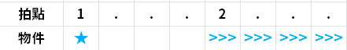
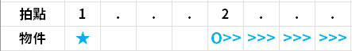
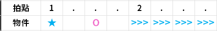
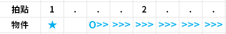
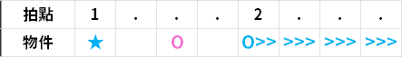

不懂滑星機制的新手可以參考這篇文：[**【心得】新手教室 滑星基礎篇 (作者：中二病的最狂)**](https://forum.gamer.com.tw/G2.php?bsn=21890&parent=71&sn=86&lorder=3)。

簡單來說，maimai 的滑星分成兩個部分：滑星頭 + 滑星條
。星頭等價於一個 TAP，星條永遠都是比星頭**慢一拍**啟動，一拍的長度就看每首歌的 BPM（選歌介面右下角都會標註）。

所以處理滑星的方式是點一下星頭，**手稍微抬起來，不要把手黏在按鍵上**，等一拍之後把星條滑掉。

另外就是滑星條的判定只看你什麼時候摸掉尾巴，開頭要什麼時候滑都沒差，所以 maimai 手元常常出現先滑掉一大半星條只留尾巴的情景。

## 扇形滑星（Wi-Fi 滑星）

這種滑星應該會讓不少新手困惑，可能會很常遇到「感覺明明已經滑掉了卻沒判定到」的狀況。

以上圖為例，扇形滑星的判定機制是 `(A5 or D5)` AND `(A4 or B4)` AND `(D4 or A3)`。大概用白話文解釋一下：
- 第 1 個任務是 `{A5, D5}`，摸到 `A5` 或 `D5` 其中一個區域，就等於完成第 1 個任務。
- 第 2 個任務是 `{A4, B4}`，摸到 `A4` 或 `B4` 其中一個區域，就等於完成第 2 個任務。
- 第 3 個任務是 `{A3, D4}`，摸到 `A3` 或 `D4` 其中一個區域，就等於完成第 3 個任務。
- 3 個任務全部完成的瞬間，就是扇形滑星滑完的瞬間。

要注意的是，3 個任務不一定要同時進行，所以會衍生以下處理扇形星的方法：

1. 正常手法：兩隻手張開，同時往下掃。
2. 先滑掉兩側 `A5`、`A3`，再滑掉中間的 `A4`：https://www.youtube.com/watch?v=eteEpukeaOU&t=104
3. 單手滑掉 `D5`、`A4`、`D4`。

會灰掉或綠掉扇形滑星的狀況，99% 都是**沒有滑到中間的 `{A4, B4}`**，所以在滑的時候請有意識的把手往中間靠。

## 拍滑

拍滑的定義：在星條出發的瞬間加上一個 TAP，讓玩家在滑掉滑星之前還要先補打一個 TAP，形成「先拍後滑」的感覺。

這個 TAP 相當於星條啟動的提示音，代表 TAP 出現的時候你要把滑星一起滑掉。

如果你是完全新手的話，那建議去打打看這首歌，熟悉一下拍滑的感覺：Help me, ERINNNNNN!!（https://www.youtube.com/watch?v=r8LsHpTIbDU&t=18s ），觀察一下 00\:18 秒開始的動作。

更進階一點的拍滑會出現需要換手滑的滑星（例：弱虫モンブラン），所以前面才會說處理滑星時手不要貼在按鍵上等滑星。

## 夾鍵

有時候 TAP 可能不會放在星條啟動的那拍，而是夾在星頭和星條之間，而且有可能不只一個 TAP。比較常出現在 11 到 12^+^ 譜面的配置會長這樣：

例：妄想感傷代償聯盟 **01\:08 處**
https://www.youtube.com/watch?v=bktAJ3bz4_4&t=68

打法有兩種，一種是直接把中間的 TAP 當星條啟動拍，打完那個 TAP 就直接開始滑星條，像這樣：

另外一種是在星條啟動瞬間補上一個啟動拍（想像多一個 TAP）：

第一種打法較節省體力，適用於高 BPM 的歌、滑星速度較快的配置。

第二種打法適用於低 BPM、滑星速度較慢的配置，這樣滑星才不容易太早滑完而粉掉。

新手如果還沒適應星頭、星條之間的獨立性，或是譜面沒研究清楚，很容易將這種配置打成第一種打法，導致滑星粉掉。例：ウミユリ海底譚[進副歌前的一小段 (**01\:07 處**)](https://www.youtube.com/watch?v=9ngvnYT4ydc&t=67)，我自己新手期練海底譚的時候一直沒意識到這個問題，導致這邊常常粉一兩條星星 .w.

## 基礎滑星練習曲推薦

挑自己喜歡的歌來練就好，然後其實也不限於這些歌，大部分 12 以下 (含) 的紫譜都可以練。盡量以 SSS+ 或是滑星全部 Perfect 為目標。某些譜面非常經典，標註為 [必練] 代表強烈建議一定要練起來。

:::default
#### Lv. 10^+^
- 弱虫モンブラン
- Future
#### Lv. 11
- 妄想感傷代償連盟
#### Lv. 11^+^
- 恋愛裁判
#### Lv. 12
- 回る空うさぎ
- だから僕は音楽を辞めた
- 紅に染まる恋の花（手順有點複雜，需要研究，但私心覺得很好玩）
#### Lv. 12^+^
- Future **[必練]**
- 弱虫モンブラン **[必練]**
- [習]ウミユリ海底譚 **[必練]**
- Destr0yer
- 華鳥風月
- 如月車站 (https://www.youtube.com/watch?v=pXULVyzMH-M)
- tape/stop/night
#### Lv. 13
- ヒビカセ
- 幽闇に目醒めしは **[換手滑星必練]**
- 砂の惑星
:::

