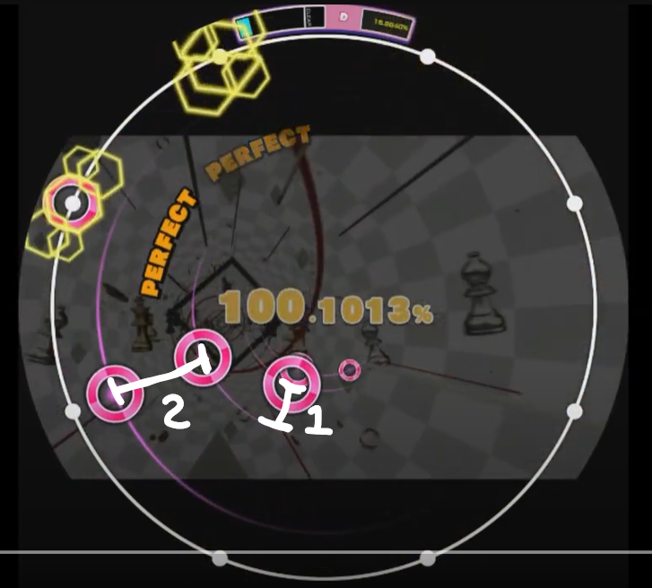
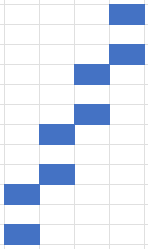

## 什麼是跳拍

跳拍（或心跳拍）對應到樂理上的名稱是 Swing，在 maimai 裡面通常會體現成將 1 個 8 分音拆成 12 分音 + 24 分音，也就是將一堆音符以間隔 2 : 1 的方式排列，而非均勻的 16 分連打。

以 Valsqotch 紅譜為例：

  
  

## 意識

跳拍的打法可按照意識流分成兩種。

:::info
**第一種：**

這種打法短拍起手固定都是同一隻手。

優點：適合處理大跨度的跳拍，腦袋比較不容易卡住。
缺點：碰到側邊的跳拍、繞一圈的跳拍會比第二種難打。

例：阿吽のビーツ **00\:38 - 00\:42 處**

https://www.youtube.com/watch?v=zKobl27lmh0&t=38s
:::

:::info
**第二種：**

這種打法短拍的起手會左右左右交互輪替。是大家比較常用的打法，幾乎沒有缺點、可以應付各種位置的跳拍。但同時也比第一種打法難練，不熟悉的話很容易打成均勻 16 分音導致噴 GREAT。

建議練習方式是先自己在桌上敲，先習慣短拍左右交替的感覺。然後多打一些有跳拍的歌，慢慢就能練起來了。

例：Valsqotch **00\:50 - 01\:05 處**

https://www.youtube.com/watch?v=ZTK3xfZ-tt0&t=50s
:::

## 練習曲推薦

:::default
- GRÄNDIR (Lv.11)
- 結ンデ開イテ羅刹ト骸 (Lv.12)
- 隠然 (Lv.12)
- 阿吽のビーツ (Lv.12^+^)
- 不機嫌なスリーカード (Lv.12^+^)
- チュルリラ・チュルリラ・ダッダッダ！ (Lv.13)
- Valsqotch (Lv.13)
- 四次元跳躍機関 (Lv.13)
- Jörqer (Lv.13^+^)
- AMAZING MIGHTYYYY!!!! (Lv.13^+^)
- Strange Bar (Lv.13^+^)
:::